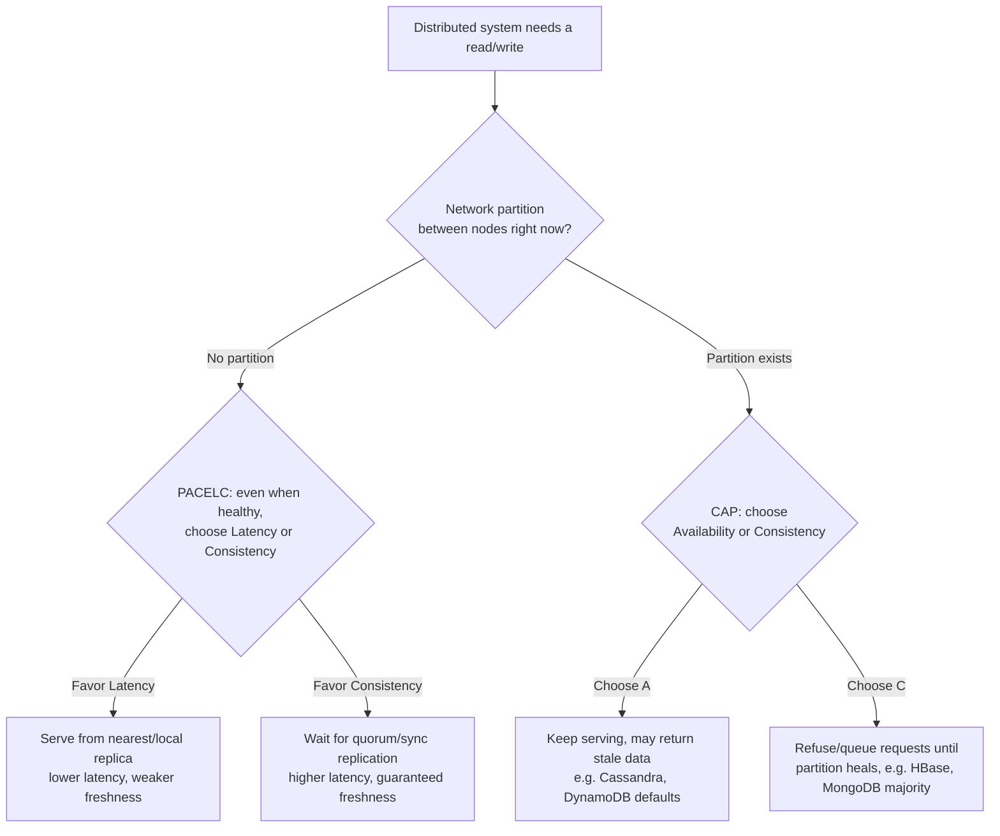

# ACID, BASE & the CAP Theorem: The Physics Underneath Every Data System
{: .no_toc }

*Part 1: Theory & Foundations &middot; Foundations: Bridging from Legacy DW & ETL*

An architect who can't state precisely what a system gives up under load will eventually approve a design that loses a transaction, shows two customers two different balances at the same instant, or falls over the first time a network link blips — and won't be able to explain why in the incident review, because "consistency" was assumed rather than chosen. Every architecture pattern later in this guide — Lambda vs Kappa, warehouse vs lake, mesh vs monolith — is really just a specific, defensible answer to the trade-off this topic names. That's why it opens [Foundations: Bridging from Legacy DW & ETL](./): the whole point of this group is to hand you the vocabulary that makes the rest of the guide precise instead of a matter of taste, and this is the most load-bearing piece of that vocabulary.

## ACID: the promise your warehouse already keeps

If you've written a stored procedure that moves money between two accounts, you've already relied on **ACID** without necessarily naming it. A transactional database — Oracle, SQL Server, PostgreSQL, the OLTP system feeding your warehouse — makes four promises about every transaction:

- **Atomicity**: the transaction happens completely or not at all. A transfer that debits one account and crashes before crediting the other is rolled back entirely, not left half-done.
- **Consistency** (the ACID sense — distinct from the C in CAP, covered below): the transaction moves the database from one valid state to another, respecting every constraint, foreign key, and trigger along the way.
- **Isolation**: concurrent transactions don't see each other's half-finished work. Two tellers processing transfers at the same instant get results as if they ran one after another.
- **Durability**: once the database says "committed," that data survives a crash, a power loss, a restart.

These four guarantees are why a single-node relational database is such a comfortable place to reason about correctness — and why moving off one, into a distributed system, is the single biggest mental shift an architect coming from a warehouse background has to make.

## BASE: what you get instead, at scale

A single machine that guarantees ACID for every transaction has a ceiling: it can only get so big, so fast, before you have to split the data across multiple nodes to keep up with volume. The instant you do that, strict ACID becomes expensive or impossible to maintain across every node for every write, and distributed systems (Cassandra, DynamoDB, most data lakes) instead offer **BASE**:

- **Basically Available**: the system responds to every request, even if some of those responses are stale.
- **Soft state**: the state of the system can change over time even without new input, as replicas converge.
- **Eventual consistency**: if no new writes occur, all replicas will *eventually* return the same value — but not necessarily right now.

BASE isn't a lesser version of ACID; it's a different bet, made deliberately in exchange for availability and horizontal scale. The architect's job is knowing which bet a given workload can afford to make.

## CAP: why you can't order all three

Computer scientist Eric Brewer formalized the reason this trade-off exists at all: the **CAP theorem**. In any distributed data system, you can guarantee at most two of these three properties simultaneously:

- **Consistency** (the CAP sense: every read receives the most recent write, or an error — closer to what distributed-systems literature calls linearizability).
- **Availability**: every request receives a (non-error) response, without guarantee it's the latest write.
- **Partition tolerance**: the system keeps operating despite network partitions — dropped or delayed messages between nodes.

At real-world scale, network partitions are not a hypothetical you can design away — cross-AZ links blip, cross-region links blip more. So partition tolerance isn't really a choice; it's a fact of distributed life. The actual decision CAP hands the architect is: **when a partition happens, do you serve possibly-stale data (choose Availability) or refuse to answer rather than risk returning stale data (choose Consistency)?** That's the real CP-vs-AP split you'll see stamped on database marketing pages — HBase and MongoDB (with majority write concern) lean CP; Cassandra and DynamoDB (default settings) lean AP.

{: .important }
> CAP only governs behavior **during an active network partition** — a relatively rare event. It says nothing about the trade-offs a system makes the other 99.9% of the time, which is exactly the gap PACELC below fills. Treating CAP as "you must always sacrifice consistency or availability" is the most common misreading of the theorem, and it will make you design for the wrong failure mode.

## PACELC: the trade-off that applies even when nothing is broken

CAP only speaks to partitions, but partitions are rare; the trade-off that matters on an ordinary Tuesday is different. Daniel Abadi's **PACELC** extension makes it explicit: **if Partition, choose Availability or Consistency (as in CAP); Else (the normal, healthy-network case), choose Latency or Consistency.** Even with no partition at all, a system that synchronously replicates a write to a quorum of nodes before acknowledging it is paying real latency for stronger consistency; a system that acknowledges after writing locally and replicates asynchronously is faster but briefly inconsistent. This is the trade-off you're actually making, all day, every day, when you pick a database's consistency setting, a replication strategy, or a caching layer — not the rare-partition case CAP describes.

For a data architect, this shows up constantly: an OLTP system backing a checkout flow will usually lean toward consistency even at some latency cost (a customer double-charged is worse than a customer waiting 200ms longer); a clickstream ingestion pipeline will usually lean toward availability and low latency, because losing or delaying a few events matters far less than the pipeline falling over. Later in this guide, when you evaluate object-storage consistency models, streaming exactly-once semantics, and whether a workload should be streaming at all, you're applying this exact ACID/BASE/CAP/PACELC vocabulary to concrete decisions — this topic is the physics; the rest of the course is the engineering built on top of it.

<!-- prevnext:start -->

---

| [&larr; Previous: Foundations: Bridging from Legacy DW & ETL](./) | [Next: Data Architecture Tenets & Styles: Monolithic, Distributed, Cloud &rarr;](02-tenets-and-styles/) |
|:---|---:|

<!-- prevnext:end -->
