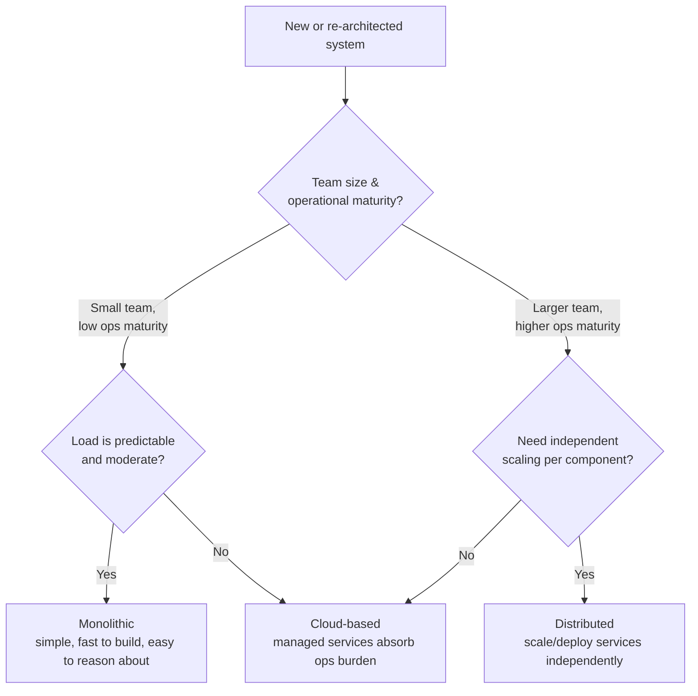

# Data Architecture Tenets & Styles: Monolithic, Distributed, Cloud
{: .no_toc }

*Part 1: Theory & Foundations &middot; Foundations: Bridging from Legacy DW & ETL*

If you can't name the tenets a design has to satisfy, you can't tell a stakeholder why their favorite shortcut is a bad idea — you'll be reduced to "it feels risky" instead of "this violates our durability and governance requirements." [ACID, BASE & the CAP theorem](01-acid-base-and-cap-theorem/) gave you the physics of what a system can promise under distribution; this topic gives you the vocabulary for judging whether a *whole system's shape* — not just one database's consistency setting — is fit for purpose.

## What "data architecture" actually means

**Data architecture** is the blueprint for how data enters a system, where it's stored, how it moves, and who or what can touch it along the way — the same role a floor plan plays for a building, except the thing flowing through it is data instead of people. A warehouse developer typically inherits this blueprint already drawn: a schema, an ETL job, a BI tool pointed at it. An architect draws the blueprint itself, and is accountable for whether it holds up as volume, team size, and business demands change.

## The tenets: what every design is judged against

Regardless of the shape a data architecture takes, it's evaluated against the same handful of tenets. Treat these as the rubric you'll come back to for every pattern in this guide — Lambda, Kappa, lakehouse, mesh, fabric — because none of those patterns is "correct" in the abstract; each is a different set of trade-offs against this same list.

| Tenet | What it means in practice |
|---|---|
| **Data quality** | Data is accurate, complete, and trustworthy enough for the decisions built on it — the subject of a later group on data contracts and quality SLAs. |
| **Scalability** | The design keeps working as volume, velocity, or user count grows by an order of magnitude, not just the volume it was built for. |
| **Security** | Access is controlled and data is protected in transit and at rest — covered in depth alongside RBAC/ABAC/RLS later in this guide. |
| **Cost efficiency** | The design doesn't spend more compute, storage, or egress than the workload justifies — its own group later in this guide. |
| **Governance** | Clear ownership, policy, and accountability for who can define, change, and use data. |
| **Compliance** | The design meets regulatory obligations (retention, right-to-be-forgotten, residency) by construction, not by afterthought. |
| **Accessibility & flexibility** | Legitimate consumers can reach the data they need, and the design can absorb new sources, formats, and consumers without a rebuild. |
| **Maintainability** | The system can be operated, debugged, and evolved by people who didn't build it. |

None of these is free, and they frequently pull against each other — stronger security adds friction that fights accessibility; higher scalability often costs more; strict governance can slow the flexibility a growing business demands. Part of an architect's job, covered directly in [The Architect's Decision Framework](../03-architects-decision-framework/) later in this guide, is making those trade-offs explicit and defensible rather than accidental.

That pull between tenets is easiest to see when two of them collide head-on. Take a retailer that just expanded into the EU: a customer invokes GDPR's right to be forgotten, which sounds like a straightforward **compliance** obligation — delete the record. But finance's seven-year audit retention requirement is a **governance** obligation pointing the other way, and the transactional facts in that customer's orders are still load-bearing for tax filings and fraud investigations that have nothing to do with the customer personally. Neither tenet loses outright; the usual resolution is to pseudonymize the customer-identifying columns on request while leaving the order facts themselves intact, so the erasure obligation and the retention obligation are both satisfied against different parts of the same row. That reconciliation — not picking a winner — is what "trade-offs explicit and defensible" means in practice, and it's a pattern you'll see again once [master data management](../09-quality-security-and-governance/02-master-data-management/) and golden records enter the picture later in this guide.

## Three styles, three different bets

Every data architecture, however elaborate its diagram, is fundamentally organized around one of three styles. The names describe *where compute and storage live relative to each other and to the business*, not any single specific technology.

**Monolithic architecture** keeps the user interface, business logic, and data access layer in one unified codebase against one database. This is the shape most legacy warehouse-and-ETL systems grew up in: one big Oracle or SQL Server instance, one ETL suite (Talend, Informatica) feeding it, one team that knows the whole thing. Its strength is simplicity — one thing to deploy, back up, and reason about, and often genuinely fast for moderate workloads because there's no network hop between layers. Its weakness shows up exactly when the business succeeds: scaling means scaling the *whole* thing, a bug in one module can take down the rest, and a growing team collides constantly over the same codebase and schema.

**Distributed architecture** breaks that single system into independent services that communicate over APIs or message queues, each potentially with its own datastore. This buys horizontal scalability — you scale the service under load, not everything — and resilience, since one service's failure doesn't automatically cascade. The cost is real complexity: network calls replace in-process function calls, and now you're managing service discovery, retries, partial failures, and (per the previous topic) explicit CAP/BASE trade-offs you didn't have to think about inside a single database.

**Cloud-based architecture** runs on a provider's managed infrastructure (AWS, Azure, GCP) rather than owned data centers, trading capital expense for operating expense and getting elastic, pay-for-what-you-use scaling, global reach, and a menu of managed services (object storage, managed warehouses, managed streaming) in return. Cloud and distributed are related but not synonymous: you can lift-and-shift a monolith onto a single cloud VM and still have every monolithic failure mode, just billed differently.

Most teams don't jump straight from one to the other, either. A common intermediate step — sometimes called a modular monolith — keeps one deployable codebase and one database but enforces module boundaries internally, as if each module were already a future service. This is closer to a legacy warehouse developer's world than it sounds: an ETL suite with clearly separated jobs per subject area (orders, inventory, finance), each writing to its own schema on its own schedule, is already halfway to a distributed shape, even though it still runs as one Talend or Informatica installation. Splitting it later means extracting an already-isolated module rather than untangling a genuinely intertwined codebase — which is exactly why recognizing this intermediate style is worth doing deliberately, not stumbling into by accident.

{: .important }
> "Cloud-based" is not automatically "scalable" or "resilient." A single large EC2 instance running your old monolithic ETL suite unchanged is a cloud-based architecture with every weakness of a monolith still intact. The tenets above — not the hosting bill — are what actually tell you whether a design is fit for purpose.

## Choosing among them

There's rarely a purely "correct" answer — the right style depends on data volume and velocity, team size and structure, global reach requirements, and how much operational complexity the organization can absorb. A small team with predictable, moderate load is often better served by a monolith they can fully understand than a distributed system they can't operate; a team supporting global, spiky, high-volume workloads usually can't avoid the complexity of distributed or cloud-native design.

A concrete version of this choice: a subscription-analytics company running a single on-premises SQL Server warehouse and one nightly Informatica job hits two walls at once — the nightly batch window no longer finishes before the business day starts, and a new mobile app team needs to write events into the same schema without waiting on the warehouse team's release cycle. Scalability and accessibility are both failing, but the fix isn't necessarily "go distributed everywhere." The warehouse workload alone might justify moving to a cloud-based columnar warehouse — a style change with no code-organization change at all — while the event-ingestion path, a genuinely different access pattern owned by a genuinely different team, is what actually justifies carving out a distributed service. Style decisions are usually made per problem inside a platform, not once for the whole thing.

This same evaluation — tenets first, style second — is the pattern you'll repeat at every larger decision point in this guide: OLTP vs OLAP workload separation next, then legacy ETL vs modern ELT, then eventually the full build-vs-buy-vs-compose framework. The tenets don't change; only the scope of what they're being applied to does.

<!-- prevnext:start -->

---

| [&larr; Previous: ACID, BASE & the CAP Theorem: The Physics Underneath Every Data System](01-acid-base-and-cap-theorem/) | [Next: OLTP vs OLAP: Transactional vs Analytical Workloads &rarr;](03-oltp-vs-olap/) |
|:---|---:|

<!-- prevnext:end -->
