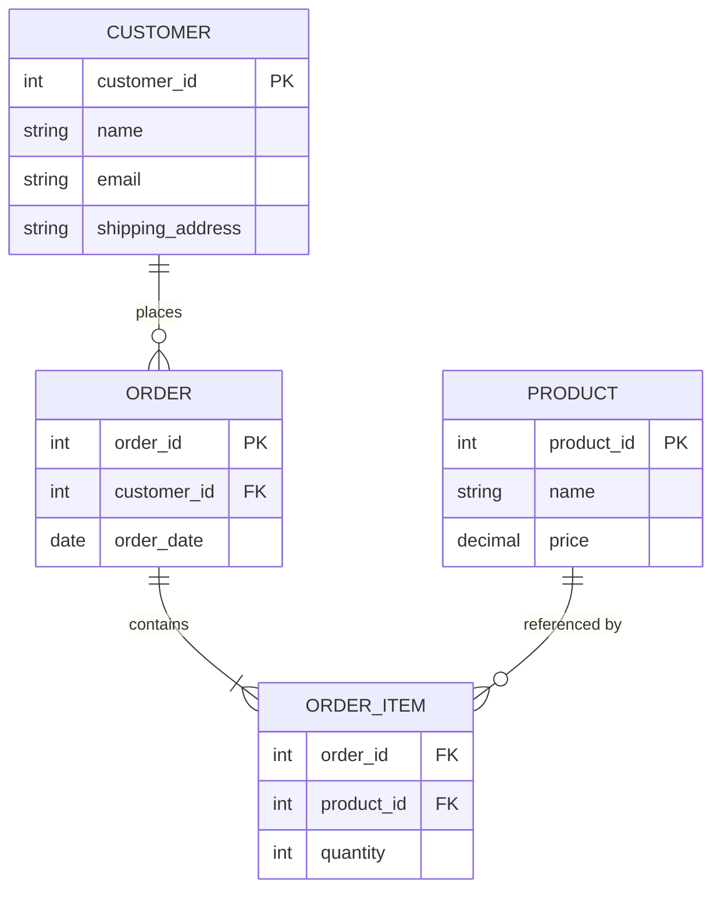

# Data Modeling, Database Types & Normalization Refresher
{: .no_toc }

*Part 1: Theory & Foundations &middot; Foundations: Bridging from Legacy DW & ETL*

An architect who can't explain *why* a schema is normalized the way it is — or when to deliberately break that normalization — will either inherit an OLTP-shaped table into an OLAP report and drown it in joins, or denormalize an operational system into an update-anomaly minefield. [OLTP vs OLAP](03-oltp-vs-olap/) established that these two workloads want structurally different shapes; this topic is the refresher on the modeling toolkit that actually produces those shapes, and on the database types built to hold them.

## Three levels of the same model

Data modeling is the blueprint for how data is organized and related, and it's usually drawn at three levels of increasing detail. A **conceptual model** captures the business's **entities** (Customer, Order, Product) and how they relate, without worrying about columns or types. A **logical model** adds **attributes** (a Customer has a name, an email) and formalizes **relationships** and **keys** — a **primary key** uniquely identifying each row, a **foreign key** referencing another table's primary key — still independent of any specific database product. A **physical model** is where that logical design becomes concrete: actual column types, indexes, partitioning, and storage choices for a specific engine. Moving through these three levels in order — rather than jumping straight to physical tables — is what keeps a schema traceable back to the business concepts it's supposed to represent. Skipping straight to physical is a common failure mode in practice: a developer opens the database client and starts creating tables and foreign keys before anyone has agreed what "Customer" even means to the business — is a guest checkout a Customer, does a returning corporate buyer with three ship-to addresses count as one Customer or three? Those are conceptual-model questions, and answering them after the physical schema already exists means every downstream fix is a migration instead of a whiteboard edit.

One design choice the conceptual model doesn't resolve on its own is what a table's primary key actually *is*. A **natural key** is a value the business already has — an email address, a SKU, a national ID number — used directly as the primary key. A **surrogate key** is a system-generated identifier (typically an auto-incrementing integer or a UUID) with no business meaning at all, used purely to identify a row. Legacy OLTP schemas lean on natural keys more often than they should, because the value looks stable at design time; the trouble surfaces later, when the business redefines that "stable" value — two customer accounts get merged, or a vendor reuses a discontinued SKU — and every foreign key referencing it has to be rewritten. Surrogate keys sidestep that risk: the key itself never has to change no matter how the business fact behind it changes, which is exactly why dimensional models depend on them almost universally. A later group covers how a surrogate key is what makes a [slowly changing dimension](../05-dimensional-modeling-cloud-era/03-scd-and-conformed-dimensions/) possible at all — it lets the same natural customer have multiple dimension rows over time without a primary-key collision.

## Database types: same modeling toolkit, different tools

The type of database you're modeling for changes which design approach fits:

- **Relational databases** (PostgreSQL, MySQL, Oracle, SQL Server) store data in tables with enforced schemas and relationships, and are the natural home for ACID-guaranteed OLTP workloads.
- **NoSQL databases** trade some of that rigidity for flexibility and horizontal scale: document stores (MongoDB) nest related data into a single JSON-like document, key-value stores (DynamoDB, Redis) optimize for fast lookups by a single key, and wide-column stores (Cassandra) optimize for high-write-throughput, access-pattern-specific queries.
- **Columnar databases** (Redshift, BigQuery, Snowflake's storage layer) store each column contiguously rather than each row, which is what makes scanning and aggregating billions of rows for OLAP fast — the same physical layout choice that Parquet and ORC bring to file-based storage later in this guide.

The design approach follows the database type: relational design starts from normalization and business rules; NoSQL design starts from the application's *access patterns* — you model the document or key-value shape around the specific query you know you'll run, sometimes duplicating data on purpose to avoid a join the database isn't built to do cheaply. A document design decision makes that concrete: nesting an order's line items directly inside the order document is fast to read — one lookup, no join — but awkward to fix if a single product's price needs correcting across thousands of historical orders. That's the same normalize-versus-denormalize tension relational modeling faces below, just resolved at design time inside the document schema instead of at query time.

## Normalization: organizing data to eliminate redundancy

**Normalization** is the process of structuring a relational schema to eliminate redundant data and the update anomalies it causes, applied in progressive stages called normal forms:

- **1NF (First Normal Form)**: every column holds a single, atomic value — no repeating groups or comma-separated lists in a cell.
- **2NF (Second Normal Form)**: every non-key column depends on the *whole* primary key, not just part of a composite one.
- **3NF (Third Normal Form)**: every non-key column depends *only* on the primary key, not on another non-key column (no transitive dependencies).

A customer's shipping address stored once in a `Customers` table and referenced by every order via a foreign key, rather than copy-pasted into every `Orders` row, is 3NF in practice: change the address once, and every order that references it is automatically correct. The cost is that reading a full order now requires a join back to `Customers` — a cost OLTP systems happily pay for the integrity guarantee.

## Denormalization: paying storage to save joins

**Denormalization** deliberately reintroduces redundancy — combining tables, duplicating columns — to reduce the number of joins a query needs, trading storage and update complexity for read speed. A reporting table that copies the customer's name and region directly onto every order row, rather than joining back to `Customers` at query time, is denormalized on purpose: it's slower to keep in sync when a customer's details change, but dramatically faster to scan for a dashboard touching millions of rows. This is exactly the direction OLAP schemas lean, and it's the seed of the star-schema dimensional modeling covered in a later group.

The trade-off has a real cost dimension, not just a conceptual one. Duplicating a customer's name and region across ten million order rows costs measurable extra storage, but recomputing that join at query time across the same ten million rows — every time a dashboard refreshes — costs measurable extra compute, and in a cloud warehouse billed by bytes scanned or by query-second, compute is almost always the more expensive of the two. That asymmetry is a large part of why OLAP schemas denormalize as aggressively as they do: storage keeps getting cheaper; scan-heavy compute doesn't. The [Cost as an Architectural Decision](../10-cost-and-performance-architecture/01-cost-as-architectural-decision/) group later in this guide works that arithmetic in dollar terms.

## How to choose

The decision comes down to the same question every time: what are the read and write patterns, and which one does this system need to be fast at? A system with frequent small writes and a need for correctness under concurrency (an OLTP order-entry system) should stay close to normalized. A system with infrequent writes and frequent large scans (an OLAP reporting layer) should denormalize deliberately and document why. Most real systems land on a hybrid: keep the system of record normalized for integrity, then denormalize downstream, in a warehouse or a serving layer, specifically for the queries that need to be fast.

{: .important }
> Over-normalizing an analytical schema is as real a mistake as under-normalizing a transactional one — a star schema forced into 3NF (a "snowflake" taken too far) can turn a two-table BI query into a fifteen-table join. Normalization level should follow the workload, not be applied uniformly out of habit.

A large e-commerce platform makes this hybrid concrete: order and payment data — where correctness under concurrent writes is non-negotiable — lives in a normalized relational store; the product catalog, which is read far more than written and varies in shape from item to item, lives in a document store modeled around how the storefront actually queries it; and clickstream and sales analytics, which need to scan huge volumes fast, land in a columnar store, denormalized into wide, query-shaped tables. No single database type or modeling style was "correct" for the whole platform — each subsystem's read/write pattern dictated its own choice, which is the same reasoning you'll apply to every architecture decision for the rest of this guide.

<!-- prevnext:start -->

---

| [&larr; Previous: OLTP vs OLAP: Transactional vs Analytical Workloads](03-oltp-vs-olap/) | [Next: From Legacy ETL to Modern ELT: Bridging Talend & Informatica-Style Tools &rarr;](05-legacy-etl-to-modern-elt/) |
|:---|---:|

<!-- prevnext:end -->
