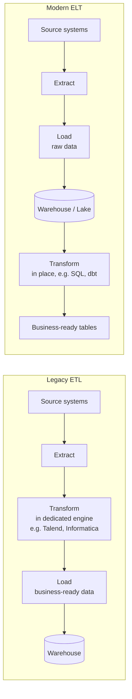

# From Legacy ETL to Modern ELT: Bridging Talend & Informatica-Style Tools
{: .no_toc }

*Part 1: Theory & Foundations &middot; Foundations: Bridging from Legacy DW & ETL*

If you've spent years building jobs in Talend or Informatica PowerCenter, you already understand data pipelines — what you need now is the vocabulary for why the *shape* of that pipeline has shifted under the industry's feet, so you can explain to a skeptical stakeholder why "just add another transformation stage to the existing ETL tool" isn't always still the right move. [Data Modeling, Database Types & Normalization Refresher](04-data-modeling-refresher/) covered how data is shaped once it lands; this topic covers how it gets there in the first place.

## What a data pipeline does

A **data pipeline** ingests data from sources — operational databases, APIs, sensors, files — and moves it through processing and storage stages until it's usable for analytics, reporting, or downstream applications. Every pipeline, however it's built, answers three questions: where does the data come from, what happens to it along the way, and where does it land.

## ETL vs. ELT: why the T moved

**ETL (Extract, Transform, Load)** is the pattern most legacy warehouse work grew up on: pull data out of source systems, run it through a dedicated transformation engine — exactly what Talend and Informatica PowerCenter were built to do — and only load the cleaned, conformed, business-ready result into the warehouse. This made sense when warehouse compute and storage were both expensive and warehouses were relatively weak at heavy transformation, so pushing that work onto a separate ETL engine before load was the efficient choice.

**ELT (Extract, Load, Transform)** flips the last two steps: raw data is extracted and loaded into the target system first, largely as-is, and transformation happens *inside* that target system afterward, using its own compute. This became the dominant pattern once cloud object storage made holding raw data cheap and columnar cloud warehouses (Redshift, Snowflake, BigQuery) became powerful enough to do heavy transformation themselves — usually in SQL, often via tools like dbt (covered later in this guide). The medallion pattern you'll meet in the next group — bronze (raw) to silver (cleaned) to gold (business-ready) — is ELT's transformation stages made explicit as layers inside the warehouse or lake itself.

The economics behind that shift are concrete, not just architectural fashion. Transforming a day's clickstream data on a dedicated on-premises ETL server was often the only option when warehouse compute was licensed per-core and treated as scarce; the same transformation running as SQL inside a cloud warehouse or a Spark cluster scales elastically and gets billed by the second, then disappears again once the job finishes. That's what "compute where the data already lives" means in dollar terms, and it's why a warehouse developer moving into an architect role should think of ELT less as a new tool category and more as a direct consequence of storage and compute finally being cheap and separately scalable — the same decoupling that underlies the [lakehouse pattern](../02-architecture-patterns-deep-dive/03-lakehouse-architecture/) covered later in this guide.

## Tools: the same landscape, wider now

The tool landscape reflects this shift rather than replacing it outright. On-premises ETL suites like **Apache NiFi**, **Talend Open Studio**, and **Informatica PowerCenter** are still common where transform-before-load remains the right call — heavily regulated environments that can't land raw, unmasked data anywhere, for instance. A healthcare claims processor bound by HIPAA is the concrete version of that: patient data often can't legally land anywhere, even inside the company's own cloud warehouse, until it's been masked and validated, which makes "load raw first" itself a compliance violation rather than a sign the team hasn't modernized. Alongside them sit **Apache Kafka** for streaming ingestion, and cloud-native services purpose-built for ELT: AWS Glue, Kinesis, and EMR; Azure Data Factory and Databricks; and their Google Cloud equivalents. None of these tools makes the ETL-vs-ELT decision for you — they're the mechanism for whichever pattern the workload actually needs.

## Best practices that don't change with the pattern

Whichever pattern you choose, the same disciplines still apply: validate data quality as early as possible, design for idempotent reprocessing (rerunning a pipeline shouldn't duplicate or corrupt data), monitor for pipeline failures and data drift, and keep the pipeline scalable enough to absorb source-volume growth without a rebuild — every one of which resurfaces in depth later in this guide.

Idempotency is worth pausing on, because ELT doesn't grant it for free. A pipeline that re-runs after a network timeout and blindly re-inserts every row it already loaded is a classic legacy-ETL failure mode, and ELT doesn't automatically fix it: if the transform logic in the silver layer isn't written to upsert on a natural or surrogate key, a rerun after a partial failure just doubles the affected day's rows silently, and the first sign of trouble is a dashboard total that's inexplicably too high. The [dbt Paradigm](../07-transformation-and-modern-data-stack/02-dbt-paradigm-contracts-idempotency/) topic later in this guide covers exactly how to write transforms that survive a rerun.

{: .important }
> Moving from ETL to ELT does not mean moving from *governed* to *ungoverned*. Landing raw data first is a legitimate architectural choice, not a license to skip validation — the checks a legacy ETL job ran before load still have to happen somewhere; ELT just moves them downstream (typically into the silver layer) instead of removing them.

The pattern you choose here — and how much of the transformation burden you push downstream versus keep at the source — sets up the next topic directly: how fast that data needs to move determines whether "downstream" means the next nightly batch or the next few seconds.

<!-- prevnext:start -->

---

| [&larr; Previous: Data Modeling, Database Types & Normalization Refresher](04-data-modeling-refresher/) | [Next: Batch, Near-Real-Time & Real-Time Processing: Building Robust Pipelines &rarr;](06-batch-realtime-and-robust-pipelines/) |
|:---|---:|

<!-- prevnext:end -->
