# Batch, Near-Real-Time & Real-Time Processing: Building Robust Pipelines
{: .no_toc }

*Part 1: Theory & Foundations &middot; Foundations: Bridging from Legacy DW & ETL*

An architect who agrees to "real-time reporting" without pinning down what that phrase means to the stakeholder saying it will either over-build (streaming infrastructure for a dashboard that only needed a five-minute refresh) or under-build (a nightly batch job promised as "real-time" that a doctor is now relying on for a lab alert). [From Legacy ETL to Modern ELT](05-legacy-etl-to-modern-elt/) covered how data moves through a pipeline; this topic covers how *fast* — and precisely which of three genuinely different speeds "fast" means.

## The latency spectrum, precisely

**Batch processing** collects data over a period — hours, a full day — and processes it all at once on a schedule. It's the shape of a nightly ETL job that rolls up yesterday's transactions into the warehouse, and it's well suited to large volumes where no individual result needs to be current within the hour.

**NRT (near-real-time)** processing works in small, frequent micro-batches or short windows, with end-to-end latency in the **seconds-to-minutes** range. This is the tier that most systems a stakeholder calls "real-time" actually are — a dashboard that refreshes every two minutes, an inventory count updated every thirty seconds. It is not the same thing as true streaming, and treating it as interchangeable with RT is the single most common miscommunication between an architect and the business side of a requirements conversation.

**RT (real-time)** processing handles data continuously, one event at a time, with end-to-end latency in the **sub-second to low-single-digit-second** range. It's what fraud detection, live bidding, and safety-critical monitoring actually require — and it's also the most operationally expensive tier to build and run, for reasons the next group's topic on "should this be streaming at all" covers in depth.

```mermaid
flowchart TD
    A["What does the stakeholder\nactually need to react to?"] --> B{"Is a decision made\nwithin seconds of the event?"}
    B -- "No — decisions are\nhourly/daily" --> C[Batch\nhours-scale latency]
    B -- "Yes, but a short delay\nis tolerable" --> D[NRT / micro-batch\nseconds-to-minutes latency]
    B -- "No delay is tolerable —\nsub-second action required" --> E[RT / streaming\nsub-second-to-low-seconds latency]
```



{: .important }
> Say "RT" or "NRT" explicitly, every time, instead of the ambiguous word "real-time" on its own. A stakeholder asking for "real-time" almost always means NRT once you ask them what decision they're making and how quickly — confirming that before you design anything can save you from building genuine streaming infrastructure nobody actually needed.

## What "robust" adds, regardless of tier

Choosing the right latency tier is necessary but not sufficient — a batch job, an NRT micro-batch pipeline, and an RT stream all fail in production the same handful of ways if these disciplines are skipped:

- **Fault tolerance**: the pipeline survives a failed task, a dropped connection, or a downstream outage without losing or corrupting data — retries, dead-letter queues, and checkpointing are the usual mechanisms.
- **Idempotency**: reprocessing the same batch or replaying the same event twice produces the same result, not duplicated rows — critical the moment any retry logic exists at all, which in practice is always.
- **Error handling & monitoring**: failures are caught, logged, and surfaced (not silently swallowed), with alerting tied to concrete thresholds rather than "someone will notice eventually."
- **Scalability**: the pipeline absorbs volume growth without a redesign — partitioning and parallelism decided ahead of the day it's needed, not the day after an outage caused by it.
- **Maintainability**: someone who didn't build the pipeline can debug and extend it, which in practice means documentation, consistent naming, and pipelines that fail loudly rather than quietly.

Security is inseparable from robustness, not a separate checklist: data should be encrypted both at rest and in transit, access to pipeline stages and outputs should be governed by explicit controls, and authentication between services (OAuth or JWT tokens rather than shared static credentials) should verify identity end to end. In regulated domains this isn't optional polish — a pipeline handling healthcare data has to satisfy HIPAA, one handling EU personal data has to satisfy GDPR, and both expectations should be designed in from the start rather than retrofitted after an audit finds the gap.

## Idempotency and checkpointing, worked

Fault tolerance and idempotency are easy to state as principles and easy to get wrong in practice, because the failure they guard against isn't the original outage — it's the *retry* an orchestrator kicks off automatically afterward. A task that dies halfway through writing two million rows and gets restarted five minutes later either reprocesses cleanly or corrupts the target, and which one happens depends entirely on whether the load was built to be replayed:

```python
# Illustrative pseudocode - not a runnable, dependency-complete script.
# Pattern: checkpointed, idempotent batch/micro-batch load.

def run_load(source, target, checkpoint_table):
    last_watermark = read_checkpoint(checkpoint_table)   # e.g. max(updated_at) already loaded
    batch = source.read_since(last_watermark)             # only the new/changed rows since then
    if batch.is_empty():
        return

    new_watermark = batch.max("updated_at")
    target.merge(                                          # MERGE / upsert, not a raw INSERT -
        batch,                                              # replaying this batch a second time
        match_on="primary_key",                             # overwrites the same rows instead of
        on_match="update", on_no_match="insert",            # duplicating them
    )
    write_checkpoint(checkpoint_table, new_watermark)       # advance the watermark only after
                                                             # the target write has succeeded
```

Two details separate this from a pipeline that merely works on a good day. First, the target write is a `MERGE`/upsert keyed on a primary key, not a plain `INSERT` — that's the whole of what "idempotent" means for a loader, because it's what makes replaying the exact same batch a harmless no-op instead of a duplicate-rows incident. Second, the checkpoint write happens strictly *after* the target write succeeds, never before or in parallel. If the job dies between the two steps, the next run simply reprocesses the same window and the merge absorbs it safely; get that ordering backwards — advance the watermark first, write second — and a single mid-batch failure silently skips rows the job never actually wrote, a gap nobody notices until a downstream total stops reconciling. The same pattern applies whether "batch" here means an overnight job or a five-second micro-batch window in an NRT pipeline — the tier changes the frequency, not the discipline.

## A case study: blending all three tiers deliberately

A hospital system's data platform is a useful worked example precisely because it can't pick one tier and be done. Electronic health records and billing data — tens of thousands of encounters and claims lines across a hospital network on a given day — are aggregated overnight in **batch**; there's no need for a claims report to reflect the last five minutes, and running that volume as a nightly window keeps compute costs predictable. Lab results feeding a clinician's dashboard flow through **NRT** micro-batches on a roughly one-minute cadence — a result available within a minute or two of the instrument finishing is entirely sufficient, and paying for full streaming infrastructure here would be waste for a workload that isn't actually latency-critical. Bedside monitor alarms — heart rate, oxygen saturation, telemetry from an ICU floor generating a continuous stream of readings — require true **RT** streaming, because a multi-second delay in that signal path is a patient-safety failure, not an inconvenience. The point isn't that healthcare uniquely needs all three; it's that almost every non-trivial platform has sub-systems that each deserve a different, deliberately chosen tier rather than one latency target applied uniformly across the whole design.

Getting this choice right — and building whichever tier you land on with the fault tolerance, idempotency, and security disciplines above — is what separates a pipeline that survives its first production incident from one that becomes the incident. The next few topics in this guide move from this foundational latency question outward to where that pipeline actually runs.

<!-- prevnext:start -->

---

| [&larr; Previous: From Legacy ETL to Modern ELT: Bridging Talend & Informatica-Style Tools](05-legacy-etl-to-modern-elt/) | [Next: AWS, Azure & Hybrid/Multi-Cloud Tooling for Data Engineers &rarr;](07-aws-azure-hybrid-tooling/) |
|:---|---:|

<!-- prevnext:end -->
