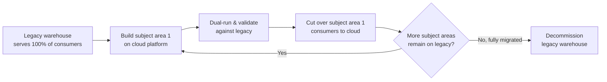

# Migrating a Legacy Warehouse to the Cloud: Patterns & Pitfalls
{: .no_toc }

*Part 1: Theory & Foundations &middot; Foundations: Bridging from Legacy DW & ETL*

Most architects don't get to design a greenfield platform — they inherit a fifteen-year-old on-prem warehouse that the business depends on every day, and the single highest-risk project of their career is often moving it to the cloud without breaking the finance close or the executive dashboard along the way. [AWS, Azure & Hybrid/Multi-Cloud Tooling](07-aws-azure-hybrid-tooling/) covered the destination services; this topic covers the *journey* to them — the migration patterns that separate a controlled cutover from a multi-week outage, and the pitfalls that turn "we're migrating the warehouse" into the project every stakeholder remembers for the wrong reasons.

## Three patterns, three risk profiles

Every warehouse migration is a choice among three patterns, and the choice is really a trade-off between speed and long-term fit:

**Lift-and-shift** moves the workload as-is — same schema, same SQL dialect where possible, same jobs — onto cloud infrastructure, typically a cloud VM or a managed instance of the same database engine. It's the fastest path off aging on-prem hardware and the lowest-risk in the narrow sense that nothing about the logic changes, but it also carries forward every design decision from fifteen years ago, including the ones the platform has outgrown. It's a reasonable first move under a hard deadline (a data-center lease expiring, hardware end-of-life), not a destination.

**Replatform** keeps the overall architecture and data model largely intact but swaps the underlying engine for a cloud-native one — an on-prem SQL Server or Teradata warehouse becoming a Redshift or Synapse warehouse, for instance. This captures real cloud-native benefits (elastic compute, separated storage/compute, managed scaling) without the cost of a full redesign, and it's the pattern most enterprise migrations actually land on.

**Refactor** (sometimes called re-architect) rebuilds the platform on cloud-native patterns — moving from a rigid **Inmon**-style normalized core to a **lakehouse**, adopting a **medallion** bronze/silver/gold layout, converting nightly **ETL** into **ELT** against object storage. It delivers the most long-term value and the most technical debt reduction, but it's the slowest and highest-risk path, because the data model and the pipelines are both changing at once instead of just the infrastructure underneath them.

| Pattern | Speed | Risk | What changes | When it fits |
|---|---|---|---|---|
| Lift-and-shift | Fastest | Lowest short-term | Infrastructure only | Hard deadline, buy time to plan properly |
| Replatform | Moderate | Moderate | Engine, not model | Most enterprise warehouse migrations |
| Refactor | Slowest | Highest | Model and pipelines both | Legacy design is actively limiting the business |

## The strangler-fig cutover

Whichever pattern is chosen, the *cutover* itself is a second, separate decision, and a **big-bang cutover** — flip every consumer to the new system on one weekend — is the single most common way a well-planned migration becomes an outage, because it means every mistake surfaces in production, at once, with no working fallback. The alternative most architects reach for is the **strangler-fig pattern**: new functionality (a subject area, a business unit, a report suite) is built and validated on the new cloud platform first, consumers are migrated to it piece by piece, and the legacy warehouse keeps serving whatever hasn't moved yet — until, eventually, nothing depends on it and it's decommissioned. The name comes from the strangler fig vine, which grows around a host tree and gradually replaces it without the tree ever being felled outright; the migration works the same way, replacing the legacy system's surface area gradually instead of amputating it in one cut.

## Dual-run validation

Between "built on the new platform" and "consumers cut over" sits the step that catches problems before they're customer-visible: **dual-run** (or parallel-run) validation, where the same source data is loaded into both the legacy warehouse and the new platform for a period, and their outputs are reconciled row-for-row or total-for-total before anyone is allowed to trust the new system alone. A finance close that has to match to the cent is the canonical case — running both warehouses in parallel for a full close cycle (or several) and diffing the results is slower than trusting the new build on faith, but it's the difference between finding a rounding or timezone bug in a reconciliation report and finding it in a board deck.

{: .important }
> Never decommission the legacy system on the same day the new one goes live, no matter how clean dual-run validation looked. Keep the old platform in a read-only, queryable state for at least one full business cycle after cutover — the bug that dual-run didn't catch is disproportionately likely to be a low-frequency edge case (a fiscal year-end calculation, a rare currency conversion) that only shows up once, and you want a source of truth to diff against when it does.

## Where migrations actually go wrong

The technical pattern is rarely what turns a migration into an incident — these five failure modes are:

- **Underestimating data volume and the initial load window**: a "final sync" scheduled for a Saturday-night maintenance window that turns out to need three days, because nobody tested the full historical load at production scale beforehand.
- **SQL dialect and semantic drift**: a stored procedure or a `NULL`-handling rule that behaves subtly differently on the new engine, producing numbers that are wrong instead of missing — the dangerous kind of bug, because dashboards don't flag a plausible-looking wrong number the way they flag a blank one.
- **Treating the cutover as a purely technical event**: no communication plan for the report authors, analysts, and downstream teams whose queries, credentials, and connection strings all have to change — a technically flawless migration still fails if nobody told the BI team the connection string moved.
- **No rollback plan**: proceeding past the point where the legacy system can be reverted to, because "we're basically done" felt true before dual-run finished proving it.
- **Skipping the requirements conversation entirely**: migrating a warehouse "as-is" without asking whether the current design still fits current needs — the fastest way to spend months moving technical debt from on-prem to cloud instead of resolving it, and precisely the kind of one-way-door decision that deserves the [deciding-under-uncertainty](../03-architects-decision-framework/01-deciding-under-uncertainty/) framing this course builds toward: reading the real requirements and constraints before committing to a pattern that's expensive to reverse once storage is decommissioned and consumers have moved on.

A migration succeeds or fails less on which pattern was chosen than on whether the cutover was staged, validated, and reversible — the same discipline, in miniature, that the rest of this course applies to designing a platform from scratch.

<!-- prevnext:start -->

---

| [&larr; Previous: AWS, Azure & Hybrid/Multi-Cloud Tooling for Data Engineers](07-aws-azure-hybrid-tooling/) | [Next: Choosing an Architecture & the Road to Becoming a Data Architect &rarr;](09-choosing-architecture-and-career-path/) |
|:---|---:|

<!-- prevnext:end -->
