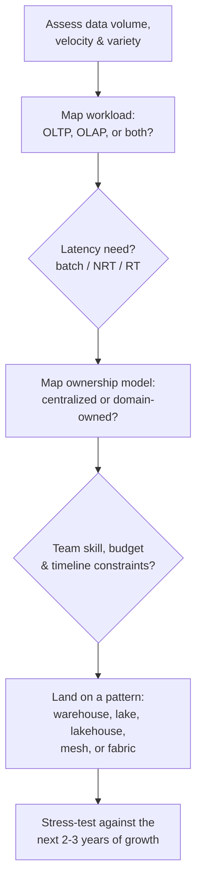

# Choosing an Architecture & the Road to Becoming a Data Architect
{: .no_toc }

*Part 1: Theory & Foundations &middot; Foundations: Bridging from Legacy DW & ETL*

Everything in this group has been building toward a single moment an architect faces repeatedly: a stakeholder describes a business problem, and the job is to turn it into a specific, defensible architecture choice — not recite the options. [Migrating a Legacy Warehouse to the Cloud](08-migrating-legacy-warehouse-to-cloud/) covered how to move an existing system; this closing topic covers how to choose the *right* system in the first place, and what it actually takes to grow into the person a business trusts to make that call.

## A step-by-step guide to choosing an architecture

Choosing an architecture is a sequence of questions answered in order, not a single decision made all at once — each answer narrows the field before the next question is even worth asking:

**Volume, velocity, and variety** come first because they eliminate options fast — a few gigabytes of well-structured transactional data rarely justifies a lake or a mesh, while multi-terabyte, semi-structured, multi-source data usually rules a plain warehouse out. **Workload shape** (the **OLTP** vs **OLAP** split from earlier in this group) and **latency need** (batch, **NRT**, or **RT**, from the previous topic) narrow it further. **Ownership model** asks whether one team can reasonably own this data end to end (favoring a centralized warehouse or lakehouse) or whether multiple domains each need to own their own data as a product (favoring a **data mesh** or **data fabric** — patterns the next group covers in depth). Only after those are answered does **team skill, budget, and timeline** get to act as a tiebreaker — the best architecture on paper that the team can't build or operate is the wrong architecture in practice. The last step matters as much as the first: a design that fits today's volume but not next year's growth just moves the same decision to a more painful, higher-stakes future date.

{: .important }
> Resist picking the architecture pattern first and reverse-engineering requirements to justify it — it's a natural bias (everyone has a favorite pattern from their last job) and it's exactly backwards. Every pattern in this course exists because it fits a specific combination of the questions above; none of them is a default.

## The road to becoming a data architect

The move from data engineer to data architect is less about learning new tools and more about a shift in what you're responsible for: an engineer is judged on whether a given pipeline runs correctly, while an architect is judged on whether the *right pipeline was designed at all* — and increasingly, on whether they can explain that choice to people who don't write SQL. Four things build that judgment over time:

- **Depth across the full stack**: not just modeling and pipelines but storage economics, security, orchestration, and cost — the topics the rest of this course works through in sequence, because an architect who's only strong in one layer will design blind spots into the others.
- **Deliberate exposure to trade-offs, not just successes**: sitting in on migrations, cost reviews, and incident retrospectives teaches what actually breaks in production in a way that only ever shipping green-field projects doesn't.
- **Communication with non-engineers**: an architecture decision that can't survive a five-minute explanation to a CFO or a compliance officer isn't finished — it's a technically correct answer to a question nobody outside engineering can evaluate, and this course returns to that skill directly once the decision framework is introduced.
- **Formal recognition, where it helps**: certifications like **TOGAF** (enterprise architecture methodology), **CDMP** (data management practice), and cloud-specific architect credentials (AWS Solutions Architect, Azure Solutions Architect Expert) won't substitute for the judgment above, but they signal it to organizations that use them as a hiring or promotion filter, and the study process itself is a reasonable forcing function for filling in whichever of the four areas above is thinnest.

None of this is a checklist to complete once — the architects worth learning from are still doing all four, on every project, years into the role. The topics that follow in this course are organized to build that same depth deliberately: from the architecture patterns worth knowing by name, through the decision framework for choosing among them, into the storage, modeling, ingestion, and operational disciplines that turn a chosen pattern into a platform that survives contact with production.

<!-- prevnext:start -->

---

| [&larr; Previous: Migrating a Legacy Warehouse to the Cloud: Patterns & Pitfalls](08-migrating-legacy-warehouse-to-cloud/) | [Next: Architecture Patterns Deep Dive &rarr;](../02-architecture-patterns-deep-dive/) |
|:---|---:|

<!-- prevnext:end -->
