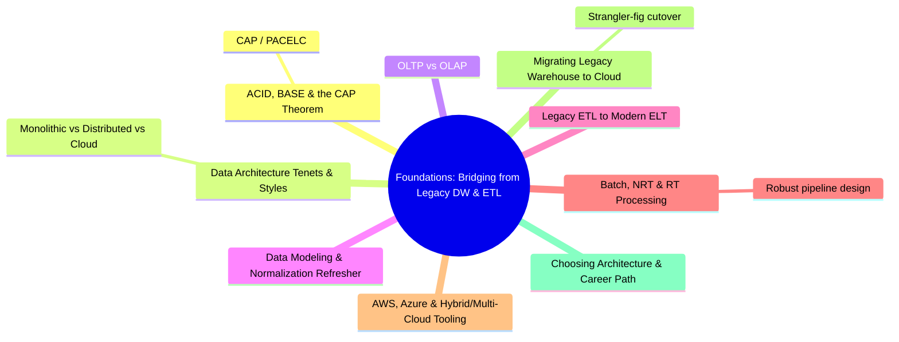

# Foundations: Bridging from Legacy DW & ETL
*Part 1: Theory & Foundations*

Part 1 opens the course here because every later decision in this guide — which architecture pattern to reach for, which table format to bet on, whether a pipeline needs to stream — is a special case of trade-offs this group establishes first: what a consistency guarantee actually promises, what workload you're really building for, and how fast data genuinely needs to move. These nine topics take a reader who already thinks in terms of a warehouse, a nightly ETL job, and a normalized schema, and rebuild that intuition one layer at a time: the physics underneath any data system (ACID/BASE/CAP), the architectural styles and workload types built on top of it, the modeling and pipeline patterns that move data through it, and finally the concrete cloud tooling, migration patterns, and career judgment needed to put it all into practice. By the end of this group, the foundational vocabulary and decision instincts for the rest of the course are in place.

**See also**: [Consistency in Practice: Read-After-Write on Object Storage](../04-storage-and-table-formats/03-consistency-models/) and [Should This Be Streaming At All?](../06-ingestion-and-streaming-decisions/02-should-this-be-streaming-at-all/) build directly on the ACID/BASE/CAP topic in this group; [Deciding Under Uncertainty](../03-architects-decision-framework/01-deciding-under-uncertainty/) extends the migration topic's requirements-and-constraints framing into a full decision model.

## Topics

| # | Topic |
|---|-------|
| 1 | [ACID, BASE & the CAP Theorem: The Physics Underneath Every Data System](01-acid-base-and-cap-theorem/) |
| 2 | [Data Architecture Tenets & Styles: Monolithic, Distributed, Cloud](02-tenets-and-styles/) |
| 3 | [OLTP vs OLAP: Transactional vs Analytical Workloads](03-oltp-vs-olap/) |
| 4 | [Data Modeling, Database Types & Normalization Refresher](04-data-modeling-refresher/) |
| 5 | [From Legacy ETL to Modern ELT: Bridging Talend & Informatica-Style Tools](05-legacy-etl-to-modern-elt/) |
| 6 | [Batch, Near-Real-Time & Real-Time Processing: Building Robust Pipelines](06-batch-realtime-and-robust-pipelines/) |
| 7 | [AWS, Azure & Hybrid/Multi-Cloud Tooling for Data Professionals](07-aws-azure-hybrid-tooling/) |
| 8 | [Migrating a Legacy Warehouse to the Cloud: Patterns & Pitfalls](08-migrating-legacy-warehouse-to-cloud/) |
| 9 | [Choosing an Architecture & the Road to Becoming a Data Architect](09-choosing-architecture-and-career-path/) |

<!-- prevnext:start -->

---

| [&larr; Previous: Home](../) | [Next: ACID, BASE & the CAP Theorem: The Physics Underneath Every Data System &rarr;](01-acid-base-and-cap-theorem/) |
|:---|---:|

<!-- prevnext:end -->
