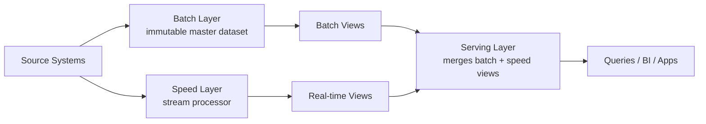

# Lambda Architecture: Batch + Speed Layers
{: .no_toc }

*Part 2: The Architecture Landscape &middot; Architecture Patterns Deep Dive*

An architect who has only ever shipped nightly batch jobs will eventually meet a stakeholder who wants a dashboard that reacts to what just happened, not to what happened last night — and reflexively rebuilding the whole pipeline around low latency is usually the wrong call, because most of that pipeline's value is in a complete, correct answer, not a fast one. This group opens Part 2: The Architecture Landscape, the section of this field guide where the tenets and workload trade-offs from [Choosing an Architecture & the Road to Becoming a Data Architect](../01-foundations/09-choosing-architecture-and-career-path/) turn into named, arguable patterns you can sketch on a whiteboard and defend in a design review. Lambda Architecture is the oldest and most literal of those patterns: rather than choosing between batch correctness and streaming speed, it runs both at once and reconciles them when a query is asked.

## The three layers

Lambda splits the pipeline into three cooperating pieces:

- The **batch layer** holds an immutable, append-only master dataset — every event ever received, never overwritten — and periodically recomputes complete **batch views** by reprocessing that entire history. Because it always recomputes from the original source of truth, any bug in the transformation logic can be fixed simply by fixing the code and reprocessing; the batch layer is the architecture's source of accuracy.
- The **speed layer** processes only the data that has arrived since the last batch cycle finished, using a stream-processing engine to produce **real-time views** that cover the gap. These views are deliberately allowed to be approximate or incomplete — their whole job is freshness, not perfection.
- The **serving layer** merges the batch views and the real-time views at query time, so a consumer gets both the completeness of the batch layer and the freshness of the speed layer in a single answer.

A concrete shape of this on AWS: the batch layer might run as a nightly Spark job on EMR, reading the full event history from S3 and writing batch views into Redshift, while the speed layer runs a Kinesis Data Streams consumer — Spark Structured Streaming or Kinesis Data Analytics — that only tracks events since the last EMR run, writing its real-time views into a low-latency store like DynamoDB. The serving layer is often nothing more than a query-time join — a Lambda function or a BI tool's semantic layer — that reads both stores and adds the numbers together.

## Data flow

Source events fan out to both layers at ingestion time. The batch layer writes to the master dataset and, on its own schedule (hourly, nightly, whatever the workload demands), recomputes batch views over the full history. The speed layer processes the same events immediately, incrementally updating real-time views that only need to cover the window since the last batch run. A query never hits the speed layer or batch layer directly — it goes to the serving layer, which knows how to stitch the two together and hand back one coherent result.



At the serving layer, the merge logic itself is usually simple — the hard part is keeping the batch and speed pipelines producing views that are actually compatible:

```python
# Illustrative pseudocode - not a runnable, dependency-complete script.
def serve(query):
    batch_result = batch_view_store.get(query.key)   # complete, but hours old
    speed_result = speed_view_store.get(query.key)    # partial, but seconds old
    return merge(batch_result, speed_result)           # reconcile the overlap window
```

In practice, the speed layer is almost always **NRT** rather than true **RT**: most stream processors emit updates in micro-batches every few seconds rather than reacting event-by-event, which is a deliberate, cheaper trade-off precisely because the batch layer is guaranteed to correct any staleness within one batch cycle anyway. Whether NRT is even fast enough for a given workload — or whether true RT is unavoidable — is a question worth pinning down on its own terms; see [Should This Be Streaming At All?](../06-ingestion-and-streaming-decisions/02-should-this-be-streaming-at-all/).

## Advantages and challenges

Lambda's fault tolerance comes from the immutable master dataset: because nothing is ever overwritten, a bad deploy or a bug in the transformation logic can always be corrected by fixing the code and replaying history through the batch layer. It also gives you both properties a stakeholder usually wants at once — an authoritative, audited number for yesterday and a live number for right now — without forcing a single system to be good at both. Concretely: if a currency-conversion bug misreported international revenue for three weeks, fixing the transformation code and replaying the master dataset repairs all three weeks in the next batch cycle — the speed layer, which only ever looked at the last few hours, was never wrong in a way that needed a separate fix.

The cost is real, though: the same business logic often has to be implemented twice, once in the batch engine's programming model and once in the streaming engine's, and keeping those two implementations semantically equivalent as requirements change is ongoing engineering work, not a one-time cost. Operating two pipelines instead of one also means twice the infrastructure to monitor, twice the failure modes to reason about, and a serving layer that has to correctly merge outputs from systems that don't share a runtime.

{: .important }
> The classic Lambda gotcha is maintaining equivalent business logic in two different processing paradigms — batch and streaming — well after the initial build. It is the single most common reason teams that start with Lambda eventually migrate toward the stream-only alternative covered next.

Lambda earns its complexity when historical correctness genuinely matters — financial reporting, billing reconciliation, anything an auditor might ask about — and a live view is also a hard requirement, not a nice-to-have. If your organization can't staff two pipelines, or if the workload doesn't actually need sub-minute freshness, that complexity is a cost with no corresponding benefit.

<!-- prevnext:start -->

---

| [&larr; Previous: Architecture Patterns Deep Dive](./) | [Next: Kappa Architecture: Stream-Only Processing &rarr;](02-kappa-architecture/) |
|:---|---:|

<!-- prevnext:end -->
