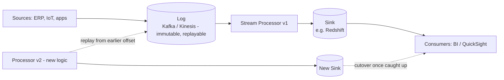

# Kappa Architecture: Stream-Only Processing
{: .no_toc }

*Part 2: The Architecture Landscape &middot; Architecture Patterns Deep Dive*

Once an architect has felt the pain of keeping a batch codebase and a streaming codebase logically equivalent, the natural next question is whether the batch layer is pulling its weight at all — and for pipelines where the source data can be fully replayed on demand, the honest answer is often no. Building on [Lambda Architecture: Batch + Speed Layers](01-lambda-architecture/), Kappa Architecture answers that question directly: keep only the speed layer, and treat every workload — live and historical alike — as a query against a single stream-processing pipeline.

## Log, processor, sink

Kappa collapses Lambda's three layers into three different components that all live in the streaming world:

- The **log** is an immutable, ordered, replayable record of every event (implemented with something like Kafka or Kinesis), retained for as long as the business might ever need to reprocess it. This is the architecture's single source of truth — there is no separate master dataset.
- The **processor** is the stream-processing engine that consumes the log and applies the transformation logic, whether that logic is running against events as they arrive or replaying the log from an earlier offset.
- The **sink** is where processed results land for consumption — a key-value store, a search index, or an analytical store such as a warehouse, or increasingly a lakehouse table format like Delta or Iceberg that a streaming engine can append to directly, which blurs the line between Kappa's sink and the medallion bronze layer covered next in this Part.

A concrete, recognizable shape of this on AWS: events from ERP systems, IoT devices, mobile apps, and social feeds arrive through **Kinesis** (with API Gateway handling request-driven ingress), get processed continuously, land in S3 for durable, replayable storage and in Redshift as the queryable sink, and are then visualized through QuickSight.

Because the processor might reprocess an event after a crash or a deliberate replay, the sink write has to be safe to repeat — the `upsert` in the pseudocode below is doing real architectural work, not just a style choice. Kappa pipelines typically lean on **at-least-once** delivery from the log paired with **idempotent** writes at the sink — a deterministic key plus an upsert, or a windowed dedupe — to get the effect of **exactly-once** results without needing the log itself to guarantee it. Getting this wrong is the most common source of double-counted metrics in a Kappa pipeline: a consumer that increments a running counter instead of overwriting a keyed value will double-count every event replayed after a checkpoint failure.

## Reprocessing means replaying the log

The biggest structural difference from Lambda shows up when something needs to change — a bug fix, a new derived field, a new business rule. In Kappa, you don't patch data in place and you don't rerun a separate batch layer: you deploy a new version of the processor and replay the log, from whatever offset you need, into a new sink. Consumers cut over to the new sink once it catches up to the live stream, and the old sink is retired.

Concretely: suppose a marketing-attribution bug undercounted mobile conversions for four months because the processor was reading the wrong device-ID field. Fixing this in Lambda would mean patching the batch transformation and waiting for the next full recompute, while the speed layer's partial view stays wrong in the meantime. In Kappa there's only one fix, and it's the same fix regardless of how far back the bug goes: patch the processor, stand up processor v2 against a fresh sink, and replay the log from four months back. Because the log is the only copy of history the architecture keeps, that replay is a full reprocessing job, not an incremental patch — for a Kafka topic with months of retention, it can mean hours of compute re-transforming events that were already correct the first time, just to fix the subset that wasn't.



```python
# Illustrative pseudocode - not runnable as-is.
for event in log.subscribe(from_offset=checkpoint):
    result = transform(event)          # same code path for "live" and "replay"
    sink.upsert(result.key, result)
    checkpoint = event.offset
```

## Advantages and challenges

Kappa's appeal is structural simplicity: one codebase, one processing model, one mental map of how data moves, which removes the entire class of bugs that come from batch and streaming logic drifting apart. Operationally, there's also just less to run — no separate batch cluster, no separate scheduling system for recomputation.

The trade-offs move rather than disappear. **Log retention** becomes a real capacity and cost decision: if the business ever needs to reprocess three years of history, the log has to be able to hold — and cheaply replay — three years of history, which is a very different storage bill than a few days of buffering. Replaying at full historical scale can also be slow and resource-intensive, since it means running every event back through the processor rather than reading a pre-aggregated batch view. And workloads that are naturally batch-shaped — complex multi-way joins across large historical datasets, the kind of ad hoc analysis a warehouse's OLAP engine is built for — are often awkward or expensive to express as pure stream operations. A finance team needing a five-year lookback join across a dozen dimension tables for an annual regulatory report is a realistic example of a workload Kappa handles poorly: it's not impossible to express as a stream job, but a batch engine built for exactly this kind of large, one-shot join will usually get there faster and cheaper.

{: .important }
> Kappa's simplicity assumes your log can hold, and affordably replay, as much history as the business will ever need to reprocess. When that horizon is measured in years rather than weeks, the log itself — not the processing logic — becomes the expensive part of the architecture.

Kappa is the right call when the source data is genuinely event-shaped and replayable, and when the organization would rather absorb log-retention costs and occasional slow full replays than maintain two parallel codebases indefinitely.

<!-- prevnext:start -->

---

| [&larr; Previous: Lambda Architecture: Batch + Speed Layers](01-lambda-architecture/) | [Next: Lakehouse Architecture: Unifying Warehouse & Lake &rarr;](03-lakehouse-architecture/) |
|:---|---:|

<!-- prevnext:end -->
