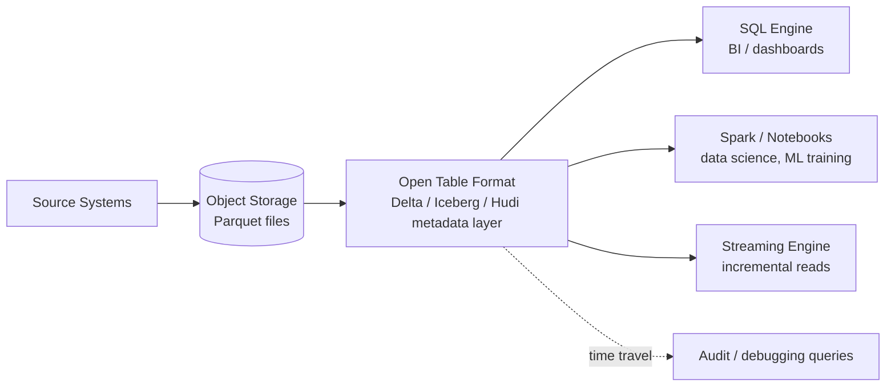

# Lakehouse Architecture: Unifying Warehouse & Lake
{: .no_toc }

*Part 2: The Architecture Landscape &middot; Architecture Patterns Deep Dive*

An architect who has just finished weighing [Kappa Architecture: Stream-Only Processing](02-kappa-architecture/) against Lambda is still implicitly choosing *how* data gets processed — but a second, equally consequential question sits underneath it: where does the processed data actually live, and does that storage layer force you to pick between a warehouse's guarantees and a lake's flexibility? Getting this wrong means either paying warehouse prices to store data nobody queries with BI tools, or watching a lake's schema drift and lack of transactions quietly poison every downstream report. Lakehouse Architecture exists to make that an obsolete trade-off: one storage layer, built on cheap object storage, that behaves like a warehouse when a BI analyst needs it to and like a lake when a data scientist needs it to.

## Two worlds that used to require two systems

For most of the last decade, an organization typically ran two parallel storage stacks. The **data warehouse** — Redshift, Snowflake, Synapse, or their on-prem ancestors — stored structured, schema-enforced data in proprietary formats, gave you **ACID** transactions, fast indexed SQL, and governance tooling, but was expensive to scale and hostile to anything that wasn't a table: JSON blobs, images, model training sets, semi-structured logs. The **data lake** — raw files sitting in **object storage** like S3 or ADLS — was the opposite: cheap, format-agnostic, and infinitely scalable, but with no transactional guarantees, no enforced schema, and a well-earned reputation for turning into a "data swamp" once enough pipelines wrote to it without discipline. A typical shop ran both: a lake for landing and data science, a warehouse for anything a BI dashboard touched, and a constant, expensive ETL job ferrying data from one to the other, with the two versions of "the same" dataset drifting apart between syncs.

## What actually closes the gap: the table format

The lakehouse pattern isn't a new storage medium — it's still Parquet files sitting in the same object storage a lake always used. What changed is a metadata layer sitting on top of those files, known as an open **table format** (Delta Lake, Apache Iceberg, or Apache Hudi are the three that matter). A table format tracks, outside the files themselves, exactly which files constitute the current and historical versions of a table, and it uses that tracking to deliver the properties a warehouse promised but a raw lake never could:

- **ACID transactions** on top of object storage, so concurrent writers don't corrupt a table and a failed job doesn't leave it half-written.
- **Schema enforcement and evolution**, so a pipeline can't silently write a column of the wrong type, but a genuine schema change (adding a column) doesn't require rewriting history.
- **Time travel**, because the metadata layer keeps pointers to every prior version of the table, letting you query "as of" a past snapshot for debugging or audit.
- A **query engine-agnostic** interface — Spark, Trino, Snowflake, and increasingly the warehouses themselves can all read the same underlying table through its format's metadata, instead of each engine owning a private copy.

{: .key-term }
> A **lakehouse** is a data lake (object storage + open file formats like Parquet) plus an open table format that adds warehouse-grade transactions, schema management, and time travel — without moving the bytes into a proprietary system.

## Data flow: one layer, many consumers

Because the lakehouse is genuinely one storage layer rather than two synchronized ones, the data flow looks flatter than the warehouse-plus-lake pattern it replaces: source data lands once, gets curated in place, and every downstream consumer — BI tool, notebook, ML training job — reads from the same tables through whatever engine suits it.

This is the same underlying idea explored in more depth in [Table Formats: Delta vs Iceberg vs Hudi](../04-storage-and-table-formats/02-table-formats-delta-iceberg-hudi/) — that topic covers how the three formats differ in their concurrency model and catalog integration; this one is about the architectural payoff of adopting any of them.

## Advantages and challenges

The headline advantage is eliminating the ETL job that used to exist purely to keep a warehouse's copy in sync with a lake's copy — there's one copy, one source of truth, and BI and data-science workloads read the same governed data instead of two datasets that quietly diverge. Storage cost follows object-storage economics rather than warehouse-proprietary economics, often an order of magnitude cheaper per terabyte, while still supporting the indexed, statistics-driven query performance BI tools expect. It also removes a governance blind spot: because access control and lineage can be applied at the table-format layer, the lake stops being the ungoverned side of the house.

The trade-offs are mostly about maturity and operational discipline rather than a fundamental gap versus a warehouse. Query performance on a lakehouse table still depends on the same file-layout hygiene a raw lake needed — partitioning choices, file sizing, and periodic compaction (small-files problems don't go away just because there's a transaction log on top). Choosing among Delta, Iceberg, and Hudi is itself a real decision with lock-in implications, since each has different engine support and catalog integration. And a lakehouse doesn't remove the need for curation: raw ingested data still needs to be cleaned, conformed, and modeled before a business user should trust it — which is exactly the problem the next topic's layering discipline solves.

{: .important }
> Adopting a table format buys you ACID and time travel, but it does not automatically buy you a well-modeled, trustworthy dataset — that discipline still has to be designed in, typically through the layered curation pattern covered next.

A lakehouse is the right foundation whenever an organization is tired of paying to keep a warehouse and a lake in sync, or needs both governed BI-grade tables and open access for data science against the same data. It's overkill for a shop with a single, small, purely-BI workload that a conventional warehouse already serves cheaply enough — the added table-format layer is a cost you take on for flexibility you have to actually need.

<!-- prevnext:start -->

---

| [&larr; Previous: Kappa Architecture: Stream-Only Processing](02-kappa-architecture/) | [Next: Medallion Architecture: Bronze/Silver/Gold &rarr;](04-medallion-architecture/) |
|:---|---:|

<!-- prevnext:end -->
