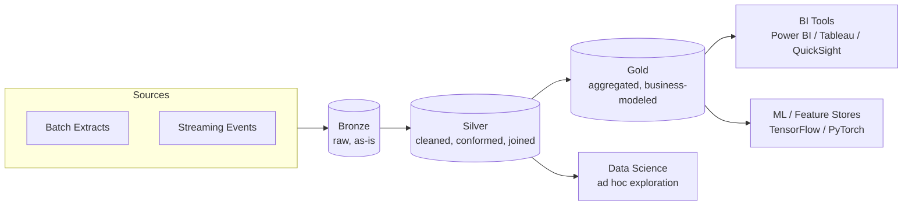

# Medallion Architecture: Bronze/Silver/Gold
{: .no_toc }

*Part 2: The Architecture Landscape &middot; Architecture Patterns Deep Dive*

A lakehouse, as covered in [Lakehouse Architecture: Unifying Warehouse & Lake](03-lakehouse-architecture/), gives you one governed storage layer with warehouse-grade transactions — but it doesn't by itself tell you *where* in that layer raw, messy source data becomes something a business user should actually trust. Without an answer, teams either let raw and curated data sit in the same tables (so nobody can tell what's safe to query) or invent ad hoc naming conventions per project that don't generalize. Medallion Architecture is the answer the industry converged on: a small number of named, progressively-cleaner layers that every pipeline flows through in the same order, so "how trustworthy is this table" becomes a question you can answer just by knowing which layer it's in.

## Bronze, silver, gold

The pattern defines three layers, each with a distinct job:

- **Bronze** holds raw data exactly as it arrived from the source — same schema, same values, typically append-only. Nothing is cleaned, deduplicated, or reshaped here; the entire point of bronze is to be a faithful, replayable copy of the source, so that if a downstream transformation turns out to be wrong, you can always recompute from bronze rather than re-extracting from a source system that may have already moved on. This is the lakehouse's answer to the batch layer's immutable master dataset in Lambda — same idea, different name.
- **Silver** applies cleaning, deduplication, conforming of types and column names, and joins across sources — this is where a raw event stream and a raw CDC feed from an OLTP system start looking like a coherent, validated, queryable dataset. Silver data is trustworthy but still shaped close to how the source systems produced it, not necessarily how the business wants to consume it.
- **Gold** is business-ready: aggregated, dimensionally modeled (**fact** and **dimension** tables, or a wide denormalized table depending on the consuming workload), and organized around a specific use case — a subject-area mart, a metric used in a specific dashboard, a feature table for a model. Gold is what a BI analyst or a downstream application actually queries.

Concretely, a raw order event landing in bronze might carry every field the source API returned — forty-plus columns, including internal flags nobody downstream needs, in whatever types the source happened to use. By silver, that same event is deduplicated on order ID, its timestamps conformed to UTC, and trimmed to the dozen or so validated columns the business actually trusts. By gold, it's been aggregated away entirely into a handful of rows in a daily revenue-by-region fact table with a **grain** of one row per day per region — the shape a dashboard actually queries. Each layer isn't just "more cleaned," it's progressively narrower and more aggregated, which is why gold tables are usually orders of magnitude smaller than bronze even though they represent the same underlying events.

## Data flow and the tools at each stage

Data enters at bronze from both batch and streaming sources, gets progressively refined moving right, and fans out to consumers who each want a different level of refinement.



The layers are typically implemented with the same big-data processing stack you'd use for any large-scale transform — historically MapReduce jobs over HDFS with YARN managing cluster resources, and in current practice **Spark** (or a warehouse's native SQL engine) reading and writing lakehouse tables at each stage. Which engine runs the bronze-to-silver and silver-to-gold transforms is a separate decision from the layering itself; the pattern only prescribes the layers and their ordering, not the compute.

Physically, the three layers are usually three separate schemas or catalogs — a `bronze` database, a `silver` database, a `gold` database — rather than a naming convention layered on top of one flat schema. That separation is what makes the access-control story below actually enforceable: **RBAC** grants on the gold schema can give analysts broad access while the same role has no grant on bronze at all, rather than relying on every analyst remembering not to query raw tables they technically have permission to see.

```python
# Illustrative pseudocode - not a runnable, dependency-complete script.
def bronze_to_silver(bronze_table):
    df = read(bronze_table)
    df = dedupe(df, keys=["source_id", "event_time"])
    df = enforce_schema(df, expected_schema)
    df = conform_types(df)
    write(df, silver_table, mode="merge")

def silver_to_gold(silver_tables, business_logic):
    fact = build_fact(silver_tables, grain="one row per order line")
    dims = build_dimensions(silver_tables)
    write_star_schema(fact, dims, gold_schema)
```

## Advantages and challenges

Medallion's biggest win is that trust becomes legible: anyone in the organization can look at a table's layer and know roughly how much validation it's been through, which turns "can I trust this number" from a Slack question into something the architecture itself answers. It also isolates failure — a bug in a silver transform can be fixed and rerun from bronze without re-extracting from the source system, the same reprocessing guarantee Lambda's batch layer gives you, but without needing a separate streaming codebase to keep in sync. And because each layer is its own set of governed tables, access control naturally tightens as data gets closer to gold — analysts might get gold and curated silver, while raw bronze (which can contain unmasked PII straight from source) stays locked down.

The costs are real, though. Data physically exists three times over (bronze, silver, gold), which means more storage and, if not carefully scheduled, redundant compute reprocessing the same rows at every layer on every run. Latency stacks up too — if gold depends on silver depends on bronze, and each hop runs on its own schedule, the freshest number in a gold table can lag the source by however long the whole chain takes to run, which matters if a stakeholder is expecting NRT freshness. Complex pipelines with many silver-stage joins and gold-stage aggregations also mean more DAG nodes to monitor, more lineage to track, and more places a schema change upstream can break something several hops downstream. In practice, the silver-to-gold transforms are exactly the kind of versioned, tested SQL models covered in [The dbt Paradigm: Transformation as Code, Data Contracts & Idempotent Reprocessing](../07-transformation-and-modern-data-stack/02-dbt-paradigm-contracts-idempotency/) — medallion gives you the layering, dbt (or an equivalent) gives you the discipline to keep each hop's logic testable and reproducible.

{: .important }
> Medallion buys you legible trust and isolated reprocessing, not free freshness — every hop from bronze to gold adds latency, so a genuinely low-latency requirement needs the streaming layering discussed later in this guide, not just a faster gold-layer job.

Reach for medallion layering by default on any lakehouse — it's cheap to adopt, well understood by tooling and hires, and gives every table an unambiguous trust level. The judgment call is how strictly to enforce the boundaries: a small team can sometimes collapse silver and gold for a narrow use case, but skipping bronze entirely (writing cleaned data straight from source) removes your only clean replay point when a transformation bug is discovered weeks later.

<!-- prevnext:start -->

---

| [&larr; Previous: Lakehouse Architecture: Unifying Warehouse & Lake](03-lakehouse-architecture/) | [Next: Data Mesh: Decentralized Domain Ownership &rarr;](05-data-mesh/) |
|:---|---:|

<!-- prevnext:end -->
