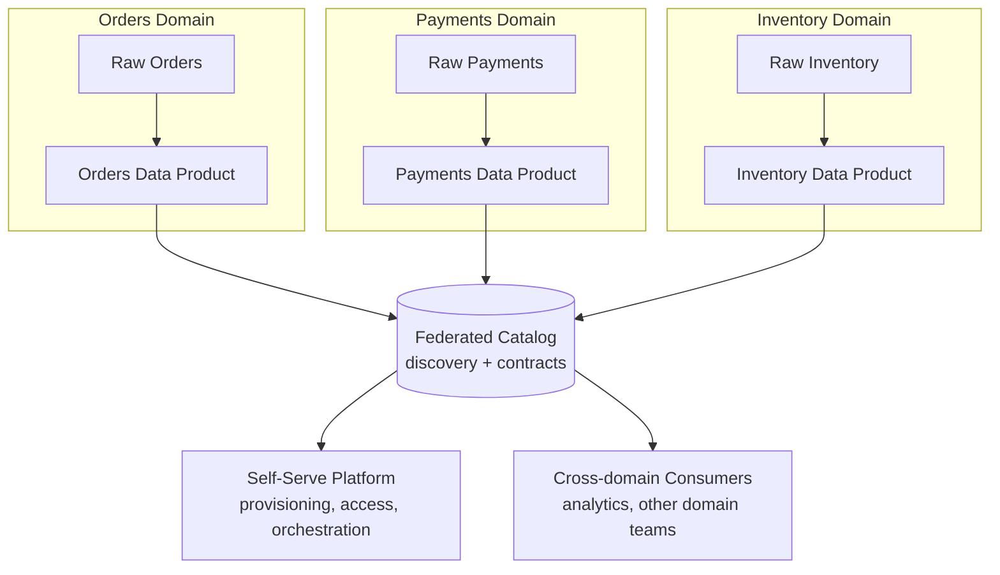

# Data Mesh: Decentralized Domain Ownership
{: .no_toc }

*Part 2: The Architecture Landscape &middot; Architecture Patterns Deep Dive*

[Medallion Architecture: Bronze/Silver/Gold](04-medallion-architecture/) solves how data gets progressively cleaned inside one lakehouse — but it quietly assumes a single team, or at least a single platform group, owns the whole bronze-to-gold pipeline for every domain in the business. That assumption breaks at scale: once you have dozens of source systems and hundreds of gold tables owned by one central data team, that team becomes the bottleneck every other team waits behind, and nobody outside it understands the domain context well enough to know if a "customer" table is actually correct. Data Mesh is the architectural response to that bottleneck — not a new storage technology, but an organizational and technical pattern that pushes data ownership out to the teams who understand the data best.

## Four principles, not four technologies

Data Mesh is defined by four principles that stand or fall together — adopting one without the others tends to fail:

1. **Domain-oriented decentralization**: the teams that own a business domain (orders, payments, inventory) own the pipelines and tables for that domain end-to-end, the same way they'd own a microservice, instead of handing raw data to a central team and waiting for it to come back curated.
2. **Data as a product**: each domain team publishes its output as a **data product** — a table or API with a defined schema, documented SLAs for freshness and quality, ownership, and discoverability — treated with the same seriousness as a public API, not a byproduct of an internal ETL job.
3. **Self-serve data infrastructure**: a central platform team still exists, but its job shifts from building pipelines to building the paved-road tooling (provisioning, orchestration, catalog registration, access control) that lets domain teams build and publish their own data products without needing platform-team expertise for every table.
4. **Federated computational governance**: global standards — schema conventions, PII handling, interoperability rules — are still enforced centrally, but domain teams participate in setting them and are responsible for complying, rather than a central team gatekeeping every change.

{: .key-term }
> A **data product** is a domain team's data output packaged with an explicit contract — schema, freshness SLA, ownership, and access path — discoverable by any other team without a support ticket. It's the mesh's unit of ownership, the way a **fact table** is dimensional modeling's unit of grain.

## What the data flow looks like decentralized

Where a medallion pipeline is one pipeline with one owner, a mesh redraws the same bronze-to-gold journey per domain, with a thin, centrally-governed layer connecting the domains rather than a central team running all of them.

## Advantages and challenges

The payoff is organizational speed: domain teams no longer wait in a central backlog to get a table modeled or a pipeline fixed, and because they own the domain, their data products tend to be more accurate — nobody understands what "returned" means for an order line item better than the order-management team itself. Mesh also scales better than a central-team bottleneck as the number of domains grows, since ownership grows headcount-for-headcount with the business rather than piling onto one team.

The costs are mostly organizational, and they're the reason mesh has a well-earned reputation for failing when adopted for the wrong reasons. Standing up genuine self-serve infrastructure is a significant, ongoing platform-engineering investment — without it, "decentralization" just means every domain team reinventing its own half-working pipeline tooling. Federated governance requires real cross-team discipline; without agreed schema and interoperability conventions, a mesh degenerates into dozens of incompatible data products that are each individually well-run but collectively ungovernable — sometimes called "the mesh that became a mess." And smaller organizations often don't have enough distinct domains, or enough engineering capacity per domain, to justify the coordination overhead at all.

{: .important }
> Data Mesh trades a central bottleneck for coordination overhead — it only pays off once you have enough independent domains, and enough platform investment in self-serve tooling, that decentralized ownership is actually faster than a well-run central team. Adopting the organizational principle without the platform investment is the most common way mesh initiatives fail.

Choose mesh over a centrally-owned warehouse or lakehouse when domain complexity and organizational size have outgrown what one team can curate — dozens of source systems, teams with real domain expertise a central team can't replicate, and executive appetite to fund a genuine self-serve platform. A single team serving a handful of domains is almost always better served staying centralized with medallion layering; mesh is a scale-driven decision, not a default.

<!-- prevnext:start -->

---

| [&larr; Previous: Medallion Architecture: Bronze/Silver/Gold](04-medallion-architecture/) | [Next: Data Fabric: Metadata-Driven Integration &rarr;](06-data-fabric/) |
|:---|---:|

<!-- prevnext:end -->
