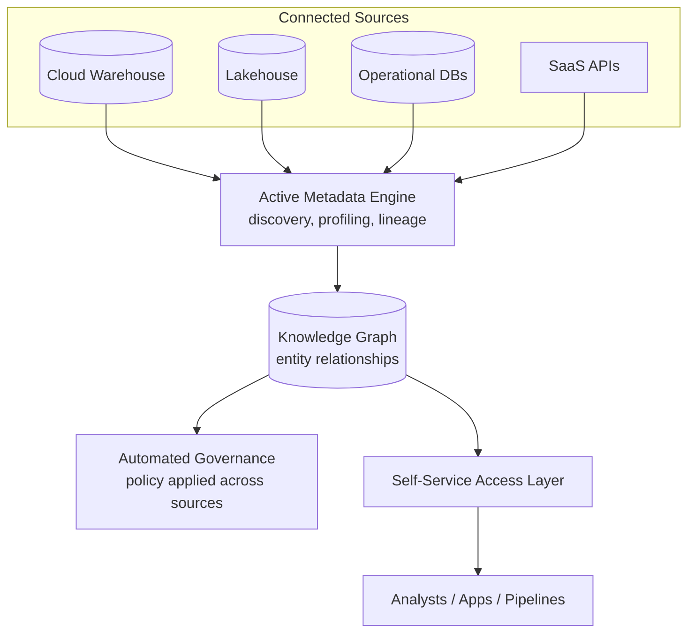

# Data Fabric: Metadata-Driven Integration
{: .no_toc }

*Part 2: The Architecture Landscape &middot; Architecture Patterns Deep Dive*

[Data Mesh: Decentralized Domain Ownership](05-data-mesh/) solves the ownership bottleneck by pushing data products out to domain teams — but it leaves an architect with a new problem: how does anyone, or anything, actually discover and connect to dozens of independently-owned data products scattered across clouds, warehouses, and lakehouses without hand-rolling integration for every pair of systems? Wiring that by hand doesn't scale past a handful of domains, and it's the reason large enterprises with genuinely heterogeneous estates — an on-prem mainframe here, an AWS lakehouse there, a SaaS CRM's API somewhere else — often reach for Data Fabric instead of, or alongside, mesh. Where mesh is primarily an organizational answer (who owns the data), fabric is primarily a technical one (how systems find and connect to each other) built around one idea: let **metadata** do the integration work that used to require custom point-to-point pipelines.

## Active metadata as the connective tissue

A data fabric is a layer of software sitting across an organization's existing data stores — it doesn't replace the warehouse, lakehouse, or operational databases underneath it, it sits over them. What makes it a fabric rather than just another catalog is that its metadata is **active**: instead of a human maintaining a static wiki of where data lives, the fabric continuously scans connected systems, automatically discovers schemas, profiles data quality, infers relationships between datasets (often represented as a knowledge graph — "this `customer_id` column is the same entity as that one, three systems over"), and uses all of that to power automated integration, access control, and recommendation. A data catalog is a component of a fabric, not a synonym for it: the catalog tells you what exists, the fabric acts on what it learns.

## How it actually works

The fabric's job, end to end, is to turn "find and connect to the right data" from an engineering task into something closer to a search query:

1. **Discovery and profiling**: connectors continuously crawl every registered source — cloud warehouses, lakehouses, operational databases, SaaS APIs — extracting schema, statistics, and lineage without requiring each source team to manually register anything.
2. **Knowledge graph construction**: the fabric links related entities across systems (the same customer, the same product SKU) even when they live in differently-structured tables with different column names, using metadata similarity and lineage rather than a human-maintained mapping.
3. **Automated policy application**: access rules, masking, and retention policies are attached to entities in the graph once and applied everywhere that entity appears, instead of being reconfigured per system.
4. **Self-service delivery**: a consumer — analyst, application, or another pipeline — queries the fabric's semantic layer and gets routed to the right underlying system, often without needing to know which system actually holds the data.

## A worked example

Picture a global retailer that grew by acquisition: a cloud warehouse for corporate BI, an on-prem Oracle ERP inherited from a merger, a Kafka-fed lakehouse for clickstream, and a SaaS CRM whose only interface is a REST API. A new fraud-analytics team needs to join "customer" across all four — but the ERP calls it `cust_no`, the CRM calls it `account_id`, and the warehouse calls it `customer_key`, with no shared identifier documented anywhere. Without a fabric, someone has to manually trace that mapping, usually by interviewing whoever's been at the company longest. With a fabric in place, the metadata engine has already profiled all four sources, noticed the overlapping value distributions and referential patterns between `cust_no`, `account_id`, and `customer_key`, and represented them as the same entity in the knowledge graph — so the fraud team's query against "customer" resolves across all four systems automatically, with the fabric's governance layer applying the same masking rule to whichever column holds the customer's national ID in each source.

## Advantages and challenges

The core advantage is integration that scales sub-linearly with the number of connected systems: adding a new source means registering one connector, not building a bespoke pipeline to every system that might need its data, because the fabric's metadata layer already knows how to relate a new entity to what it's already discovered. Governance becomes centrally enforceable even across a genuinely heterogeneous, multi-cloud estate, since policy lives on the knowledge graph rather than being reimplemented per system. And because discovery is automated rather than manually documented, a fabric tends to stay accurate as the underlying estate changes — a manually-maintained catalog rots the moment someone forgets to update it; an active-metadata fabric re-scans.

The challenges are substantial and mostly about maturity and trust in automation. Building or buying a fabric with genuinely reliable automated relationship-inference is a hard, still-evolving engineering problem — false or missed entity matches in the knowledge graph propagate into wrong access decisions or wrong "same data" assumptions downstream, which is a governance risk, not just an inconvenience. Fabric platforms also tend to be expensive, vendor-heavy investments (this is squarely where major platform vendors compete), and the fabric itself becomes a new piece of critical infrastructure that needs its own reliability and security posture. And a fabric doesn't remove the need for well-modeled data at the source — it makes messy source systems more discoverable, not less messy.

{: .important }
> A data fabric automates *discovery and connection*, not data quality or modeling — pointing an active-metadata engine at a poorly governed estate makes bad data easier to find, not more trustworthy. Fabric and mesh solve different halves of the same problem and are increasingly deployed together: mesh for domain ownership and data-product contracts, fabric for the cross-system discovery and policy enforcement that make those contracts usable enterprise-wide.

Fabric earns its cost in large, genuinely heterogeneous enterprises — multiple clouds, legacy systems that predate the current platform, dozens of source systems no single team fully understands — where hand-built point-to-point integration has already become unmanageable. It's a poor fit for a smaller shop with a handful of systems and one platform team, where a conventional catalog and a few well-documented integration pipelines solve the same problem at a fraction of the cost and complexity.

<!-- prevnext:start -->

---

| [&larr; Previous: Data Mesh: Decentralized Domain Ownership](05-data-mesh/) | [Next: Choosing Among the Patterns: Comparison & Decision Guide &rarr;](07-choosing-among-five-patterns/) |
|:---|---:|

<!-- prevnext:end -->
