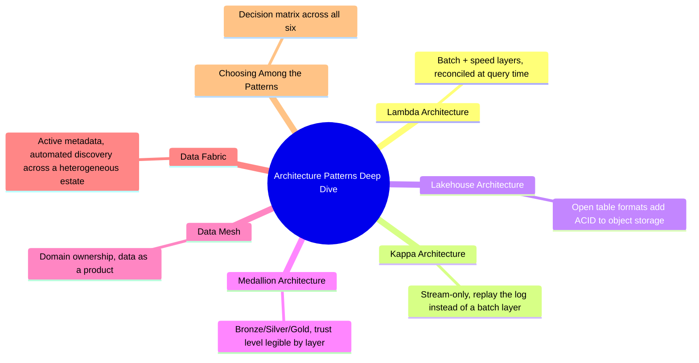

# Architecture Patterns Deep Dive
*Part 2: The Architecture Landscape*

Part 1 built the vocabulary and physics an architect reasons with — ACID and CAP, OLTP vs OLAP, batch vs NRT vs RT. Part 2 turns that vocabulary into named, arguable shapes: the six patterns in this group are the actual whiteboard sketches an architect defends in a design review, each one a specific bet about how to reconcile latency, storage economics, curation, and ownership. Taken together, the seven topics here aren't seven independent tools to memorize — they form a landscape with real structure: two answer *how data gets processed* (Lambda, Kappa), two answer *how it's stored and curated* (Lakehouse, Medallion), two answer *who owns it and how it's found* (Data Mesh, Data Fabric), and the closing topic shows how those three axes combine into one real system rather than a single pick from a menu.

**See also**: [Lakehouse Architecture: Unifying Warehouse & Lake](03-lakehouse-architecture/) connects to [Table Formats: Delta vs Iceberg vs Hudi](../04-storage-and-table-formats/02-table-formats-delta-iceberg-hudi/) in the Storage & Table Formats group, which goes deeper on how Delta, Iceberg, and Hudi differ.

## Topics

| # | Topic |
|---|-------|
| 1 | [Lambda Architecture: Batch + Speed Layers](01-lambda-architecture/) |
| 2 | [Kappa Architecture: Stream-Only Processing](02-kappa-architecture/) |
| 3 | [Lakehouse Architecture: Unifying Warehouse & Lake](03-lakehouse-architecture/) |
| 4 | [Medallion Architecture: Bronze/Silver/Gold](04-medallion-architecture/) |
| 5 | [Data Mesh: Decentralized Domain Ownership](05-data-mesh/) |
| 6 | [Data Fabric: Metadata-Driven Integration](06-data-fabric/) |
| 7 | [Choosing Among the Patterns: Comparison & Decision Guide](07-choosing-among-five-patterns/) |

<!-- prevnext:start -->

---

| [&larr; Previous: Choosing an Architecture & the Road to Becoming a Data Architect](../01-foundations/09-choosing-architecture-and-career-path/) | [Next: Lambda Architecture: Batch + Speed Layers &rarr;](01-lambda-architecture/) |
|:---|---:|

<!-- prevnext:end -->
