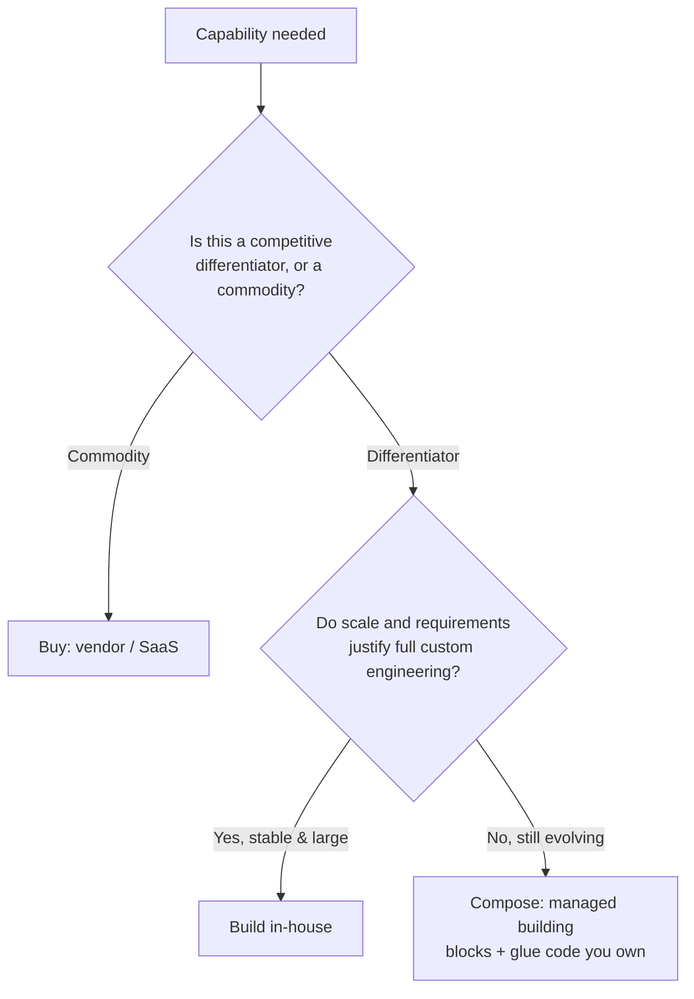

# Deciding Under Uncertainty: Requirements, Constraints & Build vs Buy vs Compose
{: .no_toc }

*Part 2: The Architecture Landscape &middot; The Architect's Decision Framework*

An architect who has just finished mapping six named patterns can still freeze the first time a stakeholder asks "which one should we build, and by when" — because recognizing a pattern on a landscape and committing a real team, budget, and timeline to it are two different skills, and only the second one is the actual job. [Architecture Patterns Deep Dive](../02-architecture-patterns-deep-dive/) supplied the vocabulary of what's possible; this topic, opening **The Architect's Decision Framework**, supplies the discipline for choosing among those possibilities before every fact is in — because waiting for every fact is itself a decision, and usually the wrong one.

## The architect's job: deciding under uncertainty

A data engineer is judged on whether a pipeline runs correctly against a spec someone else wrote. An architect is judged on whether the spec was the right one to write — and that judgment almost always has to happen before requirements are fully known, vendor pricing is finalized, or the team has proven it can operate the thing being proposed. Waiting for certainty isn't the safe option it feels like: every week spent gathering more information is a week the business isn't getting the system, and stakeholder patience doesn't pause while you wait.

The tool that makes deciding under uncertainty tractable, rather than reckless, is sorting every decision by how expensive it is to reverse. A **two-way door** decision is one you can walk back with a bounded, tolerable cost — swapping an orchestration tool, adjusting a partitioning scheme, trying a new file format on one table. Make these fast, on the best available evidence, and let production usage tell you if you were wrong. A **one-way door** decision is expensive or effectively impossible to reverse once acted on — committing to a primary cloud provider, adopting a table format across dozens of pipelines, reorganizing a platform team around data mesh. These deserve genuinely slower deliberation, wider input, and a written record of *why* — an **ADR** (architecture decision record, covered in full later in this course) — because the cost of being wrong compounds for years, not weeks.

{: .important }
> Sorting a decision correctly before you analyze it matters more than the analysis itself. Spending a one-way door's worth of diligence on a two-way door burns the one resource an architect can't get back — time the team could have spent learning from a real, running system — while rushing a genuine one-way door treats a multi-year commitment like a config change.

## Reading the real problem: requirements and constraints

Stakeholders describe symptoms and wants, not requirements — "we need this in real time," "the board wants AI," "the dashboard is too slow" — and turning that into an architecture decision starts with diagnosing which constraints are actually **binding**, meaning which ones genuinely limit the solution space, versus which ones are assumptions nobody has actually tested. Five constraints do almost all of the narrowing work:

- **Latency**: what does "real time" actually mean to this stakeholder, in seconds — it often turns out to mean a dashboard that's a few minutes fresher than today, not sub-second streaming, a distinction this course returns to directly when it asks whether streaming is worth its complexity tax at all.
- **Cost**: is there a number, or a range, and is it capex (a platform team's headcount) or opex (a per-query cloud bill) — the two aren't interchangeable even when the totals look similar on paper.
- **Compliance**: does the data touch a regulated category — PII, PCI, healthcare records — that mandates specific controls, retention limits, or data-residency rules, independent of what's technically simplest to build.
- **Skills**: what can the current team actually build and operate at 2 a.m., not what a conference talk made look easy — a team fluent in SQL and a legacy ETL tool is a different starting point than a team that already runs Kafka in production.
- **Timeline**: what's the actual deadline, and is it a hard external date (a regulatory cutover) or a soft internal one that can flex if the alternative is a rushed, brittle build.

Take a concrete request: a marketing VP asks for "a real-time customer 360." Read literally, that's an underspecified wish. Read as constraints, it resolves to: latency where "updated within the hour" is fine, a cost ceiling set by an already-approved BI budget, no new PII obligations since the data already lives in the CRM, a team fluent in SQL and Python but not stream processing, and a deadline tied to a campaign launch eight weeks out. That combination points toward a scheduled batch or micro-batch pipeline into the existing warehouse — not the streaming build the phrase "real-time" implied.

## Build vs. buy vs. compose: the core decision framework

Once the constraints are diagnosed, most architecture decisions reduce to one recurring question: should this capability be **built** in-house from primitives, **bought** as a vendor product or SaaS that does the whole job, or **composed** from managed and open-source building blocks stitched together with glue code your own team owns? **Compose** has become the modern data stack's default — a best-of-breed ingestion tool, warehouse, and transformation layer, each independently swappable — precisely because it sits between the other two rather than forcing an all-or-nothing choice, a pattern the next topic traces back to its roots.

**Buy** wins when the capability is a commodity — nobody earns a competitive advantage hand-rolling a better CDC connector than a vendor who has already solved it for a thousand customers. **Build** wins when the capability is a genuine differentiator, requirements are stable enough to justify the investment, and scale is large enough that a vendor's per-unit pricing would cost more than a team's salary. **Compose** wins in the much larger middle: requirements are still shifting, no single vendor covers the whole problem well, and the team wants to swap any one piece later without re-architecting everything — the price is that your team now owns the integration glue and the operational burden of more moving parts, even though no single part is fully custom.

## Speaking to power: the CFO, CISO, and CTO conversation

The same build-vs-buy-vs-compose decision has to be pitched three different ways to survive a real budget conversation, because a **CFO**, a **CISO**, and a **CTO** are each optimizing for a different variable, and a pitch tuned for only one of them reads as tone-deaf to the other two. The CFO wants total cost of ownership over a real time horizon, not just the license or cloud bill. The CISO wants to know who has access to the data, where it physically lives, and what happens in a breach or an audit — a buy decision that hands customer data to a vendor is a different risk conversation than a build decision that keeps everything inside your own network boundary. The CTO wants to know what this does to team velocity and on-call load a year out — five composed tools mean five new 3 a.m. failure modes, while one bought platform can free the team for work a vendor can't do.

A decision that can only be justified to one of the three isn't ready for a room with all three in it. Translating the same call into a cost sentence, a risk sentence, and a velocity sentence — worked out before the meeting, not improvised during it — is what separates an architect's pitch from an engineer's status update, a skill this course returns to once the reference architecture and mental-model topics later in this group are in place.

<!-- prevnext:start -->

---

| [&larr; Previous: The Architect's Decision Framework](./) | [Next: The Evolution of Data Architecture: Warehouse to Lake to Lakehouse to Mesh/Fabric &rarr;](02-evolution-of-data-architecture/) |
|:---|---:|

<!-- prevnext:end -->
