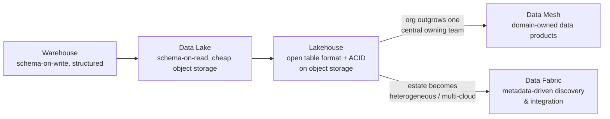

# The Evolution of Data Architecture: Warehouse to Lake to Lakehouse to Mesh/Fabric
{: .no_toc }

*Part 2: The Architecture Landscape &middot; The Architect's Decision Framework*

Knowing how to sort a decision by reversibility and diagnose the real constraints behind a request — [Deciding Under Uncertainty](01-deciding-under-uncertainty/) — is only half the job, because the "right" architecture keeps changing out from under you even when nobody made a mistake along the way. A build/buy/compose call made correctly for today's constraints can become the wrong call in three years simply because the constraints themselves moved. This topic traces the shape of that movement: the same handful of forces that pushed data platforms from **warehouse** to **lake** to **lakehouse**, and separately toward **data mesh** and **data fabric**, so that "why did we move off our old warehouse" and "why might we move off what we have right now" become the same, answerable question.

## Why architectures keep changing (and why yours will too)

Architectures don't change because a pattern goes out of fashion — they change because the constraints that made the previous choice correct stop holding. Three forces do most of the pushing: **data volume, velocity, and variety** grow past what the original design assumed (a warehouse sized for structured sales data starts choking on clickstream and IoT feeds); **workload diversity** expands beyond what one storage shape serves well (a system built purely for BI dashboards now also has to feed a machine-learning training pipeline); and **organizational scale** outgrows what a single central team can own with genuine domain expertise (ten data-literate teams can each know their own data better than one team knows all ten). None of these forces is a mistake by the original architect — they're evidence the business succeeded enough to outgrow its own platform, which is a good problem to have and a real one to design for, and a very different failure mode from simply picking the wrong pattern on day one.

It also means the direction of travel is rarely a straight line. A platform can hit the workload-diversity force well before it hits the organizational-scale one, or the reverse — a company might diversify into machine learning workloads for years on a small, centralized team before it ever has enough independent domains to justify a mesh. Reading which force is actually pressing on your platform *right now*, rather than assuming they arrive in the textbook order below, is what keeps this from becoming a checklist to march through on a schedule.

## Warehouse to lake to lakehouse: the centralized lineage

The first lineage keeps ownership centralized and evolves the storage layer underneath it. The **warehouse** came first: schema-on-write, structured, tuned for **OLAP** queries, and effective right up until the business needed to store unstructured or semi-structured data — logs, JSON events, images — that didn't fit a predefined schema and wasn't worth the engineering cost of forcing it to. The **data lake** answered that by flipping to schema-on-read on cheap object storage, accepting almost anything, but lost the transactional guarantees and governance a warehouse took for granted — enough lakes turned into ungoverned "data swamps" that the industry needed another fix. The **lakehouse** is that fix: cheap object storage underneath, with an open table format restoring ACID transactions, schema enforcement, and time travel on top, covered in full in [Lakehouse Architecture](../02-architecture-patterns-deep-dive/03-lakehouse-architecture/) from the previous group. Each step in this lineage kept the same basic assumption — one team, one platform, one place data lives — and improved what that platform could store and guarantee.

## Mesh and fabric: the decentralized lineage

The second lineage doesn't touch storage technology at all — it questions the centralized-ownership assumption itself. Once an organization has enough domains, each with real data expertise, a single central team curating everyone's data becomes the bottleneck, not the storage format. **Data mesh** answers the *ownership* half of that problem: domains own their data as a product, publish it through a self-serve platform, and comply with federated governance standards instead of waiting on a central team's backlog, covered in [Data Mesh](../02-architecture-patterns-deep-dive/05-data-mesh/). **Data fabric** answers a related but distinct *discovery and integration* problem: in a technically heterogeneous, often multi-cloud estate, active metadata automates finding and connecting datasets regardless of who owns them, covered in [Data Fabric](../02-architecture-patterns-deep-dive/06-data-fabric/). Mesh and fabric are orthogonal to the warehouse-lake-lakehouse lineage, not a replacement for it — a mesh domain still has to choose a storage layer for its own data products, and today that's usually a lakehouse. They're also orthogonal to a third axis this lineage doesn't touch at all: processing topology and curation layering. Whether a given domain (or a centralized platform) runs [Lambda](../02-architecture-patterns-deep-dive/01-lambda-architecture/) or [Kappa](../02-architecture-patterns-deep-dive/02-kappa-architecture/) processing, and whether it organizes its lakehouse with [medallion](../02-architecture-patterns-deep-dive/04-medallion-architecture/) layering, is a separate set of choices layered on top of wherever a platform sits in the storage and ownership evolution — a mesh domain still picks Lambda vs. Kappa for its own pipeline, and a centralized lakehouse still needs bronze-to-gold layering regardless of how it got there.

## The modern data stack and the build-vs-buy-vs-compose question

The "modern data stack" — a cloud warehouse or lakehouse, a managed ingestion tool, **dbt**-style transformation, an orchestrator, and a BI layer, mostly bought or composed rather than built — is itself a product of this same evolution. Each layer became cheap, well-documented, and modular enough on its own that **compose** became the default answer to the build-vs-buy-vs-compose question from the previous topic, where a decade earlier building most of this in-house was the only option. That shift is *why* compose dominates today's platforms far more than it did in the Talend/Informatica-and-on-prem-warehouse era: the building blocks worth composing simply didn't exist yet.

## Which pattern wins when: synthesis and the thesis

None of this is a one-time choice — most organizations pass through several stages of this lineage as they scale, and the architect's job is recognizing when the current stage's constraints have genuinely changed, not when a newer pattern is merely getting attention at a conference. A rough scorecard: a small team with one domain and mostly BI workloads belongs on a centralized warehouse or lakehouse, full stop. A growing company whose workload diversifies into ML or near-real-time use cases stays centralized but adds a lakehouse's flexibility and, where the latency truly demands it, the streaming patterns the next groups cover. A large enterprise with dozens of genuinely independent domains and a funded platform team is where mesh starts paying for itself. A sprawling, multi-cloud, legacy-plus-modern estate where simply *finding* the right dataset is the bottleneck is where a fabric-style discovery layer earns its keep, regardless of which ownership model sits underneath it.

{: .important }
> An architecture that's wrong for your company in three years is not evidence you designed it wrong today — it's evidence your company changed. Re-litigating a warehouse decision against requirements it was never asked to meet is a different exercise from admitting the original decision was flawed, and confusing the two leads to architecture chosen by trend instead of by trajectory.

<!-- prevnext:start -->

---

| [&larr; Previous: Deciding Under Uncertainty: Requirements, Constraints & Build vs Buy vs Compose](01-deciding-under-uncertainty/) | [Next: The Reference Architecture: Source to Ingest to Store to Transform to Serve to Consume &rarr;](03-reference-architecture/) |
|:---|---:|

<!-- prevnext:end -->
