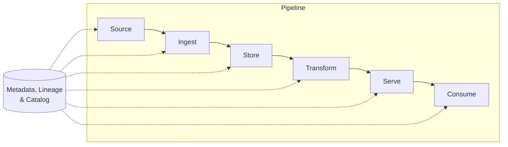

# The Reference Architecture: Source to Ingest to Store to Transform to Serve to Consume
{: .no_toc }

*Part 2: The Architecture Landscape &middot; The Architect's Decision Framework*

Every pattern and lineage from the last two topics — Lambda vs. Kappa, warehouse vs. lakehouse, centralized vs. mesh — is a different answer to the same underlying six-part question, and an architect who can't draw that shared skeleton from memory in a design review or an interview hasn't actually internalized any of those patterns, only memorized their names. [The Evolution of Data Architecture](02-evolution-of-data-architecture/) showed why the pattern changes over time; this topic gives you the one diagram every one of those patterns is a variation of, so you can place any architecture — past, present, or proposed — onto it in seconds.

## The canonical layers: Source, Ingest, Store, Transform, Serve, Consume

Strip any data platform down to its essentials and it reduces to six stages, in this order, regardless of which pattern from the previous group implements them:

- **Source**: the systems of record data originates from — OLTP databases, SaaS APIs, event producers, flat files, IoT devices — none of which exist to make your platform's life easy.
- **Ingest**: how data actually moves from source into the platform: batch, incremental, or **CDC**, covered in depth in this course's Ingestion & Streaming Decisions group.
- **Store**: the durable landing layer everything else sits on top of — object storage plus a table format and partitioning scheme, the subject of the Storage & Table Formats group.
- **Transform**: turning landed data into something trustworthy and query-shaped, usually through **ELT** and **medallion** bronze-to-gold layering, covered in Transformation & the Modern Data Stack.
- **Serve**: the layer that exposes transformed data to consumers — a semantic layer, BI tool, reverse ETL sync, or data API — covered under Serving, Reliability & the Mesh Operating Model.
- **Consume**: the actual humans, dashboards, applications, or ML/AI models using the output, which is where the platform's value either gets realized or doesn't.

The dotted **metadata bar** running underneath all six boxes isn't decorative — lineage, cataloging, and governance touch every stage, and a platform that only thinks about metadata at the end (a catalog bolted on after the fact) is why lineage gaps and undocumented tables happen in the first place. It's also the piece newcomers to this diagram most often forget to draw, precisely because none of the six boxes seem to "belong" to it — which is exactly why it deserves its own line rather than a note squeezed into one of the boxes.

## Drawing it from memory: the whiteboard exercise as a skill

Being able to reproduce this diagram cold, under the mild pressure of a design review or an interview, is a real and trainable skill, not a formality. A reliable five-step draw order:

1. Draw the six boxes left to right first, before labeling anything — committing to the skeleton before the detail keeps you from getting stuck mid-drawing.
2. Label each box with the source types, storage layer, and tools *this specific company* actually has — a generic diagram convinces no one; a specific one shows you did the diagnosis from the previous topic.
3. Add the metadata bar spanning all six boxes, because a diagram missing it invites the first hard question in the room: "how do we know what broke when something breaks?"
4. Mark where batch and stream paths diverge — usually at Ingest, and again at Transform if the architecture is Lambda-style — since a single line from Source to Consume implies a simplicity the real system rarely has.
5. Annotate each box with the one or two decisions that live there (file format at Store, SCD strategy at Transform, semantic-layer tool at Serve) — this is what turns a shape into an actual architecture proposal.

## The same diagram, monolith vs. mesh: redraw it decentralized

A centralized architecture draws this diagram exactly once: one Source-to-Consume chain, owned end to end by one platform team, with one metadata bar underneath it. A **data mesh** doesn't discard the six boxes — it repeats them. Each domain draws its own Source-to-Consume chain for its own data products: a sales domain owns its sources, ingestion, storage, transformation, and serving surface; a fulfillment domain owns a separate, parallel chain for its own data. What changes isn't the skeleton, it's the cardinality and what spans it — instead of one metadata bar owned by one team, a shared self-serve platform provides common tooling across every domain's chain, and federated governance standards (not a single team's sign-off) keep the domains interoperable.

This is also the fastest way to catch a common misconception before it costs anyone a rebuild: a data mesh is not "no architecture," and it's not a single, bigger diagram either — it's the same small diagram, drawn once per domain, with the ownership boundary moved from one team to several. An architect asked to sketch a mesh design who instead draws one giant undifferentiated blob of boxes hasn't actually understood the decentralization; they've drawn a centralized architecture with extra labels. Redrawing the same six boxes as several parallel chains under a shared platform bar is the fastest way to explain what mesh actually changes about an architecture, and what it deliberately leaves alone.

## Where each layer's decisions live: the course as one diagram

Because this diagram is the skeleton the rest of this course hangs off of, it's worth mapping explicitly which group covers which box's decisions — a useful reference the next time you're deciding what to study next or where a gap in your own platform actually lives:

| Layer | Key decisions made here | Covered in |
|---|---|---|
| Source | OLTP vs. OLAP shape, structured vs. semi-structured origin | Foundations |
| Ingest | Batch vs. incremental vs. CDC, batch vs. NRT vs. RT | Ingestion & Streaming Decisions |
| Store | Object storage, file format, table format, partitioning | Storage & Table Formats |
| Transform | ETL vs. ELT, medallion layering, data contracts, idempotency | Transformation & the Modern Data Stack |
| Serve | Semantic layer, reverse ETL, data APIs | Serving, Reliability & the Mesh Operating Model |
| Consume | BI, operational analytics, ML features, RAG | Architecting for AI & Closing the Loop |

Metadata, cost, performance, and security decisions don't fit neatly into a single box because they cut across all six — which is exactly why they get their own dedicated groups (DataOps, Orchestration & Metadata; Cost & Performance Architecture; Quality, Security & Governance) rather than living inside this diagram at all.

## Batch + stream layering: Lambda vs. Kappa at the reference level

The Lambda-vs-Kappa choice from the previous group is really a statement about what happens between Ingest and Transform, not a separate architecture bolted onto this one. **Lambda** runs two parallel paths through those middle boxes — a batch path recomputing complete history and a speed path processing only what's arrived recently — that reconcile at Serve, covered in [Lambda Architecture](../02-architecture-patterns-deep-dive/01-lambda-architecture/). **Kappa** collapses that to a single stream-only path from Ingest through Transform, relying on replaying the log itself for reprocessing instead of maintaining a separate batch path, covered in [Kappa Architecture](../02-architecture-patterns-deep-dive/02-kappa-architecture/). In both cases, Store is typically the same lakehouse either path writes into — the six-box diagram doesn't grow a seventh box for streaming; streaming is a way of drawing a second line through boxes two, three, and four.

{: .important }
> Every pattern in this course — Lambda, Kappa, mesh, fabric, medallion — is a variation on where within these six boxes complexity gets absorbed, never an exception to the six boxes themselves. If you can't place a proposed architecture onto Source → Ingest → Store → Transform → Serve → Consume, you don't understand it yet — you've only memorized its name.

<!-- prevnext:start -->

---

| [&larr; Previous: The Evolution of Data Architecture: Warehouse to Lake to Lakehouse to Mesh/Fabric](02-evolution-of-data-architecture/) | [Next: A Mental Model for Architecture Choices: Table Formats, Cloud Providers, Hybrid Cloud & Build vs Buy &rarr;](04-mental-model-for-architecture-choices/) |
|:---|---:|

<!-- prevnext:end -->
