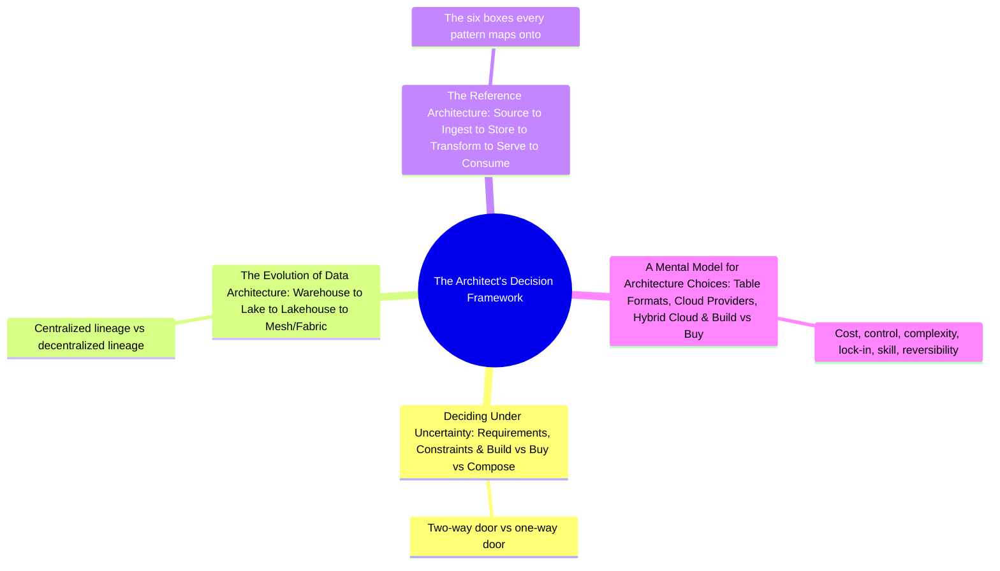

# The Architect's Decision Framework
*Part 2: The Architecture Landscape*

Part 2: The Architecture Landscape opened by naming six patterns worth recognizing on sight — Lambda, Kappa, lakehouse, medallion, mesh, fabric. Knowing the landscape isn't the same skill as choosing a path across it, though, and that's the gap this group closes: it's the toolkit for *deciding*, not another survey of options. These four topics build one continuous argument — deal with uncertainty deliberately (two-way vs. one-way doors, build vs. buy vs. compose), understand why the "right" answer keeps moving (the warehouse-to-mesh evolution), internalize the one diagram every pattern is a variation of (source through consume), and finish with a reusable six-dimension model you can run any future choice through, including ones this course hasn't named yet.

This group leans hard on what Architecture Patterns Deep Dive already established and hands several of its own ideas forward to later groups. See also: [The Evolution of Data Architecture](02-evolution-of-data-architecture/) revisits every pattern from [Architecture Patterns Deep Dive](../02-architecture-patterns-deep-dive/) by name; [A Mental Model for Architecture Choices](04-mental-model-for-architecture-choices/) applies its six-dimension framework to the AWS/Azure/hybrid tooling covered in [AWS, Azure & Hybrid/Multi-Cloud Tooling for Data Engineers](../01-foundations/07-aws-azure-hybrid-tooling/) and to the table-format decision covered in depth in [Table Formats: Delta vs Iceberg vs Hudi](../04-storage-and-table-formats/02-table-formats-delta-iceberg-hudi/).

## Topics

| # | Topic |
|---|-------|
| 1 | [Deciding Under Uncertainty: Requirements, Constraints & Build vs Buy vs Compose](01-deciding-under-uncertainty/) |
| 2 | [The Evolution of Data Architecture: Warehouse to Lake to Lakehouse to Mesh/Fabric](02-evolution-of-data-architecture/) |
| 3 | [The Reference Architecture: Source to Ingest to Store to Transform to Serve to Consume](03-reference-architecture/) |
| 4 | [A Mental Model for Architecture Choices: Table Formats, Cloud Providers, Hybrid Cloud & Build vs Buy](04-mental-model-for-architecture-choices/) |

<!-- prevnext:start -->

---

| [&larr; Previous: Choosing Among the Patterns: Comparison & Decision Guide](../02-architecture-patterns-deep-dive/07-choosing-among-five-patterns/) | [Next: Deciding Under Uncertainty: Requirements, Constraints & Build vs Buy vs Compose &rarr;](01-deciding-under-uncertainty/) |
|:---|---:|

<!-- prevnext:end -->
