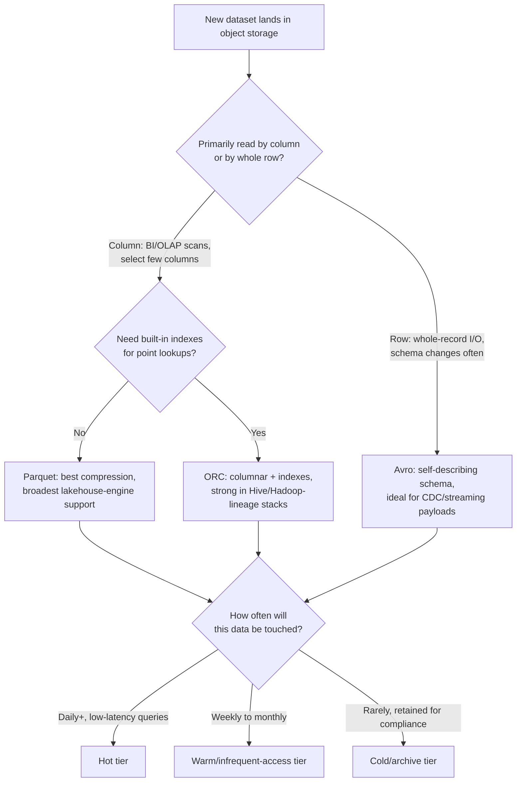

# Storage Foundations: Object Storage, File Formats & Access Patterns
{: .no_toc }

*Part 3: Designing the Data Layer &middot; Storage & Table Formats*

Every decision later in this guide — which table format to adopt, whether a workload should stream, how a warehouse gets modeled — rests on physical storage choices that are cheap to get right early and expensive to unwind later: the wrong file format or partitioning scheme doesn't throw an error, it just quietly makes every query and every dollar of compute more expensive, forever. [A Mental Model for Architecture Choices](../03-architects-decision-framework/04-mental-model-for-architecture-choices/) closed Part 2 with a reusable framework — cost, control, complexity, lock-in, team skill, reversibility — for evaluating architecture decisions; this topic opens Part 3, "Designing the Data Layer," by applying that framework to the most foundational layer of all: where bytes physically live and how they're shaped once they land there.

## Object Storage as the Foundation

A legacy warehouse — Teradata, Exadata, an on-prem SQL Server box — couples storage and compute on the same hardware: to get more disk, you buy more of the same appliance that also runs your queries, whether you need the extra CPU or not. **Object storage** (Amazon S3, Azure Data Lake Storage, Google Cloud Storage) broke that coupling. It's a flat, virtually unlimited store of immutable binary objects, addressed by key rather than by file path on a specific disk, replicated durably across a provider's infrastructure, and billed per gigabyte-month rather than per appliance.

**Decoupled storage and compute** is the single architectural shift that made everything else in this course possible: a Spark cluster, a Snowflake warehouse, and a Trino query engine can all read the same Parquet files sitting in the same S3 bucket, scaling independently, spinning up only when a query needs them, and paying nothing when idle. This is also precisely what turns a pile of files into a **data lake** — cheap, durable, engine-agnostic storage that any compute layer can point at — and it's the ground every pattern from Part 2 (lakehouse, medallion, mesh) is built on.

## Choosing a File Format: Parquet vs ORC vs Avro

Object storage tells you *where* bytes live; the file format tells you how they're organized once they're there, and that choice has direct consequences for both query speed and storage cost. The core distinction is columnar versus row-oriented layout:

- **Parquet** stores data column-by-column, so a query that touches 3 of a table's 80 columns only reads those 3 columns off disk. That makes it the default for analytical (OLAP) workloads and the format nearly every lakehouse engine and table format treats as a first-class citizen.
- **ORC** is also columnar, with built-in lightweight indexes and predicate pushdown, and remains common in Hive/Hadoop-lineage stacks — functionally close to Parquet, but with a narrower ecosystem outside that lineage.
- **Avro** is row-oriented and self-describing (the schema travels with the data), which makes it a poor fit for wide analytical scans but a strong fit for record-at-a-time workloads — Kafka topic payloads, CDC change events, anything where a whole record is read or written together and the schema needs to evolve gracefully.

## Access Patterns: Hot, Warm, Cold & the Cost of Egress

Not all data deserves the same storage cost. Cloud object stores expose **access tiers** — hot (standard, immediately available, most expensive per GB), warm (infrequent-access, cheaper per GB but with a retrieval fee), and cold (archive, cheapest per GB but retrieval can take hours) — and picking the wrong one is a pure waste: paying hot-tier prices for a table nobody has queried in eight months, or archiving a table your BI dashboards hit every morning. A warehouse-background engineer's instinct to just "keep everything on fast disk" doesn't transfer here; storage tiering is a cost lever, not an afterthought (Part 5 covers it as one in depth).

**Egress** — the cost of moving data *out* of a cloud provider's network, whether to another region, another cloud, or the public internet — deserves equal attention, because it's the fee most engineers forget exists until the bill arrives. Replicating a multi-terabyte lake across clouds for a hybrid architecture, or letting a BI tool pull raw data cross-region instead of querying it in place, can turn a cheap storage decision into an expensive networking one.

## Partitioning & File Sizing: The Small-Files Problem

**Partitioning** splits a table's files into subdirectories by a column's value — typically a date — so a query filtering on that column can skip reading files that can't possibly match, rather than scanning the whole table. It's the object-storage equivalent of an index, and it's usually the single highest-leverage performance decision you'll make for a large table.

Overdoing it backfires. Partition by something too granular — customer ID, or an hour-level timestamp on a low-volume table — and you end up with thousands of tiny files, each a few kilobytes, instead of a handful of well-sized ones.

{: .important }
> The **small-files problem** doesn't fail loudly — it just makes every query slower, because the query engine spends more time listing and opening files than actually reading data, and every open file carries fixed metadata overhead. A table with 100,000 ten-kilobyte files will out-cost and out-lag the same data stored as 100 one-gigabyte files by a wide margin, and the fix (compaction) is itself an ongoing maintenance job you have to plan for, not a one-time cleanup.

The rule of thumb worth carrying from a warehouse background: aim for file sizes in the 128 MB–1 GB range per file, and partition at a grain coarse enough that each partition still produces a reasonably sized set of files — not so fine that every write creates a new, mostly-empty partition.

## Compression & Layout Trade-offs

Columnar formats compress far better than row formats because similar values sit next to each other on disk — but the codec you pick trades CPU for size. **Snappy** is fast to compress and decompress with a modest compression ratio, and is the common default for data actively queried. **Gzip** compresses tighter at higher CPU cost, better suited to colder, rarely-read data where storage cost matters more than read speed. **Zstandard (zstd)** increasingly splits the difference, offering gzip-like ratios at closer-to-Snappy speed, and has become the default recommendation in newer lakehouse tooling.

Layout matters as much as codec: sorting or clustering data on the columns a query filters on most (sometimes called z-ordering) lets an engine skip whole files based on min/max statistics in the file footer, compounding the benefit of partitioning without adding more directories. Together, file format, tiering, partitioning, and compression are the physical decisions that everything in the next topic — table formats layering transactional guarantees on top of these same files — assumes you've already made reasonably well.

<!-- prevnext:start -->

---

| [&larr; Previous: Storage & Table Formats](./) | [Next: Table Formats: Delta vs Iceberg vs Hudi &rarr;](02-table-formats-delta-iceberg-hudi/) |
|:---|---:|

<!-- prevnext:end -->
