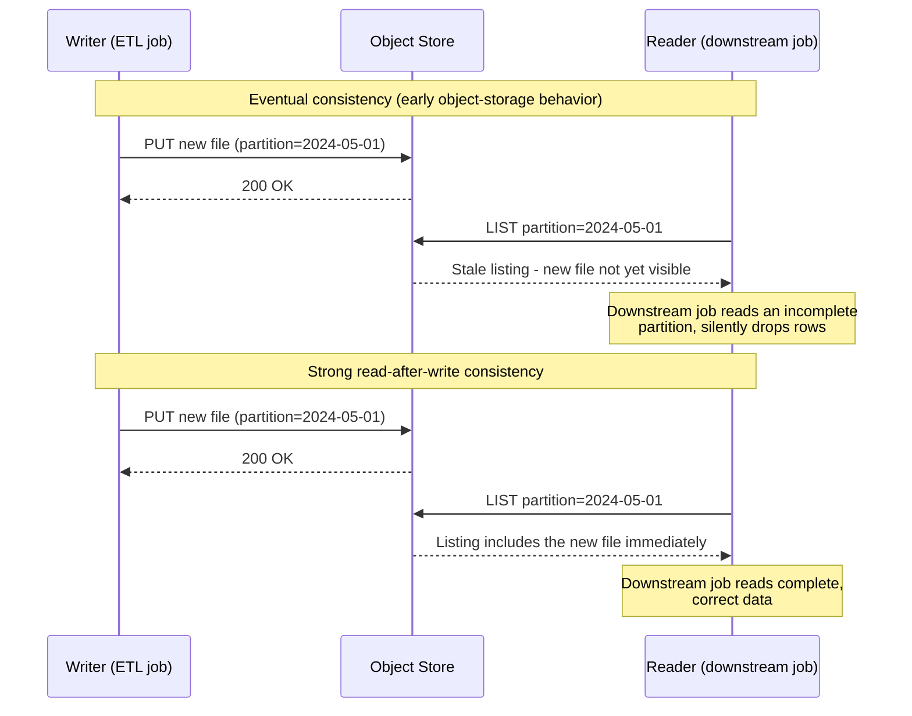

# Consistency in Practice: Read-After-Write on Object Storage
{: .no_toc }

*Part 3: Designing the Data Layer &middot; Storage & Table Formats*

[Table Formats: Delta vs Iceberg vs Hudi](02-table-formats-delta-iceberg-hudi/) explained how a transaction log turns a directory of files into something that behaves like a table — but that log only protects you if every reader and writer agrees, the instant a write completes, on what the storage layer will actually hand back when asked. That's not a given: it's the exact **CAP**/**PACELC** trade-off from [ACID, BASE & the CAP Theorem](../01-foundations/01-acid-base-and-cap-theorem/) made concrete, applied to one specific system — the object store underneath everything in this group. An architect who assumes object storage always returns the latest write will eventually debug a pipeline that "randomly" drops or duplicates rows, when the real cause was never random at all.

## Read-After-Write Consistency, Defined

**Read-after-write consistency** means that as soon as a write is acknowledged, any subsequent read — from any client, anywhere — returns that write's result, not a stale prior version. Amazon S3 now provides this as a baseline guarantee for all object operations. That wasn't always true: for years, S3 gave **eventual consistency** on overwrite PUTs and on listing operations after new objects were added — a write could succeed while a LIST or GET from a different client still returned the old (or no) object for some window afterward, per the BASE model's "eventually, if no new writes occur, all replicas converge."

## Why Early Cloud Data Lakes Got Bitten

Before that baseline guarantee existed, this gap caused real, hard-to-reproduce production bugs. A Spark job would write output files, then immediately list the output directory to hand off to the next stage — and occasionally get back a listing missing files that had, provably, already been written. Tools like **EMRFS Consistent View** and **S3Guard** existed specifically to paper over this by keeping an external, strongly consistent index (in DynamoDB) of what a directory *should* contain, because the object store itself couldn't be trusted to say so immediately. This is also, not coincidentally, a large part of *why* table formats keep their own transaction log rather than trusting a directory listing at all — the log is a self-maintained source of truth that doesn't depend on the storage layer's listing consistency.

## Why It Still Matters for CDC and Streaming

Object storage being strongly consistent today doesn't retire this concern — it relocates it. A streaming or **CDC** (change data capture) consumer that lists raw files instead of reading a table format's committed snapshot can still observe a partition mid-write: some of a batch's files landed, others haven't, and there's no atomic boundary marking "this commit is done" outside the transaction log. Reading too early produces the exact failure mode the diagram above shows — incomplete, silently wrong results, not an error you can catch.

{: .important }
> Never treat a raw storage listing as the current state of a table. Always resolve state through the table format's log or snapshot — the atomicity boundary lives there, not in the object store's directory semantics — and any CDC or streaming consumer that bypasses it is one race condition away from a duplicate or dropped event that no retry will fix.

This is exactly the PACELC trade-off, not just CAP: even with no partition and a healthy network, a system choosing to serve reads with minimum latency (from a nearby replica, before full propagation) versus waiting for guaranteed-fresh consistency is choosing Latency over Consistency on an ordinary Tuesday. The [Ingestion Decisions](../06-ingestion-and-streaming-decisions/01-ingestion-decisions-batch-incremental-cdc/) topic later in this course, and its treatment of exactly-once semantics, both assume this lesson: correctness comes from committing through a log, never from racing a listing call.

<!-- prevnext:start -->

---

| [&larr; Previous: Table Formats: Delta vs Iceberg vs Hudi](02-table-formats-delta-iceberg-hudi/) | [Next: Dimensional Modeling for the Cloud Era &rarr;](../05-dimensional-modeling-cloud-era/) |
|:---|---:|

<!-- prevnext:end -->
