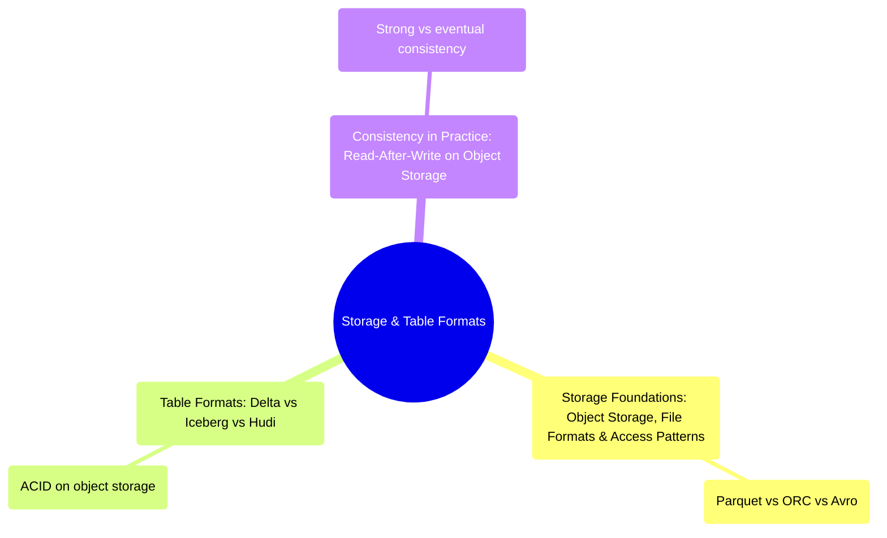

# Storage & Table Formats
*Part 3: Designing the Data Layer*

Part 2 mapped the landscape of architecture patterns and gave you a framework for choosing among them; Part 3, "Designing the Data Layer," is where those choices get physical — where bytes actually live, how they're organized into something queryable, and what guarantees you can trust the instant a reader shows up. These three topics build in a straight line: object storage and file formats determine what you're working with at the byte level, table formats layer transactional semantics on top so that byte soup behaves like an actual table, and consistency guarantees determine whether the promises those first two layers make actually hold up under concurrent, distributed access. Get this group right and every pattern from Part 2 — lakehouse, medallion, mesh — has solid ground to stand on; get it wrong and no amount of clever orchestration upstream saves you from silently wrong query results downstream.

See also: [Medallion Architecture: Bronze/Silver/Gold](../02-architecture-patterns-deep-dive/04-medallion-architecture/), [ACID, BASE & the CAP Theorem: The Physics Underneath Every Data System](../01-foundations/01-acid-base-and-cap-theorem/), and [Ingestion Decisions: Batch, Incremental Loading & Change Data Capture](../06-ingestion-and-streaming-decisions/01-ingestion-decisions-batch-incremental-cdc/).

## Topics

| # | Topic |
|---|-------|
| 1 | [Storage Foundations: Object Storage, File Formats & Access Patterns](01-storage-foundations/) |
| 2 | [Table Formats: Delta vs Iceberg vs Hudi](02-table-formats-delta-iceberg-hudi/) |
| 3 | [Consistency in Practice: Read-After-Write on Object Storage](03-consistency-models/) |

<!-- prevnext:start -->

---

| [&larr; Previous: A Mental Model for Architecture Choices: Table Formats, Cloud Providers, Hybrid Cloud & Build vs Buy](../03-architects-decision-framework/04-mental-model-for-architecture-choices/) | [Next: Storage Foundations: Object Storage, File Formats & Access Patterns &rarr;](01-storage-foundations/) |
|:---|---:|

<!-- prevnext:end -->
