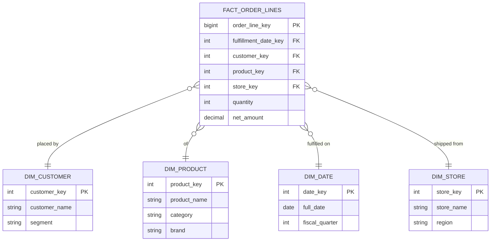

# Facts, Dimensions & Grain: The Foundation of Dimensional Modeling
{: .no_toc }

*Part 3: Designing the Data Layer &middot; Dimensional Modeling for the Cloud Era*

Whichever of the three schools from [Warehouse Design Philosophies: Inmon vs Kimball vs Data Vault](01-inmon-vs-kimball-vs-data-vault/) your organization leans toward, the layer stakeholders actually query is almost always dimensional in shape — even a Data Vault deploys a Kimball-style mart on top of its hubs and satellites. That makes the vocabulary below load-bearing, not background: declare the wrong **grain** before you write a single `CREATE TABLE`, and every `JOIN`, every `SUM()`, and every stakeholder's trust in the resulting number breaks — usually silently, months later, when someone double-counts a metric or can't reproduce a report.

## Facts and dimensions, refreshed

You already know this shape from every star-schema warehouse you've built: a **fact** table holds the measurable events of a business process — an order line, a page view, a sensor reading — as numeric measures plus foreign keys. A **dimension** table holds the descriptive context those measures are analyzed by — customer, product, date, store. The refresher isn't the definitions; it's what changes when the fact table sits on a columnar cloud warehouse instead of a row-store appliance: storage is now cheap and compute is billed by bytes scanned, which flips some of the normalization trade-offs you learned on-prem (more on that below, and fully in the next-but-one topic on OBT).

## Grain: declare it before you model anything

The single most consequential decision in a dimensional design is the **grain** — the precise statement of what one row in the fact table represents. "One row per order" and "one row per order line" and "one row per order line per day" are three different fact tables with three different join behaviors, even though a sloppy requirements conversation can describe all three as "sales data." Declare the grain in one sentence before touching DDL:

```sql
-- Grain declaration, written as a comment before any DDL exists:
-- "One row per order line, per calendar day it was fulfilled from."
-- Every measure and every dimension foreign key below must be true at that grain.

CREATE TABLE fact_order_lines (
    order_line_key    BIGINT        NOT NULL,  -- surrogate key, one per grain row
    fulfillment_date_key INT        NOT NULL REFERENCES dim_date(date_key),
    customer_key      INT           NOT NULL REFERENCES dim_customer(customer_key),
    product_key       INT           NOT NULL REFERENCES dim_product(product_key),
    store_key         INT           NOT NULL REFERENCES dim_store(store_key),
    quantity          INT           NOT NULL,
    net_amount        DECIMAL(12,2) NOT NULL,
    PRIMARY KEY (order_line_key)
);
```

This reads like the same ANSI DDL you'd write in T-SQL or PL/SQL against a legacy warehouse appliance — grain isn't a cloud-era invention. What's changed is the cost of getting it wrong: reprocessing a mis-grained fact table across a columnar cloud warehouse at scale is a bytes-scanned bill, not just an afternoon of rework.

**Mixing grains in one fact table is the most common modeling failure this decision guards against** — adding a "shipping fee" measure that's actually one-per-order into a table declared one-row-per-order-line either duplicates the fee across every line (inflating totals) or forces awkward `NULL`-guarded logic. If a measure doesn't naturally exist at the declared grain, it belongs in a different fact table, full stop.

## Fact table types: grain isn't always "one row per event"

Every example so far has assumed a **transaction fact** — one row per discrete business event, grain declared once and stable for the life of the table, the shape you already build automatically from an OLTP order feed or a clickstream. Two other canonical fact shapes exist because not every business process actually generates a discrete event worth capturing.

A **periodic snapshot fact** declares its grain around a fixed time interval instead of an event: "one row per SKU per store, per day, capturing quantity on hand at close of business." Nothing "happened" at that instant — the pipeline is observing state, not recording a transaction — but the grain discipline applies just as strictly: every measure and dimension key on that row must be true at end-of-day for that SKU and store, or the table silently blends two different observation points into one. This is the shape behind the "Inventory Snapshots" row in the bus matrix that [Slowly Changing Dimensions & Conformed Dimensions Across the Enterprise](03-scd-and-conformed-dimensions/) introduces next.

An **accumulating snapshot fact** covers a multi-step process with a defined start and end — an order moving through placed, shipped, and delivered — as a single row updated in place as each milestone lands, carrying one date foreign key per milestone (`order_date_key`, `ship_date_key`, `delivery_date_key`) rather than the single date key a transaction fact needs.

The distinction isn't academic — it decides whether a measure is additive. `net_amount` on the order-line fact above sums cleanly across every dimension, including date. Quantity-on-hand on a periodic snapshot is only semi-additive: summing it across stores on a given day is meaningful, summing it across 30 days is not, since day 30's on-hand figure already reflects what was there on day 29. Force a snapshot process into a transaction-fact grain and stakeholders either lose the ability to answer "what was on hand as of date X," or the pipeline ends up logging every micro-change instead of writing one clean row per day — the storage-versus-correctness trade-off shows up again, just one level up from the grain declaration itself.

## Star vs snowflake, and the over-normalization cost trap

A **star schema** keeps every dimension flat and denormalized — `dim_product` holds category and subcategory and brand all in one table, even though category and brand are themselves entities with their own attributes. A **snowflake schema** normalizes those out into separate linked tables (`dim_product` → `dim_category` → `dim_brand`), trading storage duplication for referential cleanliness.

On a legacy row-store appliance, snowflaking often paid for itself in storage savings. On a cloud columnar warehouse, that trade inverts: storage is priced at cents per gigabyte per month while compute is priced per query, so the extra `JOIN`s a snowflake forces onto every BI query cost more in scan time and query-engine overhead than the storage ever saved. This is the **over-normalization cost trap** — carrying an on-prem instinct (normalize to save disk) into an environment where disk is nearly free and joins are the expensive resource. Default to a star schema in the cloud unless a dimension's own attributes change often enough, or grow large enough, that normalizing it out demonstrably reduces load and query cost.



That diagram is a star, not a snowflake — `dim_product` carries `category` and `brand` inline rather than pointing to separate dimension tables, which is the default this section just argued for. The next topic picks up where a dimension like `dim_customer` stops being static: what happens architecturally when a customer's segment or region *changes*, and how the same dimension stays usable across every fact table that references it.

<!-- prevnext:start -->

---

| [&larr; Previous: Warehouse Design Philosophies: Inmon vs Kimball vs Data Vault](01-inmon-vs-kimball-vs-data-vault/) | [Next: Slowly Changing Dimensions & Conformed Dimensions Across the Enterprise &rarr;](03-scd-and-conformed-dimensions/) |
|:---|---:|

<!-- prevnext:end -->
