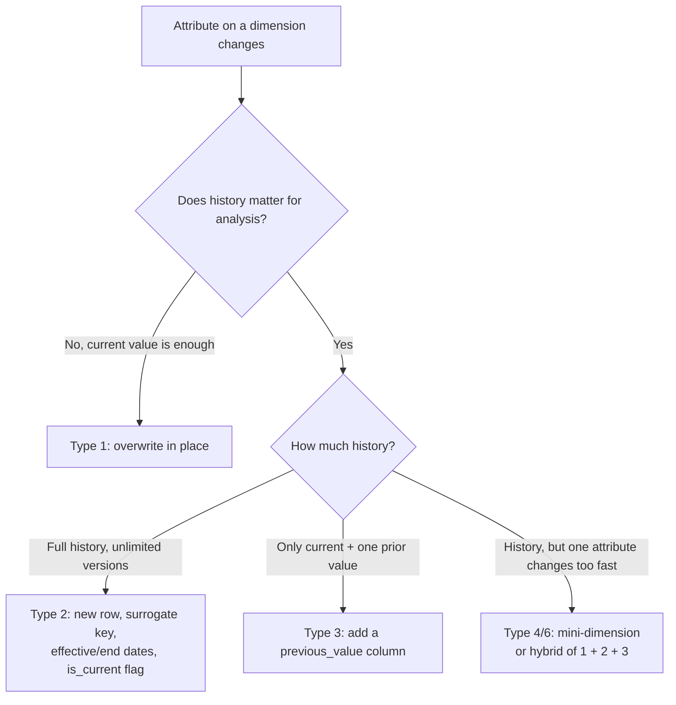

# Slowly Changing Dimensions & Conformed Dimensions Across the Enterprise
{: .no_toc }

*Part 3: Designing the Data Layer &middot; Dimensional Modeling for the Cloud Era*

[Facts, Dimensions & Grain](02-facts-dimensions-grain/) treated `dim_customer` as if it were static — but a customer's segment, region, or address changes constantly in the source system, and an architect has to decide, table by table, whether the warehouse overwrites that change, preserves it, or splits the difference. Get this wrong and you get one of two failure modes stakeholders will actually notice: a historical report that silently re-tells the past using today's customer segment (because you overwrote when you should have preserved history), or a dimension table that's ballooned into millions of near-duplicate rows because every business process invented its own version of "customer" (because nobody conformed it).

## SCD types are decisions, not a taxonomy to memorize

A **slowly changing dimension (SCD)** is any dimension whose attributes change over time at a much slower rate than fact-table inserts. The "types" aren't trivia — each one is a deliberate answer to "does this attribute's history matter for analysis?"

- **Type 0**: never changes (or you deliberately ignore changes) — e.g. a customer's original acquisition date.
- **Type 1**: overwrite in place, no history kept — correct a misspelled name, or track an attribute nobody analyzes historically.
- **Type 2**: preserve full history by inserting a new row per change, with a surrogate key, `effective_date`/`end_date`, and an `is_current` flag — the default choice when a fact needs to reflect "what was true at the time," like a customer's region at the moment of a sale.
- **Type 3**: keep only the current value plus one prior value in an extra column — used sparingly, when you need "before vs. after" for one specific attribute but not full history.
- **Type 4/6**: split fast-changing attributes into a separate mini-dimension, or hybrid the above — used when a Type 2 dimension is growing too fast because one volatile attribute is dragging the whole row into new versions.



Type 2 is the workhorse, and its mechanics reuse a pattern you likely already know from legacy warehouse upserts — this is just that same pattern with a `MERGE` instead of a cursor loop:

```sql
-- Illustrative SCD Type 2 upsert (ANSI-style MERGE; exact syntax varies by
-- warehouse dialect, but the pattern reads like standard T-SQL/PL-SQL)
MERGE INTO dim_customer AS target
USING staged_customer AS source
    ON target.customer_id = source.customer_id
   AND target.is_current = TRUE
WHEN MATCHED AND (
        target.segment <> source.segment
     OR target.region  <> source.region
     )
    THEN UPDATE SET
        end_date   = CURRENT_DATE - 1,
        is_current = FALSE;

-- Second pass: insert the new "current" version for anything just closed out above
INSERT INTO dim_customer (customer_id, segment, region, effective_date, end_date, is_current)
SELECT s.customer_id, s.segment, s.region, CURRENT_DATE, NULL, TRUE
FROM staged_customer s
JOIN dim_customer d
  ON d.customer_id = s.customer_id AND d.is_current = FALSE AND d.end_date = CURRENT_DATE - 1;
```

{: .important }
> Every fact table that joins to a Type 2 dimension must join on the dimension's **surrogate key**, never the natural/business key — joining on `customer_id` instead of `customer_key` collapses history and silently attributes every historical fact to whichever version of the customer happens to be current today.

## Conformed dimensions and the bus matrix

None of this matters at enterprise scale if `dim_customer` built for the sales mart doesn't match `dim_customer` built for the support mart — a **conformed dimension** is one built once, with agreed-upon keys, attributes, and grain, then shared across every fact table and every business process that needs it. Without conformance, "active customer count" means something different in every dashboard, and reconciling them becomes a standing tax on the analytics team.

Kimball's **bus matrix** is the planning tool for this: business processes (facts) down the rows, shared dimensions across the columns, an "X" where a process uses that dimension.

| Business Process | dim_date | dim_customer | dim_product | dim_store |
|---|---|---|---|---|
| Sales | X | X | X | X |
| Returns | X | X | X | X |
| Support Tickets | X | X | | |
| Inventory Snapshots | X | | X | X |

Build the matrix before building marts, and every team inherits the same `dim_customer` rather than reinventing it — which is the difference between a warehouse that scales to dozens of fact tables and one that quietly forks into dozens of incompatible ones.

<!-- prevnext:start -->

---

| [&larr; Previous: Facts, Dimensions & Grain: The Foundation of Dimensional Modeling](02-facts-dimensions-grain/) | [Next: Beyond Star Schemas: One Big Table & Wide Tables &rarr;](04-beyond-star-schemas/) |
|:---|---:|

<!-- prevnext:end -->
