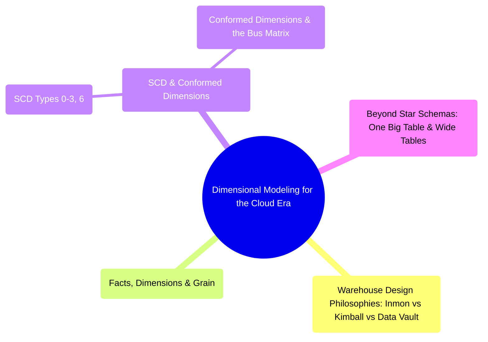

# Dimensional Modeling for the Cloud Era
*Part 3: Designing the Data Layer*

Storage and table formats decide where and how the bytes live; this group decides how those bytes get shaped into something a business user can query. It belongs here — right after object storage and table-format decisions, before ingestion patterns get chosen — because grain, keys, and schema design depend on what the underlying storage layer already guarantees (ACID writes, schema evolution), and every ingestion or transformation decision downstream inherits the target model's shape. Taken together, these four topics move from an organization-level design philosophy (Inmon vs Kimball vs Data Vault), through the mechanics every dimensional model rests on (facts, dimensions, and grain declared first), through keeping that model correct as data changes and consistent across domains (SCD and conformed dimensions), to knowing when cloud-warehouse economics argue for collapsing the star into wider, flatter tables.

## Topics

| # | Topic |
|---|-------|
| 1 | [Warehouse Design Philosophies: Inmon vs Kimball vs Data Vault](01-inmon-vs-kimball-vs-data-vault/) |
| 2 | [Facts, Dimensions & Grain: The Foundation of Dimensional Modeling](02-facts-dimensions-grain/) |
| 3 | [Slowly Changing Dimensions & Conformed Dimensions Across the Enterprise](03-scd-and-conformed-dimensions/) |
| 4 | [Beyond Star Schemas: One Big Table & Wide Tables](04-beyond-star-schemas/) |

<!-- prevnext:start -->

---

| [&larr; Previous: Consistency in Practice: Read-After-Write on Object Storage](../04-storage-and-table-formats/03-consistency-models/) | [Next: Warehouse Design Philosophies: Inmon vs Kimball vs Data Vault &rarr;](01-inmon-vs-kimball-vs-data-vault/) |
|:---|---:|

<!-- prevnext:end -->
