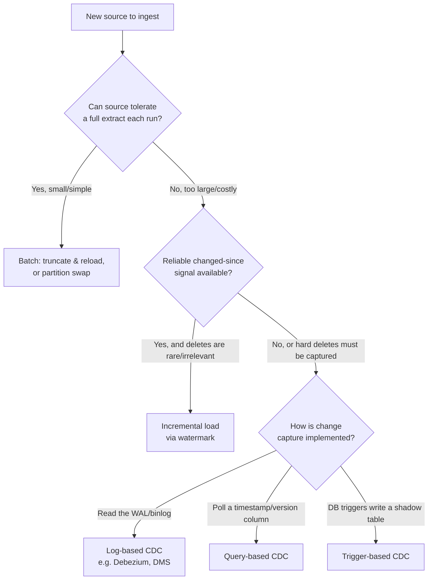

# Ingestion Decisions: Batch, Incremental Loading & Change Data Capture
{: .no_toc }

*Part 4: Moving & Shaping Data &middot; Ingestion & Streaming Decisions*

An architect who defaults to "just re-copy the whole table every night" eventually meets a source system that can't survive a full extract on a hot path, and one who defaults to "stream everything with CDC" eventually meets a team that has no idea how to operate a log-based pipeline at 3 a.m. Knowing which ingestion pattern a given source and consumer actually calls for is what keeps you out of both traps — and it's a decision you make once per source, not once per course. The [previous topic on One Big Table and wide tables](../05-dimensional-modeling-cloud-era/04-beyond-star-schemas/) settled what the data should look like once it lands; this topic is about how it gets there, and the two decisions compound — a wide gold table assembled by squashing joins upstream needs a very different ingestion cadence than a narrow fact table fed row-by-row. The instinct itself should feel familiar from [legacy ETL and its modern ELT descendant](../01-foundations/05-legacy-etl-to-modern-elt/): choosing a load strategy for a Talend or Informatica job was the same decision, just with fewer options on the table than a cloud-native pipeline now offers.

## The Ingestion Decision Tree

Before writing a single pipeline, work through a short, ordered set of questions rather than reaching for whatever tool is fashionable:

1. **How fresh does the destination actually need to be?** Nightly, hourly, minutes, or seconds — this is a business answer, not a technical one, and it bounds everything downstream.
2. **Can the source tolerate a full extract on every run?** A 10,000-row reference table can be reloaded in full forever. A 500-million-row transaction table cannot.
3. **Does the source expose a reliable "changed since" signal** — a trustworthy, monotonically increasing timestamp or version column?
4. **Does the source support log-based capture** — read access to a write-ahead log or binlog — or is that access blocked by a managed-service tier, a legacy vendor, or a DBA who (reasonably) won't grant it?

The answers sort every source into one of three buckets: **batch**, **incremental**, or **CDC** (change data capture) — and CDC itself splits three ways again, covered below.



## Batch and Bulk Load Patterns: Truncate, Reload & Partition Swap

The simplest correct pipeline is **truncate-and-reload**: wipe the target and copy the source in full, every run. It has no state to get wrong — no watermark to mismanage, no missed update to chase — which is exactly why it's still the right answer for small dimension and reference tables where the cost of a full copy is trivial next to the cost of a stateful bug.

At scale, the same idea survives as a **partition swap**: build the new day's (or hour's) data in a staging partition, validate it, then atomically repoint the table's partition metadata to the new data and drop the old one. Consumers never see a half-loaded table, a failed run leaves yesterday's partition untouched, and reprocessing a bad day is just re-running one partition — a pattern any warehouse developer who has done a nightly Talend truncate-and-load into a staging table will recognize immediately, just made atomic and reversible.

## Incremental Loading and the Watermark That Dropped Rows

Once a full reload is too expensive, you load only what changed since the last run, tracked by a **watermark** — a bookmark value, usually a timestamp or a monotonically increasing key, marking how far the previous run got. The next run queries `WHERE last_updated > watermark`, loads the results, and advances the watermark to the newest value it saw.

The failure mode that gives this section its name is well known to anyone who has run this pattern in production: a row's `last_updated` timestamp is written by an application server whose clock is a few seconds behind the extraction job's, or the timestamp is set at the start of a transaction that doesn't commit until after the extract has already run and moved the watermark past it. The row's write is real, but by the time your query runs, its timestamp already looks "old enough" to have been captured last run — except it wasn't, because it hadn't committed yet. The row silently never gets picked up, and nothing errors to tell you. The standard defenses are a **lookback buffer** (always re-query a few minutes behind the last watermark and de-duplicate the overlap on load) or moving the source to log-based CDC, which has no such ambiguity because it reads the commit log itself.

```python
# Illustrative pseudocode - not a runnable, dependency-complete script.
def run_incremental_load(source, watermark_store, lookback_minutes=15):
    last_watermark = watermark_store.get("orders_last_updated")
    # Pad the watermark to cover clock skew and late-committing transactions
    safe_watermark = last_watermark - timedelta(minutes=lookback_minutes)

    rows = source.query(
        "SELECT * FROM orders WHERE last_updated > %s ORDER BY last_updated",
        safe_watermark,
    )
    if not rows:
        return

    upsert_into_target(rows, key="order_id")  # idempotent: re-pulled overlap is harmless

    new_watermark = max(row["last_updated"] for row in rows)
    watermark_store.set("orders_last_updated", new_watermark)
```

{: .important }
> A watermark built on an update timestamp is only as trustworthy as the clock and the commit ordering behind it. Pad it with a lookback buffer and make the load idempotent on a natural key, or move to log-based CDC entirely — otherwise rows updated during the extract window quietly vanish, and the pipeline reports success the whole time.

## Change Data Capture: Log vs Query vs Trigger

**CDC** means capturing every row-level change — inserts, updates, and critically, *deletes* — as it happens, rather than periodically diffing state. There are three ways to implement it, and the choice is really about what access the source will grant you:

- **Log-based CDC** tails the database's write-ahead log or binlog (the pattern behind tools like Debezium or AWS DMS). It has the lightest read impact on the source, captures deletes natively, and preserves ordering — but it requires log-access privileges, enough log retention to survive consumer downtime, and a team comfortable operating a stream of change events rather than a batch job.
- **Query-based CDC** polls the source for rows changed since the last watermark — mechanically the same incremental-load pattern above, just labeled "CDC" when it's the primary change-tracking mechanism. It's the easiest to stand up anywhere SQL access exists, but it misses hard deletes (a deleted row simply stops appearing, which looks identical to "nothing changed") and adds repeated query load to the source.
- **Trigger-based CDC** attaches database triggers that write every change to a shadow table your pipeline reads instead of the source table. It captures deletes without needing log access, which makes it the fallback for locked-down or legacy databases — at the cost of extra write-path overhead on every source transaction and a shadow table that has to evolve in lockstep with schema changes.

## Architecture Review #2: Mixed Ingestion for a 200-Store Retailer

A national retailer with 200 stores rarely needs one ingestion pattern — it needs a deliberate mix, chosen per source and per consumer:

- **POS transaction facts** land via nightly **batch**: truncate-and-reload into a staging partition, then partition-swap into the fact table. Financial reconciliation only cares about end-of-day totals, so paying for continuous capture here buys nothing.
- **Store inventory levels** feed online availability checks that shoppers see within seconds, so they're captured via **log-based CDC** off each store's inventory database straight into a fast-changing dimension.
- **Supplier and store master data** changes rarely, but the source is a legacy on-prem SQL Server the vendor won't grant log access to — so it's loaded via **query-based incremental** with a generously padded watermark, accepting that a rare hard delete needs a periodic full reconciliation pass to catch.

No single row in the manifest says "this is the retailer's ingestion architecture" — the architecture is the composite of three defensible, source-specific decisions.

<!-- prevnext:start -->

---

| [&larr; Previous: Ingestion & Streaming Decisions](./) | [Next: Should This Be Streaming At All? RT vs NRT Trade-offs & Exactly-Once Semantics &rarr;](02-should-this-be-streaming-at-all/) |
|:---|---:|

<!-- prevnext:end -->
