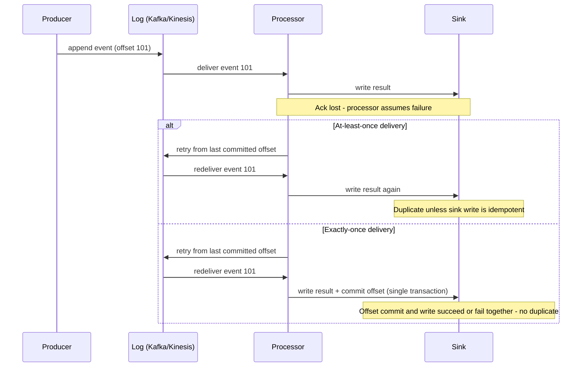

# Should This Be Streaming At All? RT vs NRT Trade-offs & Exactly-Once Semantics
{: .no_toc }

*Part 4: Moving & Shaping Data &middot; Ingestion & Streaming Decisions*

A stakeholder who asks for "real-time reporting" is making an architecture decision without knowing it — and an architect who builds continuous streaming infrastructure for a dashboard that only ever needed a five-minute refresh has spent months of engineering effort, plus an ongoing on-call burden, on a requirement nobody actually had. The [previous topic's ingestion decision tree](01-ingestion-decisions-batch-incremental-cdc/) sorted sources into batch, incremental, or CDC based on how the data gets *captured*; this topic asks a question that sits above all three — once change is being captured, does it need to keep *moving* continuously, or is periodic movement enough to satisfy whoever's waiting on it?

## The Real-Time Illusion: Latency Is a Business Decision

The word "real-time" gets used loosely enough that two people in the same meeting can mean latencies three orders of magnitude apart. This course uses the two terms precisely, and so should you:

- **RT (real-time)**: continuous, event-at-a-time processing with sub-second-to-low-single-digit-second end-to-end latency — true streaming, where each event is processed as it arrives rather than waiting for company.
- **NRT (near-real-time)**: micro-batched processing with latency in the seconds-to-minutes range. This is what most systems a stakeholder calls "real-time" actually are, as the [batch, NRT, and RT spectrum topic](../01-foundations/06-batch-realtime-and-robust-pipelines/) laid out.

The question that actually matters is not "how fast can we make this?" but "what decision gets made from this data, and what does it cost the business if that decision is made two minutes later instead of two hundred milliseconds later?" A fraud-scoring model blocking a card swipe or a bidding engine responding to an ad auction has a real answer: those decisions expire in milliseconds, which is genuine RT territory. An inventory dashboard, a churn score, or a daily active-user count almost never does — NRT, or even batch, meets the actual business need at a fraction of the cost.

## Streaming Architecture Components: Log, Processor, Sink

Whichever latency tier you land on, a streaming pipeline is built from three components:

- **Log** — a durable, ordered buffer of events (Kafka, Kinesis) that decouples producers from consumers and lets a processor replay history if it falls behind or needs to reprocess.
- **Processor** — the stateful compute engine (Flink, Spark Structured Streaming, Kinesis Data Analytics) that consumes the log, applies windowing, joins, and aggregation, and tracks its own progress through the log via offsets.
- **Sink** — where results land: a warehouse table, a cache, an API. This is usually where correctness gets won or lost, because the sink is what a duplicate or dropped event actually damages.

Windowed aggregation in the processor uses its own notion of a **watermark** — not the incremental-load bookmark from the previous topic, but a marker of how far event-time has progressed, telling the processor when it's safe to finalize a window because no more late-arriving events are expected. Same word, same underlying idea (a checkpoint marking safe progress), different mechanism.

## Exactly-Once vs At-Least-Once: The Architect's Choice

Every streaming pipeline has to pick a delivery guarantee, and the choice ripples through every downstream design decision:

- **At-least-once** delivery retries on any failure or lost acknowledgment, which means a consumer may see the same event more than once. It's simpler and cheaper to run, but it pushes the correctness problem onto the sink — the sink write must be **idempotent** (an upsert keyed by a stable event id, not a blind insert or increment) or duplicates silently inflate counts and totals.
- **Exactly-once** delivery ties offset commits to sink writes in a single atomic unit — via the processing framework's own transactional semantics (Kafka transactions, Flink checkpointing) or a transactional sink — so each event affects the result precisely once even after a retry. It's the stronger guarantee, but it costs more in throughput, adds more moving parts (checkpoint coordination, transactional sinks), and is harder to reason about when something does go wrong.

## When Streaming Is NOT Worth It: The Complexity Tax

Streaming — RT in particular — carries a standing cost that a batch or NRT pipeline doesn't: an always-on process that needs 24/7 on-call rather than a job that either ran last night or gets retried this morning, exactly-once machinery that's genuinely hard to get right, schema evolution that has to happen on a live stream instead of between batch runs, and backpressure/scaling concerns that don't exist when nothing is running between scheduled invocations. None of that is free, and all of it has to be staffed and maintained indefinitely, not just built once.

{: .important }
> Don't reach for RT streaming because a stakeholder said "real-time" — ask what decision gets made from the data and what a two-minute delay would actually cost. In practice, NRT (a micro-batch every one to five minutes) satisfies the overwhelming majority of "real-time" requirements at a fraction of the operational cost of true RT, and batch satisfies a good number of the rest.

## Lambda vs Kappa: Unifying Batch & Stream

Once you do need streaming, the same exactly-once and complexity-tax trade-offs resurface at the architecture level. [Lambda architecture](../02-architecture-patterns-deep-dive/01-lambda-architecture/) keeps a batch layer and a speed layer side by side, accepting the operational cost of running two systems in exchange for the batch layer's easy correctness as a backstop to the speed layer's best-effort freshness. [Kappa architecture](../02-architecture-patterns-deep-dive/02-kappa-architecture/) collapses both into a single stream-processing path and handles reprocessing by replaying the log — simpler to operate as one system, but only workable once you trust your stream processor's exactly-once and replay guarantees enough to make it the sole source of truth. Which one an organization leans toward is usually a direct readout of how it answered the exactly-once question above.

<!-- prevnext:start -->

---

| [&larr; Previous: Ingestion Decisions: Batch, Incremental Loading & Change Data Capture](01-ingestion-decisions-batch-incremental-cdc/) | [Next: Transformation & the Modern Data Stack &rarr;](../07-transformation-and-modern-data-stack/) |
|:---|---:|

<!-- prevnext:end -->
