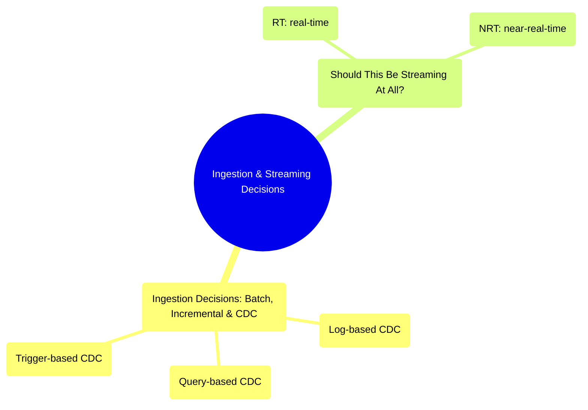

# Ingestion & Streaming Decisions
*Part 4: Moving & Shaping Data*

Part 3 settled where data lives and how it's shaped once it lands; Part 4, "Moving & Shaping Data," picks up the next question — how it actually gets there. That ordering matters: choosing an ingestion cadence or a streaming architecture before the target model is settled means guessing at a destination, and this group is where the guessing stops. Its two topics work as one decision, made in sequence: first sort a source into batch, incremental, or CDC based on what it can tolerate and what access it grants; then, independent of how change is captured, decide whether that change needs to move continuously at all, or whether periodic movement already satisfies whoever's waiting on it.

See also: [From Legacy ETL to Modern ELT: Bridging Talend & Informatica-Style Tools](../01-foundations/05-legacy-etl-to-modern-elt/), [Batch, Near-Real-Time & Real-Time Processing: Building Robust Pipelines](../01-foundations/06-batch-realtime-and-robust-pipelines/), [Lambda Architecture: Batch + Speed Layers](../02-architecture-patterns-deep-dive/01-lambda-architecture/), and [Kappa Architecture: Stream-Only Processing](../02-architecture-patterns-deep-dive/02-kappa-architecture/).

## Topics

| # | Topic |
|---|-------|
| 1 | [Ingestion Decisions: Batch, Incremental Loading & Change Data Capture](01-ingestion-decisions-batch-incremental-cdc/) |
| 2 | [Should This Be Streaming At All? RT vs NRT Trade-offs & Exactly-Once Semantics](02-should-this-be-streaming-at-all/) |

<!-- prevnext:start -->

---

| [&larr; Previous: Beyond Star Schemas: One Big Table & Wide Tables](../05-dimensional-modeling-cloud-era/04-beyond-star-schemas/) | [Next: Ingestion Decisions: Batch, Incremental Loading & Change Data Capture &rarr;](01-ingestion-decisions-batch-incremental-cdc/) |
|:---|---:|

<!-- prevnext:end -->
