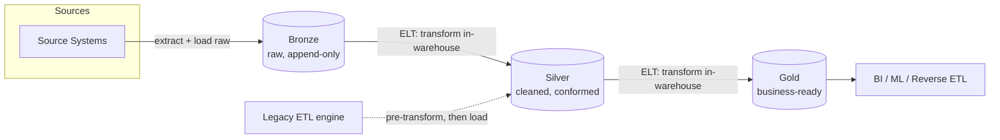

# ETL vs ELT & the Medallion Pattern in Practice
{: .no_toc }

*Part 4: Moving & Shaping Data &middot; Transformation & the Modern Data Stack*

Pick the wrong place to run your transformation logic and you either bottleneck every load on a single ETL server or hand your warehouse a compute bill it didn't need to pay — this topic is what lets you place the **T** deliberately instead of by habit. The [previous topic](../06-ingestion-and-streaming-decisions/02-should-this-be-streaming-at-all/) settled how data *arrives* — batch, NRT, or true RT; this one picks up right after landing and asks what happens to that data once it's sitting in your platform, before anyone can query it with confidence.

## ETL vs ELT: why the T moved

In the Talend/Informatica world you likely came from, the sequence was fixed: **ETL**. A dedicated engine extracted rows from the source, transformed them in-flight — cleansing, joining, aggregating — on that engine's own compute, and only then loaded the finished, warehouse-ready rows into the target. The transform step was expensive and slow, so architects deliberately minimized what it touched, and the warehouse never saw raw data at all.

**ELT** flips the last two steps. Extracted data lands in the warehouse or lake *first*, raw and largely unmodified, and the transform runs afterward as SQL (or dbt, which is SQL underneath) against the warehouse's own compute. The reason this became the default isn't fashion — it's economics. Cloud warehouses and lakehouses (Snowflake, BigQuery, Databricks, Redshift) decoupled storage from elastic, pay-per-query compute, so pushing transformation into that engine means you scale it the same way you scale everything else, instead of provisioning and babysitting a separate ETL cluster. The T didn't move because SQL got smarter; it moved because compute got cheaper and more elastic *where the data already lives*.

That doesn't make ETL obsolete. A regulated field that must be masked or dropped before it ever touches shared storage, or a source system too fragile to receive a firehose of unfiltered rows, still argues for transforming before load. The decision is compute placement, not fashion — where do you have elastic capacity, and what has to be true of the data before it's allowed to land.

## The medallion pattern: bronze, silver, gold

ELT's raw-first approach only works if "raw in the warehouse" doesn't mean "raw in front of business users." The **medallion** pattern — introduced architecturally in [Medallion Architecture: Bronze/Silver/Gold](../02-architecture-patterns-deep-dive/04-medallion-architecture/) — is the layering discipline that makes ELT safe: three progressively refined zones inside the same platform, not three separate systems. Here the focus is narrower and more operational: how ETL/ELT placement decisions actually play out layer by layer, day to day.

- **Bronze** — the raw landing zone. Data arrives close to source format, append-only, unaltered even if it's messy or duplicated. This is your audit trail and your replay source if anything downstream breaks.
- **Silver** — cleaned and conformed. Deduplication, type casting, key standardization, and joins that make bronze usable, but still close to the grain of the source systems rather than shaped for one specific report.
- **Gold** — business-ready. Aggregated, dimensional, or wide tables built for a specific consumption pattern — a BI dashboard, a finance close process, a machine learning feature set.

Each hop bronze → silver → gold is itself an ELT transform running as SQL against the platform's compute, which is why the two ideas are really one pattern: ELT is the *mechanism*, medallion is the *organization* of the transforms that mechanism runs.

The dotted line is the ETL path some sources still take: a legacy or compliance-bound source is scrubbed *before* it's allowed to land, feeding silver directly rather than passing through an untouched bronze copy. Most sources today skip that detour.

A gotcha worth internalizing before you build on this pattern:

Each layer should be safely rebuildable from the layer beneath it. If gold can only be reproduced from silver and silver can only be reproduced from a bronze copy you've already overwritten, you've lost your replay path — the exact failure mode idempotent reprocessing (next topic) is designed to prevent.
{: .important}

## Where this leaves you

You now have a placement decision (ETL vs ELT) and an organizing pattern for the ELT side (medallion). What's still missing is *how* those bronze-to-silver-to-gold transforms get written, tested, and safely rerun without corrupting what's already landed — that's the dbt paradigm, next.

<!-- prevnext:start -->

---

| [&larr; Previous: Transformation & the Modern Data Stack](./) | [Next: The dbt Paradigm: Transformation as Code, Data Contracts & Idempotent Reprocessing &rarr;](02-dbt-paradigm-contracts-idempotency/) |
|:---|---:|

<!-- prevnext:end -->
