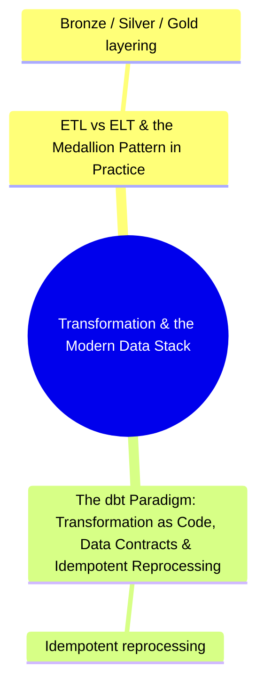

# Transformation & the Modern Data Stack
*Part 4: Moving & Shaping Data*

This group sits in Part 4, *Moving & Shaping Data*, right after the ingestion and streaming decisions covered earlier in the Part — a deliberate sequence, since once you've decided how data lands and how fast, the next question an architect owns is what happens to it *after* it lands, before anyone downstream can query it with confidence. These two topics work as a single argument: the first settles where transformation compute should run (ETL vs. ELT) and how the resulting layers are organized (the medallion pattern); the second settles how the transforms themselves are written, contractually enforced, and safely rerun without corrupting what's already landed. Together they turn "the T in ETL/ELT" from a vague step in a diagram into a concrete, version-controlled, testable part of the platform.

See also: [Medallion Architecture: Bronze/Silver/Gold](../02-architecture-patterns-deep-dive/04-medallion-architecture/) for the architectural treatment of the layering pattern this group applies operationally.

## Topics

| # | Topic |
|---|-------|
| 1 | [ETL vs ELT & the Medallion Pattern in Practice](01-etl-vs-elt-and-medallion-in-practice/) |
| 2 | [The dbt Paradigm: Transformation as Code, Data Contracts & Idempotent Reprocessing](02-dbt-paradigm-contracts-idempotency/) |

<!-- prevnext:start -->

---

| [&larr; Previous: Should This Be Streaming At All? RT vs NRT Trade-offs & Exactly-Once Semantics](../06-ingestion-and-streaming-decisions/02-should-this-be-streaming-at-all/) | [Next: ETL vs ELT & the Medallion Pattern in Practice &rarr;](01-etl-vs-elt-and-medallion-in-practice/) |
|:---|---:|

<!-- prevnext:end -->
