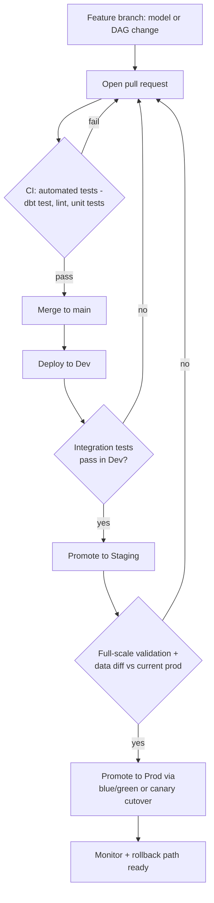

# DataOps & Platform Engineering: CI/CD, IaC/GitOps & Orchestration Patterns
{: .no_toc }

*Part 5: Running It Like a Platform &middot; DataOps, Orchestration & Metadata*

A transformation layer that only runs correctly on one engineer's laptop isn't an architecture, it's a liability with a due date — the moment two people touch the same project, or a change meant for staging lands straight in the warehouse everyone else depends on, the absence of **DataOps** stops being an inconvenience and starts being an incident. [Transformation & the Modern Data Stack](../07-transformation-and-modern-data-stack/) closed out Part 4 by turning transformation logic into version-controlled, testable code; this topic opens Part 5, "Running It Like a Platform," with the question that code alone never answers: how does a change get from a developer's branch into production safely, repeatedly, and without anyone babysitting the deploy?

## Why DataOps: The Discipline That Separates Architects From Pipeline-Builders

A pipeline-builder ships a job, runs it by hand when it breaks, and fixes forward under pressure. An architect designs the *system* a job runs inside of — one where every change is tested before it merges, every environment is reproducible from code, every deploy can be rolled back, and every failure page tells someone exactly what broke and why. **DataOps** is the name for that discipline: applying the practices DevOps proved out for application software — automated testing, continuous delivery, infrastructure as code, observability — to data pipelines specifically, where the "product" being shipped is as often a transformation or a schema as it is an application binary.

The gap between the two mindsets shows up first at the worst possible moment. A pipeline-builder's shop discovers a broken model when a stakeholder's dashboard shows last Tuesday's numbers; a DataOps shop catches the same broken model in a pull request, because a test failed before it ever reached a branch anyone deploys from. Nothing here is exotic — it's the same discipline a warehouse team already applies to application code — the difference is refusing to treat pipelines, schemas, and orchestration config as the one part of the stack that gets to skip it.

## CI/CD for Data Pipelines

**CI/CD** — continuous integration and continuous delivery — is the mechanism DataOps runs on. Continuous integration means every proposed change (a modified SQL model, a new DAG, an altered schema) triggers an automated test suite the moment it's opened as a pull request: `dbt test` runs against a sampled or ephemeral dataset, SQL gets linted, unit tests exercise transformation logic in isolation, and the change simply cannot merge while any of that is red. Continuous delivery picks up from there: a merged, passing change is automatically packaged and made ready to promote through environments, with a human approval gate before it reaches production if the organization wants one, or without one if the team has earned enough trust in its test suite to deploy straight through.

Compare this to how a mapping moved between environments in a classic Informatica or Talend shop: exported as XML, hand-carried to the next server, re-imported, and manually re-pointed at that environment's connections — a process where drift between environments was not a risk, it was a certainty. CI/CD replaces hand-carrying with a single source of truth: the same commit that passed tests in dev is, byte-for-byte, what runs in staging and then production, because it's the *same artifact*, not a re-export.

## Infrastructure as Code and GitOps

**IaC** (infrastructure as code) means the warehouse, the compute clusters, the IAM roles, and the orchestrator's own configuration are defined as version-controlled code — typically Terraform, CloudFormation, or Pulumi — rather than clicked together in a cloud console. **GitOps** is the operating discipline built on top of that: git is the single source of truth for infrastructure state, a change is proposed as a pull request, reviewed like any code change, and applied by an automated reconciler once merged — never by someone running a command from their laptop against production credentials.

```hcl
# Illustrative Terraform fragment - not a deployable stack.
resource "snowflake_warehouse" "transform_wh_prod" {
  name           = "TRANSFORM_WH_PROD"
  warehouse_size = "MEDIUM"
  auto_suspend   = 60
}

resource "aws_mwaa_environment" "orchestrator_prod" {
  name              = "prod-orchestrator"
  airflow_version   = "2.9.2"
  dag_s3_path       = "dags/"
  source_bucket_arn = aws_s3_bucket.dags.arn

  # GitOps: this environment's DAGs are synced only from main's
  # dags/ folder after CI passes - never uploaded by hand.
}
```

The payoff shows up during a disaster, not during normal operations: if the warehouse account were deleted tonight, an IaC-managed platform is rebuilt by re-applying the same Terraform state that built it the first time, in minutes, with a git history that shows exactly what existed and who approved it — versus a click-ops environment where nobody is entirely sure what's actually configured until they try to rebuild it and something's missing.

## Environment Promotion: Dev to Staging to Prod

The same code moves through three environments on its way to being trusted with real consumers, and CI/CD is what moves it — nobody hand-deploys to production, ever, because "ever" is precisely how a moment of shortcut becomes an outage.



**Dev** is for fast, cheap iteration — a sampled dataset or an isolated schema where a broken run costs nothing. **Staging** is a full-scale mirror of production, the place integration tests run against real data volumes and a diff against current production output catches regressions that a sampled dev dataset never would. **Prod** is what consumers depend on, and the only changes that reach it are ones that already passed both gates.

## Blue/Green vs Canary for Data

Once a change is ready for production, *how* it goes live matters as much as the testing that got it there. **Blue/green** deployment builds the new version of a table or a model's output in full, alongside the current version, validates it in place, and then atomically repoints consumers to the new version — the data equivalent of the partition-swap pattern from the ingestion topic, but applied to a whole transformed model rather than one day's partition. **Canary** deployment instead routes a small slice of traffic or a small slice of consumers to the new logic first — a subset of downstream queries, or a limited date range reprocessed with the new transformation — and widens that slice only as confidence grows.

{: .important }
> Never let a model change land on the table consumers already query while it's still being built or validated. Whether it's blue/green's atomic swap or canary's gradual widening, the point of both patterns is the same: consumers only ever see a complete, validated version of the truth, and a bad deploy has a fast, defined way back to the last good one.

## Orchestration Patterns: DAGs and Dependency Management

**Orchestration** is the layer that decides what runs, in what order, and what happens when a step fails — and the structure underneath nearly every modern orchestrator is a **DAG**, a directed acyclic graph of tasks where an edge means "depends on" and the "acyclic" part guarantees there's no circular dependency waiting to deadlock a run. Extract depends on nothing; load depends on extract finishing; a gold-layer model depends on every silver-layer model it selects from — and the orchestrator (Airflow, Dagster, and similar tools all express this the same way) walks that graph, running what's ready, retrying what failed, and holding back anything whose upstream hasn't succeeded yet.

This replaces the older reality of a folder full of cron jobs whose dependencies exist only in an engineer's memory — job B happens to run at 3 a.m. because someone once figured out job A usually finishes by then, until one day it doesn't, and B silently processes half-loaded data. A DAG makes that dependency explicit and enforced: B literally cannot start until A reports success, and a late or failed A holds B back rather than letting it run against incomplete input.

## Scheduled vs Event-Driven Orchestration

The last decision is what actually triggers a DAG run. **Scheduled** orchestration fires on a fixed cadence — nightly at 2 a.m., hourly on the hour — and is simple to reason about, easy to communicate an SLA around, and fine for anything that genuinely only needs to be fresh by a fixed clock time. **Event-driven** orchestration instead triggers a run off something happening — a file landing in object storage, a message arriving on a queue, a CDC event committing — and is what makes an orchestrated pipeline compatible with an NRT or RT latency requirement, since it starts working the moment there's something to work on rather than waiting for the next scheduled slot.

The trade-off is operational complexity: a scheduled DAG fails in one obvious way (it didn't run, or it ran and errored), while an event-driven one adds a sensor or a trigger that itself needs monitoring, and a burst of events can fan out more concurrent runs than the platform was sized for. Most mature platforms end up running both — batch aggregates on a schedule, high-value CDC feeds off events — chosen per pipeline the same deliberate way the ingestion topic chose batch, incremental, or CDC per source.

<!-- prevnext:start -->

---

| [&larr; Previous: DataOps, Orchestration & Metadata](./) | [Next: Metadata, Lineage & the Data Catalog &rarr;](02-metadata-lineage-and-catalog/) |
|:---|---:|

<!-- prevnext:end -->
