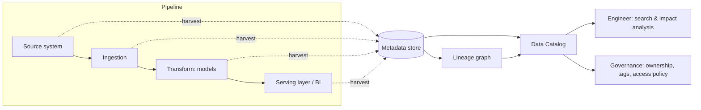

# Metadata, Lineage & the Data Catalog
{: .no_toc }

*Part 5: Running It Like a Platform &middot; DataOps, Orchestration & Metadata*

Once pipelines deploy themselves through CI/CD across a dozen orchestrated DAGs, an architect runs into a question the [previous topic on DataOps and orchestration patterns](01-dataops-cicd-iac-orchestration/) never had to answer: if this column changes, what breaks, and who finds out before a stakeholder does? Getting caught without an answer — during an incident at 2 a.m., or a compliance audit with a two-week deadline — is the concrete cost of skipping **metadata**, **lineage**, and the **data catalog**, which is why the same platform discipline that automated deployment also has to automate knowing what's out there and how it connects.

## Metadata as the Platform's Nervous System

**Metadata** is data about data: a table's schema and column types, who owns it, when it was last updated, how often it's queried, what quality checks pass against it, what sensitivity or PII tags apply to it. On a small platform, one engineer can hold most of this in their head. That stops working somewhere well before a hundred tables and a dozen pipelines, and past that point, undocumented metadata isn't saved effort — it's a standing outage risk, because nobody can safely change anything without first tracking down someone who remembers.

The fix is to stop treating metadata as documentation someone writes once and instead treat it as a byproduct every pipeline emits automatically: an orchestrator run reports which tables it read and wrote, a transformation tool reports the columns each model produces and their types, a quality check reports its pass/fail result — all harvested continuously into a shared metadata store rather than maintained by hand in a wiki that's stale within a month. Technical metadata (schema, types, freshness) and operational metadata (run history, volumes, latency) both matter here, but it's business metadata — a plain-language definition of what "active customer" or "net revenue" actually means in this warehouse — that closes the gap a schema alone can't: two tables can be perfectly documented at the column level and still disagree about what a shared term means.

## Lineage: Knowing What Breaks What

**Lineage** is metadata connected into a graph: this gold table was built from these silver models, which were built from these bronze tables, which came from these three source systems. Table-level lineage answers "what depends on this table"; column-level lineage answers the sharper question "what depends on *this column specifically*" — the difference matters enormously when the change on the table is a rename or a type change to one field, not the whole table disappearing.

Lineage earns its keep in two moments. Before a change, it turns "what breaks if I touch this?" from a guess into a query: walk the graph downstream from the column in question and get the exact list of models, dashboards, and consumers affected — impact analysis instead of institutional memory. After a failure, it does the same walk in reverse: a broken dashboard's number is wrong, and root-cause analysis is tracing lineage upstream through every transformation until the failing step is found, rather than re-reading every DAG by hand.

{: .important }
> Lineage that's assembled by hand in a spreadsheet is stale the day someone ships a change without updating it, and stale lineage is worse than none — it tells you a wrong answer with total confidence. Lineage only stays trustworthy if it's harvested automatically from the orchestrator, the transformation layer, and the catalog's own scans, the same way metadata is.

## The Catalog: Discovery and Governance Hub

The **data catalog** is where harvested metadata and lineage become usable: a searchable inventory of what data exists, what it means, who owns it, and how trustworthy it is, aimed at two different audiences at once. For an engineer or analyst, it's a discovery tool — search for "revenue" and find the one gold table that's actually the source of truth, instead of five candidate tables and no way to tell which is current. For governance, it's the enforcement hub — where sensitivity tags, ownership records, and access policy get attached to data so that downstream access-control decisions (covered in the next group) have something concrete to act on.

A catalog populated once at launch and never refreshed decays into the same untrustworthy state as hand-built lineage — the fix in both cases is the same: wire metadata harvesting into the pipelines and the orchestrator that already run every day, so the catalog reflects Tuesday's platform on Tuesday, not the platform as it looked at rollout.

<!-- prevnext:start -->

---

| [&larr; Previous: DataOps & Platform Engineering: CI/CD, IaC/GitOps & Orchestration Patterns](01-dataops-cicd-iac-orchestration/) | [Next: Quality, Security & Governance &rarr;](../09-quality-security-and-governance/) |
|:---|---:|

<!-- prevnext:end -->
