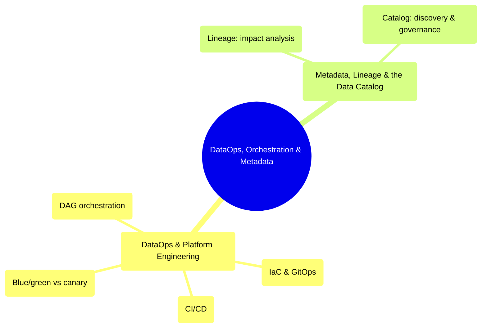

# DataOps, Orchestration & Metadata
*Part 5: Running It Like a Platform*

Part 4 ended with transformation logic finally living as version-controlled, tested code; Part 5, "Running It Like a Platform," starts here because code that's correct once isn't the same thing as a platform that stays correct — that takes a way to deploy changes safely and a way to know what's out there and what depends on what. This group's two topics cover exactly those two halves: first the operating discipline that gets a change from a laptop into production without an outage — CI/CD, infrastructure as code, environment promotion, orchestration — and then the metadata, lineage, and catalog layer that lets anyone on the team answer "what will this break?" before they ship, instead of finding out after. Together they turn a working pipeline into something the rest of the organization can actually depend on and safely evolve.

## Topics

| # | Topic |
|---|-------|
| 1 | [DataOps & Platform Engineering: CI/CD, IaC/GitOps & Orchestration Patterns](01-dataops-cicd-iac-orchestration/) |
| 2 | [Metadata, Lineage & the Data Catalog](02-metadata-lineage-and-catalog/) |

<!-- prevnext:start -->

---

| [&larr; Previous: The dbt Paradigm: Transformation as Code, Data Contracts & Idempotent Reprocessing](../07-transformation-and-modern-data-stack/02-dbt-paradigm-contracts-idempotency/) | [Next: DataOps & Platform Engineering: CI/CD, IaC/GitOps & Orchestration Patterns &rarr;](01-dataops-cicd-iac-orchestration/) |
|:---|---:|

<!-- prevnext:end -->
