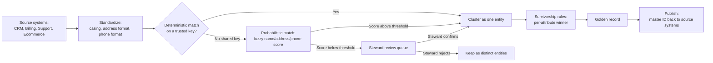

# Master Data Management: Golden Records, Matching & Stewardship
{: .no_toc }

*Part 5: Running It Like a Platform &middot; Quality, Security & Governance*

A data contract can guarantee that the `customers` table your team ships has the right columns, types, and freshness every time it's queried — but it can't guarantee that the row for "Rahul Singh" in the CRM and the row for "R. Singh" in billing are the same person. [Data Quality & Data Contracts](01-data-quality-and-contracts/) made correctness of a single dataset an engineered property; master data spans systems no single contract owns end to end, and that's a different problem entirely. **Master data management (MDM)** is the discipline that closes that gap: making sure the handful of entities every part of the business argues about — customer, product, account, vendor — resolve to exactly one trustworthy record, instead of a slightly different almost-right version living in each system that touches them.

## Why the same customer has five names

Every system that captures a customer captures a slightly different version of them. The e-commerce checkout form stores whatever a shopper typed. The CRM stores whatever a sales rep typed, months later, from memory. Billing stores whatever the payment processor returned. Support stores whatever the ticket system autofilled from an email address. None of these systems is wrong, exactly — each one is a faithful record of what it observed, at the time it observed it. But an executive asking "how many customers do we have" or a churn model asking "has this customer bought from us before under a different account" needs one answer, not four systems' worth of near-duplicates that a normal `JOIN` on `customer_id` will never reconcile, because there usually isn't a shared key at all.

## Match/merge: finding out which rows are the same entity

The first mechanical problem is **matching**: deciding which rows, across systems, describe the same real-world entity. Where a reliable shared key exists — a tax ID, a verified email, a loyalty number — matching is **deterministic**: an exact match on that key is proof enough. Most of the time no such key exists, or it exists inconsistently, and matching has to be **probabilistic**: compare name, address, phone, and date of birth after standardizing them (casing, abbreviations, formatting), score the similarity of each pair, and treat anything above a confidence threshold as the same entity. Rows that match get **merged** into a cluster — not necessarily by overwriting anything yet, just by recording "these N source rows are the same underlying entity."

## Survivorship rules: which value wins

Once a cluster of matching rows exists, something has to decide which source's value wins for each attribute — that's **survivorship**. A common set of rules, applied per attribute rather than per record: most-recently-updated wins for things like a phone number or address; a designated authoritative source wins for things like legal name or tax status (billing, not a sales rep's CRM entry, is usually authoritative here); most-complete value wins when one source has a field the others left blank; and an explicit manual override, logged and attributed, wins over all of the above when a steward has corrected something the automated rule got wrong. Survivorship rules are a governance decision as much as a technical one — deciding that billing outranks CRM for legal name is a business call, not something a matching algorithm can infer on its own.

## The golden record, and where it actually lives

The output of match, merge, and survivorship is the **golden record** — the single version of an entity every system is meant to treat as authoritative. Architecturally, there are two ways to implement this, and it's a build-vs-buy-vs-compose decision like any other: a **registry** style keeps each source system's data where it already lives and stores only a cross-reference of IDs plus the survived attributes, which is cheaper to stand up but means every consumer still has to know how to assemble the full picture; a **hub** style fully materializes the golden record as its own system of record and publishes it back out to every consuming system, which costs more to build and operate but gives every downstream system one place to look. Most MDM programs start as a registry for a single entity (usually customer) and only build toward a hub once the business case for a fully materialized golden record justifies the investment.

A golden record doesn't stay static once it exists — a customer's segment, region, or tier on that record changes over time exactly like any other dimension attribute, which is the [Slowly Changing Dimensions](../05-dimensional-modeling-cloud-era/03-scd-and-conformed-dimensions/) problem, one layer upstream. An MDM hub has to decide whether an updated golden-record attribute overwrites the previous value or preserves it as history, and if a downstream `dim_customer` is built from that golden record, its SCD Type 2 versioning is only as correct as the golden record's own change history.

## Stewardship: who owns fixing it when it's wrong

Automated matching gets an MDM program most of the way there — typically the large majority of records resolve cleanly on a strong key or a high-confidence fuzzy match — but the remainder land in a review queue by design, and someone has to own that queue. A **data steward** is usually a named business-side role, not an engineer: someone in sales operations or a dedicated master-data team who resolves ambiguous matches, approves survivorship overrides, and is accountable when a customer calls in furious that their account still shows an address they moved out of two years ago. This is a governance function, not just a pipeline configuration — an MDM program with a well-tuned matching algorithm and no steward decays back into duplicate, conflicting records within a year, because new source systems keep appearing and new edge cases keep breaking rules nobody's watching. Deciding who resolves a wrong record, and how fast, is as much a part of the architecture as the matching logic itself.

<!-- prevnext:start -->

---

| [&larr; Previous: Data Quality & Data Contracts: How Much Quality Is Enough?](01-data-quality-and-contracts/) | [Next: Security & Governance: Access Control, Federated Governance & Compliance by Design &rarr;](03-security-and-governance/) |
|:---|---:|

<!-- prevnext:end -->
