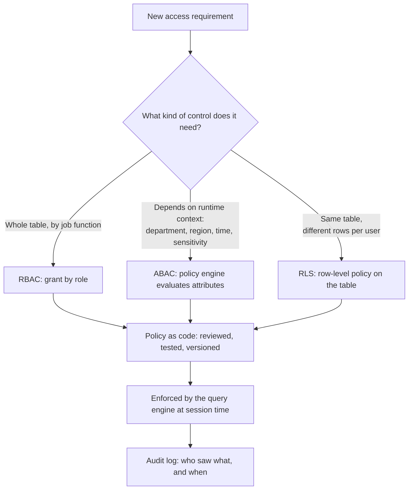

# Security & Governance: Access Control, Federated Governance & Compliance by Design
{: .no_toc }

*Part 5: Running It Like a Platform &middot; Quality, Security & Governance*

A golden record is only half of trustworthy governance — the other half is making sure the right people, and only the right people, can see it, and that "the right people" is a rule the platform enforces rather than a spreadsheet of who asked nicely. [Master Data Management](02-master-data-management/) established one authoritative version of a sensitive entity like a customer; this topic is about controlling who gets to see which fields of it, under which regulatory obligation, and proving that control holds up when an auditor asks.

## The access architecture: RBAC vs ABAC vs RLS

**RBAC (role-based access control)** ties permissions to a role — analyst, engineer, finance — rather than to an individual, and it's the simplest model to reason about: look at someone's role, and you know what they can touch. It's also the model most legacy warehouse teams already know from database `GRANT` statements. Its weakness shows up at scale: real organizations accumulate exceptions faster than roles can cleanly represent them, and a role list quietly grows into `finance-emea-readonly-excl-payroll`, which is a role in name only.

**ABAC (attribute-based access control)** decides access at query time from attributes of the user, the resource, and the context — department equals Finance, and region matches the user's own region, and it's within business hours — evaluated by a policy engine rather than looked up in a fixed grant list. It's far more flexible than RBAC and scales better to genuine exceptions, at the cost of being harder to audit: "who can see this" is now the output of a rule evaluation, not a list you can read.

**RLS (row-level security)** operates at a different layer entirely from the other two. RBAC and ABAC decide whether you can touch a table at all; RLS decides which *rows* of a table you're already allowed to query you actually see. A sales rep running `SELECT * FROM orders` gets a result silently filtered to their own region by a policy attached to the table itself — invisible to the query, enforced by the engine, and impossible to bypass by writing cleverer SQL.



## Policy as code

**Policy as code** means access rules are expressed as versioned, testable configuration — checked into git, reviewed via pull request, tested in CI — instead of an access change being a ticket that ends with a DBA running an ad hoc `GRANT` nobody else reviews. The mechanism varies by platform (an Open Policy Agent-style rule engine, a cloud catalog's tag-based policies, a warehouse's native attribute-based grants), but the pattern is the same everywhere: the rule that decides who can see what is a diffable artifact, not an institutional memory that leaves when the person who set it up does.

```text
# Illustrative policy-as-code fragment (Rego-style pseudocode, not a runnable file)
package access.customer_pii

default allow = false

allow {
    input.user.role == "support_agent"
    input.resource.classification == "pii"
    input.user.region == input.resource.region
    input.request.purpose == "ticket_resolution"
}
```

A policy expressed this way is testable the same way application code is: a pull request that would widen access to a `pii`-classified table can be caught by a CI check before it merges, not discovered during an audit six months later.

## Federated governance

In a decentralized organization — a **data mesh** where each domain owns its own data products — governance can't be one central team approving every access request one at a time; that's a bottleneck that scales linearly with headcount while requests scale with the whole business. It also can't be a free-for-all, or every domain invents its own definition of "sensitive." **Federated governance** splits the difference: a small set of non-negotiable global policies — PII classification standards, minimum retention, encryption requirements — is set and enforced centrally, while each domain owns and grants access to its own data products within those guardrails. The center defines the floor; the domains operate freely above it.

## Compliance by design: PII, retention, and the right to be forgotten

**PII (personally identifiable information)** has to be classified before it can be governed — usually via automated scanning tied into the catalog, tagging columns like email, phone, or address as sensitive so every downstream policy (RLS filters, masking, access grants) can key off that tag instead of a person remembering which columns are risky. **Retention** policy determines when data is deleted or archived, driven by a legal or contractual requirement rather than a storage-cost decision — keeping data "just in case" past its legally required retention window is itself a compliance liability, not a safety margin. The **right to be forgotten (RTBF)**, the sharpest of the three, requires that an individual's data can be located and deleted across *every* system it propagated to — including the golden record built by MDM, every SCD Type 2 history row that ever captured their name or address, and any derived feature built for a model. None of that is possible without the **lineage** the platform's metadata layer already tracks — you cannot honor a deletion request for data you can't trace.

## How much security is enough? The friction-vs-risk decision

Every access control adds friction: a data scientist waits days for a grant, a dashboard breaks because RLS filtered out rows an analyst didn't expect, a policy-as-code review adds a step to a pipeline change. Every gap in access control is a risk whose cost is usually invisible until a breach or an audit finding makes it suddenly very visible. The architect's actual job isn't to maximize control uniformly — it's to size control to a dataset's real sensitivity and blast radius. Locking down a public product catalog as tightly as a table containing tax IDs wastes engineering effort on the low-risk table and, worse, trains people to treat governance as friction to route around rather than a control worth respecting.

{: .important }
> Security's cost isn't only breach risk — it's the friction tax on every legitimate query. Push that tax too high and people build shadow pipelines and unmanaged spreadsheet exports to get their job done anyway, which is a *worse* security posture than the one you were trying to avoid. Size controls to actual sensitivity and blast radius, not uniformly to the strictest tier you can imagine.

<!-- prevnext:start -->

---

| [&larr; Previous: Master Data Management: Golden Records, Matching & Stewardship](02-master-data-management/) | [Next: Cost & Performance Architecture &rarr;](../10-cost-and-performance-architecture/) |
|:---|---:|

<!-- prevnext:end -->
