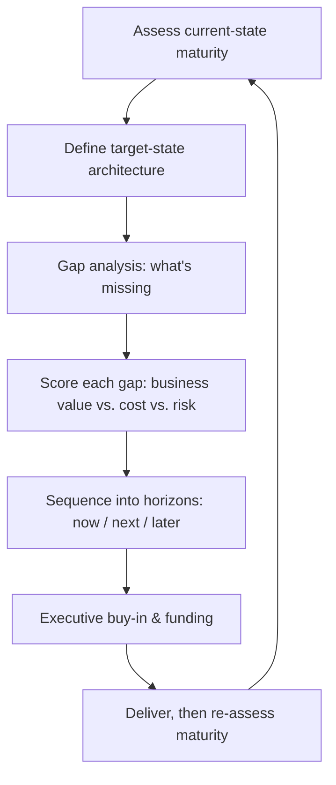

# Data Strategy & Roadmaps: Maturity Assessment, Gap Analysis & Business Alignment
{: .no_toc }

*Part 5: Running It Like a Platform &middot; Quality, Security & Governance*

Everything in this course so far has assumed someone already decided *what* to build — a lakehouse, a mesh, a conformed warehouse — and handed you the mandate to build it well. In practice, an architect is often handed the opposite: a vague executive directive ("get us AI-ready," "stop the reporting fire drills") and no architecture at all, just a budget line and a deadline. [Security & Governance](../03-security-and-governance/) assumed a platform already exists that policy can be enforced on; this topic is what comes *before* that — turning a vague mandate into a sequenced, fundable plan for which platform gets built first, and in what order.

## Strategy is an architecture artifact, not a slide deck

A **data strategy** is the multi-year statement of what capabilities the organization needs from its data platform and why, tied explicitly to business outcomes — revenue, cost, risk, or compliance — rather than to technology for its own sake. A **roadmap** is that strategy broken into sequenced, scoped initiatives with rough timing and ownership. Treating either as a one-time slide deck for an executive offsite is the most common way strategy work gets wasted: a deck gets approved, nobody revisits it, and eighteen months later the "strategy" bears no relationship to what actually got built. A strategy earns the name only if it's revisited on the same cadence as the roadmap it drives — typically annually, or whenever a major initiative completes and changes what's actually possible next.

## Maturity assessment: where the organization actually is

Before proposing where to go, an architect has to establish, honestly, where the organization currently stands. A **maturity assessment** scores current capability across dimensions like data quality, governance, architecture, and self-service — not as a vanity exercise, but because it determines what's even *feasible* to propose next. An organization still manually reconciling spreadsheets for its monthly close cannot jump straight to a real-time feature store; the gap between where it is and where a pitch deck wants it to be is the actual scope of the work.

| Level | Characteristic | Typical signal |
|---|---|---|
| 1 — Ad hoc | No consistent process; heroics and tribal knowledge | "Only Dave knows how the finance numbers reconcile" |
| 2 — Reactive | Processes exist but are manual and inconsistently followed | Data quality issues found by consumers, not producers |
| 3 — Managed | Defined processes, owned systems, basic governance | A catalog exists; lineage is traceable for critical tables |
| 4 — Defined | Governance and quality are proactive and measured | Data contracts, SLAs, and a working stewardship model |
| 5 — Optimized | Data is a managed product; architecture adapts by design | Self-service with guardrails; mesh/fabric-style autonomy |

This is a simplified version of the kind of scale formalized in frameworks like **DAMA-DMBOK's Data Management Maturity Model** — the exact framework matters less than using *some* consistent, repeatable scale, scored the same way each year, so progress (or its absence) is visible rather than asserted.

## Target state and gap analysis

The **target state** is the architecture the organization needs in, typically, 2-3 years — concrete enough to name (a lakehouse on Iceberg with federated governance, say) but not so detailed it becomes a premature design document. **Gap analysis** is the honest list of what's missing between the current-state score and that target: a catalog that doesn't exist yet, a governance council that's never met, a streaming capability nobody has built. Each gap becomes a candidate initiative — and the next step is deciding which ones actually belong on a funded roadmap and in what order.

## Prioritizing the roadmap: value, cost, and risk — not just technical merit

Every gap looks urgent to the team that feels it, which is exactly why prioritization can't be left to whoever argues loudest. A workable scoring approach rates each candidate initiative against three independent axes: **business value** (which executive priority does this actually move — revenue, cost, risk, or compliance?), **cost** (engineering effort and ongoing run cost, the same calculus as [Cost as an Architectural Decision](../../10-cost-and-performance-architecture/01-cost-as-architectural-decision/)), and **risk** (what happens if this *isn't* done — a compliance fine, a recurring outage, a slow erosion of trust in the numbers). A popular sequencing device borrowed from general strategy work is **Horizon 1/2/3**: Horizon 1 is what sustains and fixes the current platform (the data contracts and quality gates that stop the bleeding), Horizon 2 is the capability expansion already funded and in motion (the lakehouse migration), and Horizon 3 is the speculative bet (a feature store for a model nobody's shipped yet). A healthy roadmap has initiatives in all three horizons — a roadmap that's all Horizon 3 is chasing novelty while the current platform rots; one that's all Horizon 1 never moves the organization anywhere new.

{: .important }
> The single most common roadmap failure isn't picking the wrong initiatives — it's sequencing a multi-year, all-or-nothing build with no delivered value until the end. Executive sponsorship erodes long before a two-year "big bang" finishes, and the first budget cut lands on exactly the program with nothing to show yet. Sequence the roadmap so every quarter ships something a stakeholder can see working, even if it's a narrow slice of the eventual target state.

## Business alignment: the architect as translator

A roadmap initiative that can't be traced to a business outcome a non-technical executive would recognize — "faster financial close," "fewer customer-data compliance findings," "lower cloud spend" — is a sign the initiative is solving an engineering problem the business never asked about, however real that problem is to the team closest to it. The discipline is to attach a one-line business case to every roadmap item *before* it's prioritized, not after, as justification for a decision already made. This is the same translation skill the [Capstone](../../12-architecting-for-ai-and-closing-the-loop/03-capstone-designing-and-defending-ai-ready-platform/) exercises later in this course: defending an architecture to a board means defending it in the board's vocabulary, not the platform's.

## Decide-under-uncertainty, applied at roadmap scale

[Deciding Under Uncertainty](../../03-architects-decision-framework/01-deciding-under-uncertainty/) introduced build-vs-buy-vs-compose and the one-way-door vs. two-way-door distinction for a single architectural decision. A roadmap is that same judgment exercised repeatedly, at a coarser grain, across a multi-year horizon: each initiative is itself a build-vs-buy call, and the sequencing decision — what goes in Horizon 1 versus Horizon 3 — is itself a bet on how much the landscape (vendors, regulation, the organization's own maturity) will change before that later initiative starts. A roadmap that locks every initiative in at once, with no re-assessment checkpoint, treats a string of two-way-door decisions as if they were all one-way — which is how roadmaps survive past the point they stopped being right.

<!-- prevnext:start -->

---

| [&larr; Previous: Security & Governance: Access Control, Federated Governance & Compliance by Design](../03-security-and-governance/) | [Next: The Governance Operating Model: Owners, Stewards, Custodians & the Council &rarr;](../05-governance-operating-model/) |
|:---|---:|

<!-- prevnext:end -->
