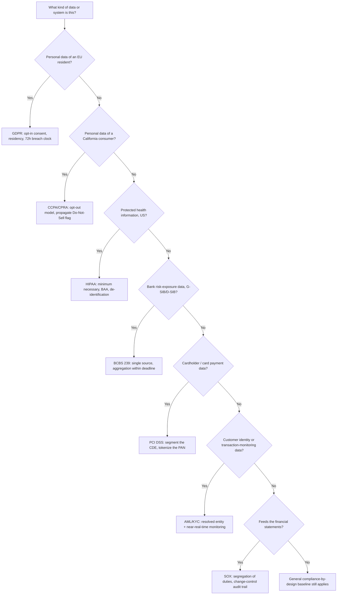

# Privacy & Industry Regulation: GDPR, CCPA, HIPAA & BFSI Compliance (Basel, PCI DSS, AML/KYC, SOX)
{: .no_toc }

*Part 5: Running It Like a Platform &middot; Quality, Security & Governance*

[Security & Governance](../03-security-and-governance/) treated "compliance by design" as one general capability — classify PII, retain it on schedule, be able to delete it on request. In practice, "compliant with what" is never generic, and a bank or insurer never faces just one regime: GDPR, CCPA, and HIPAA each impose a specific obligation on personal data, and a BFSI platform additionally has to satisfy several *industry-specific* regimes at the same time — Basel/BCBS 239, PCI DSS, AML/KYC, and SOX each govern a different slice of the same platform. [The Governance Operating Model](../05-governance-operating-model/)'s owner/steward/custodian roles only work if someone on that team can say exactly which of these obligations applies to a given table and what it concretely requires. Getting this wrong isn't an abstract risk — it's a multi-million-dollar fine, a blocked product launch, or a failed regulatory exam, and a BFSI architect will typically meet four or five of these at once, not just one.

## GDPR: consent, residency, and the 72-hour clock

The **GDPR (General Data Protection Regulation)** governs personal data of EU residents and is built on an **opt-in consent** model: processing personal data requires a **lawful basis** — usually explicit consent, a contractual necessity, or a legitimate interest the organization can defend — and that basis has to be recorded, not assumed. It grants **data subject rights**: access (what do you hold on me), rectification, the **right to be forgotten** already covered under Security & Governance, and **portability** (export my data in a usable format to another provider). High-risk processing — large-scale profiling, for instance — requires a **DPIA (Data Protection Impact Assessment)** before it goes live, not after. Two requirements bite architecture directly: cross-border transfer rules mean personal data leaving the EU needs an **adequacy decision** or **Standard Contractual Clauses (SCCs)** in place, which is why EU customer data often has to be *stored and processed in-region* rather than replicated freely to a US data center; and a **72-hour breach notification** clock means an incident-response process needs fast, reliable lineage to even know what was exposed in time to report it. Fines reach **4% of global annual revenue or €20M**, whichever is larger.

## CCPA/CPRA: opt-out, not opt-in — a different model, not a weaker one

California's **CCPA (as amended by CPRA)** looks similar to GDPR on the surface — rights to know, delete, and correct personal information — but runs on an **opt-out** model rather than GDPR's opt-in: a business can process personal data by default, and the architecture obligation is to honor a consumer's **"Do Not Sell or Share My Personal Information"** request once made, not to obtain permission first. That difference matters architecturally more than it sounds: a "Do Not Sell" flag has to propagate to every downstream consumer of that record — an ad-tech export, a data broker feed, an analytics pipeline — not just block it at the point of collection, which means the flag needs to travel with the data through every pipeline that touches it, the same propagation problem lineage exists to solve. CCPA also carries a **private right of action** for certain data breaches, meaning individual consumers — not just a regulator — can sue directly.

## HIPAA: PHI, minimum necessary, and the Business Associate Agreement

**HIPAA** governs **PHI (protected health information)** in the US and applies to **covered entities** (providers, insurers) and their **business associates** — any vendor, including a cloud provider, that touches PHI on a covered entity's behalf, which is why a cloud contract for a healthcare workload always includes a **BAA (Business Associate Agreement)** spelling out each party's security obligations under the shared-responsibility model. The **minimum necessary standard** is the architectural core of HIPAA: a user or system should see only the PHI fields actually required for their role, which in practice means field-level masking and RLS policies designed around PHI's 18 defined identifiers, not a blanket "clinician sees everything" grant. De-identifying data for research or analytics has two recognized paths: **Safe Harbor** (strip all 18 identifiers) or **Expert Determination** (a qualified statistician certifies the re-identification risk is very small). HIPAA also requires detailed **access audit logs** — who viewed which record, when, and in what system.

## BFSI compliance: Basel is one regime among several, not the whole picture

A bank, broker, or insurer doesn't get to satisfy "financial services compliance" once — it carries a stack of distinct regimes simultaneously, each aimed at a different failure mode: Basel/BCBS 239 at risk blindness, PCI DSS at card-data theft, AML/KYC at money laundering and terrorist financing, and SOX at financial-statement fraud. Each one shapes a different part of the same architecture.

### Basel III / BCBS 239: risk data aggregation as an architecture mandate

**BCBS 239** — the Basel Committee on Banking Supervision's *Principles for Effective Risk Data Aggregation and Risk Reporting* — protects the *financial system* rather than an individual, and it reads less like a privacy law and more like a direct architecture spec. It was written after the 2008 crisis exposed that major banks literally could not tell regulators, fast enough, how exposed they were to a single failing counterparty like Lehman Brothers. It applies to **G-SIBs (globally systemically important banks)** and, increasingly, large domestic banks, and its 14 principles group into governance, **risk data aggregation capability** (accuracy and integrity, completeness, timeliness, adaptability), risk reporting practice, and supervisory review. The architectural teeth are in "aggregation capability": a bank has to produce an accurate, complete view of its risk exposure — across legal entities, business lines, and geographies — within a regulator-defined window, sometimes within a day during a stress event, from an architecture built on a **single authoritative source** per risk category rather than reconciled spreadsheets.

### PCI DSS: shrinking the blast radius around cardholder data

**PCI DSS (Payment Card Industry Data Security Standard)** applies to anyone who stores, processes, or transmits card data, and its central architectural concept is the **cardholder data environment (CDE)** — the network segment, systems, and pipelines that actually touch a card's **PAN (primary account number)**. The standard rewards an architecture that makes the CDE as small as possible: **network segmentation** isolates it from the rest of the platform so most systems never need to be in audit scope at all, and **tokenization** — replacing the real PAN everywhere outside the payment processor with a non-sensitive token — lets analytics, CRM, and reporting systems join on "which card" without ever holding the actual number. Done well, this turns a company-wide audit into a narrow one: the fewer systems that touch raw PAN, the fewer systems PCI DSS's encryption, access-logging, and quarterly vulnerability-scan requirements actually apply to.

### AML/KYC: entity resolution and transaction monitoring under a legal deadline

**AML (anti-money laundering)** and **KYC (know your customer)** obligations — codified in the US **Bank Secrecy Act (BSA)** and its international equivalents — require a bank to know who its customers really are and to flag suspicious transaction patterns, filing a **Suspicious Activity Report (SAR)** within a legally defined window once something is flagged. Architecturally, this depends on two capabilities covered earlier in this course: **KYC due diligence** is only as good as the [Master Data Management](../02-master-data-management/) golden record it runs against — a customer spread across five unmatched records is five weaker, incomplete pictures instead of one reliable one, and sanctions-list screening has to run against the resolved entity, not each fragment. **Transaction monitoring** needs a near-real-time or real-time pipeline (the RT vs NRT distinction from [Should This Be Streaming At All?](../../06-ingestion-and-streaming-decisions/02-should-this-be-streaming-at-all/) matters here — a monitoring system that only sees yesterday's transactions is monitoring after the fact) capable of pattern detection — structuring, rapid movement across accounts — across a retention window that typically runs five years or more, since regulators can ask for the trail long after the transaction happened.

### SOX: an audit trail for whatever feeds the financial statements

**SOX (Sarbanes-Oxley)** applies to US public companies and, unlike the other three, isn't really about protecting data subjects or detecting fraud in transactions — it's about guaranteeing that the systems and processes producing the *financial statements* are controlled and auditable. **ICFR (internal control over financial reporting)** requires **segregation of duties** (the person who can change a general-ledger pipeline's transformation logic shouldn't also be the person who approves it) and a durable **change-control audit trail** for any system that feeds the numbers in a 10-K or 10-Q. For a data architect, this means the lineage and DataOps discipline from earlier groups — versioned transformations, CI-reviewed pipeline changes, immutable logs of who changed what and when — isn't optional tooling hygiene for the finance-reporting pipeline specifically; it's the literal evidence an external auditor will ask to see.

### Other regimes worth recognizing by name

| Regime | Region / sector | What it specifically requires |
|---|---|---|
| **Solvency II** | EU insurers | Basel-equivalent risk and capital-adequacy reporting, insurer-specific |
| **MiFID II** | EU capital markets | Trade and transaction reporting, 5-7 year record retention, synchronized timestamps |
| **GLBA** | US financial institutions | Customer financial-privacy notices, a documented information-security "Safeguards" program |
| **RBI data localization** | India (payments) | Payment system transaction data must be stored only on servers located in India |

None of these need a dedicated deep dive here, but an architect operating in that region or sector has to know the regime exists before a regulator points it out.

## Designing for more than one regime at once

A bank with EU subsidiaries and California retail customers doesn't get to pick one regime — the same customer record can be GDPR personal data, CCPA personal information, KYC-relevant identity data, *and* in scope for SOX if it feeds regulatory capital reporting, each with a different obligation attached. The pattern that scales is tagging classification in the catalog by **regulation**, not just by sensitivity: a column carries tags like `gdpr-personal-data`, `pci-pan`, `aml-kyc-identity`, and `sox-financial-reporting` independently, and the policy-as-code layer from [Security & Governance](../03-security-and-governance/) keys its rules off whichever tags are present on a given record rather than one global "is this sensitive" flag. That's a materially bigger catalog design decision than it sounds — a single boolean doesn't carry enough information to know whether a change to this column needs a SOX-style approval workflow, a PCI DSS segmentation boundary, or both.

{: .important }
> Don't wait for the second regulatory regime to force a redesign. A platform built for one regime's rules — one global "PII" tag, one approval workflow — works fine until a second one applies (a new product line brings PCI DSS in scope; an IPO brings SOX in scope), at which point every table tagged the old way needs retrofitting under deadline pressure, with auditors and lawyers both watching. Design the classification scheme to carry per-regulation tags from day one, even when only one regulation currently applies.

<!-- prevnext:start -->

---

| [&larr; Previous: The Governance Operating Model: Owners, Stewards, Custodians & the Council](../05-governance-operating-model/) | [Next: Cost & Performance Architecture &rarr;](../../10-cost-and-performance-architecture/) |
|:---|---:|

<!-- prevnext:end -->
