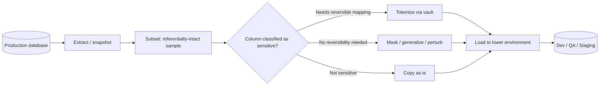

# Test Data Management: Masking, Tokenization, Subsetting & Synthetic Data for Lower Environments
{: .no_toc }

*Part 5: Running It Like a Platform &middot; Quality, Security & Governance*

An architect who gets GDPR, HIPAA, and PCI DSS right in production can still cause the exact breach those regimes exist to prevent — by refreshing a QA environment from a production snapshot and handing a hundred engineers, contractors, and offshore testers unrestricted read access to real PANs and health records that were never in scope for any of those controls. [Privacy & Industry Regulation](../06-privacy-and-industry-regulation/) covered what each regime requires of *production*; **test data management (TDM)** is where that same obligation gets applied to every *copy* of production data an organization makes — and in most companies there are more of those copies (dev, QA, staging, a BI sandbox, an offshore partner's UAT) than there are production instances. Treating a lower environment as exempt from the rules just because it isn't customer-facing is one of the most common ways a compliant production platform still ends up on the front page for a breach.

## Why "just copy prod down" doesn't work

The appeal of a straight prod clone is obvious: real data has the skew, nulls, duplicate near-matches, and edge cases that a hand-written test fixture never does, so bugs that only show up against realistic data actually get caught before release. The problem is that a lower environment is almost always *less* controlled than production, not equally controlled — more people have access (every developer, every QA contractor, every offshore team member), monitoring is lighter, and the data frequently ends up on laptops, in local Docker containers, or in a trial cloud account nobody remembers to lock down. A straight clone multiplies your real exposure surface by every lower environment you maintain, without multiplying any of the controls that make production defensible. The fix isn't "don't use real data's shape" — it's de-identifying it before it lands anywhere outside production's own perimeter.

## Masking vs. tokenization: two different guarantees

These two techniques get used interchangeably in casual conversation, but they make fundamentally different promises, and picking the wrong one for a given column is a real design mistake, not a style preference.

**Masking** irreversibly transforms a value into something that looks realistic but bears no recoverable relationship to the original — shuffling last names across rows, hashing an email address, or substituting a format-preserving fake SSN that still passes a `###-##-####` validation check. Once masked, the real value is gone; nobody, in any environment, can get it back. That's exactly right for an environment that never legitimately needs the real value again.

**Tokenization** replaces the real value with a surrogate token *and* keeps the real value recoverable — but only from a secure token vault that lives in production, under stricter access control than the lower environment itself. The same real value always maps to the same token, which is what lets a tokenized customer ID still join correctly across twenty tables in the lower environment, while the only system that can reverse a token back to a real SSN is the production vault nobody outside the platform team can reach. This is the same technique [Privacy & Industry Regulation](../06-privacy-and-industry-regulation/) described for shrinking a PCI DSS cardholder data environment — applied here to every sensitive column in an environment refresh, not just the PAN.

The deciding question is simple: does anything downstream ever legitimately need the real value back? If no, mask it. If yes — a support workflow that occasionally needs to look up a real record from a staging ticket, for instance — tokenize it.

## Subsetting: shrink the blast radius before you de-identify

De-identifying a full production copy still leaves you running (and paying for) a full production-sized lower environment. **Data subsetting** carves out a smaller, referentially-intact slice instead — a sample of customers, cascaded through every foreign key that touches them, so a subset order table only contains orders belonging to the subset of customers already selected. Done well, this shrinks storage and compute cost in every non-prod environment and shrinks the exposure surface by the same factor, since there's simply less data sitting anywhere that isn't production. Done badly — sampling each table independently instead of cascading one customer sample through the whole schema — it silently breaks joins, and QA spends a sprint debugging a "data bug" that's actually a subsetting bug.

## Generalization and perturbation: lighter-touch techniques

Masking and tokenization both replace a value outright, which is sometimes more than a given use case needs. Two lighter techniques trade precision for realism instead:

- **Generalization** reduces precision rather than replacing the value: an exact birthdate becomes a birth year, a 5-digit ZIP becomes a 3-digit region. The record is still real in aggregate but no longer uniquely identifying.
- **Perturbation** adds small, statistically bounded noise to a numeric value — a salary or a transaction amount shifts by a few percent, keeping distributions, averages, and percentiles realistic for a performance or analytics test without any single value matching a real person's exactly.

These matter most for a performance-testing or analytics-sandbox environment, where masking every value outright would destroy the statistical realism the test actually depends on, but leaving raw values in place is still an unacceptable exposure.

## Synthetic data: when even masked real data is too risky

For the lowest-trust environments — a public sales demo, an outsourced development team with no need to ever see a real customer, training material distributed outside the company — even consistently masked real data is more exposure than the use case justifies, because the row-level *structure* (which columns are populated together, which values cluster) can itself leak something about real customers. **Synthetic data generation** sidesteps that by generating data algorithmically, from rules or a generative model trained on production's statistical shape, rather than transforming real rows at all. The trade-off is fidelity: synthetic data reproduces the distributions you told the generator to reproduce, but it won't spontaneously contain the rare, specific edge case — a particular null-handling bug, a specific out-of-range value — that's sitting in row four million of actual production and is exactly what caused last quarter's incident. Most mature TDM programs use synthetic data as a supplement for the highest-risk environments, not a full replacement for masked real data everywhere.

| Technique | Reversible? | Preserves referential integrity? | Best for |
|---|---|---|---|
| Masking | No | Yes, if applied consistently | Dev/QA that never needs the real value back |
| Tokenization | Yes, via prod vault only | Yes, by design | Columns a controlled workflow occasionally needs to reverse |
| Generalization | No (precision already lost) | N/A (same row, less precise) | Analytics/performance tests needing realistic aggregates |
| Perturbation | No | N/A | Numeric fields where exact values don't matter, distributions do |
| Synthetic data | N/A — no real row exists | By design in the generator | Lowest-trust environments: demos, outsourced teams, training material |

## Automating the refresh: who owns the pipeline

None of this works as a manual, one-off step before a big release — it has to be a recurring, orchestrated pipeline, for the same reason any other data pipeline is: a manual process run under deadline pressure is exactly when someone skips the masking step "just this once" to unblock a sprint. The refresh job should be driven by the same **PII classification tags** already maintained in the catalog for [Security & Governance](../03-security-and-governance/) — a column tagged `pii-email` gets masked or tokenized automatically on every refresh, rather than a human remembering which of four hundred columns are sensitive this quarter — and scheduled and versioned through the same [DataOps & Platform Engineering](../../08-dataops-orchestration-and-metadata/01-dataops-cicd-iac-orchestration/) orchestration that runs every other pipeline on the platform, with an audit log of what ran, when, and against which classification ruleset. Several of the policy-engine tools already covered for dynamic masking — Immuta and Privacera among them — ship TDM connectors for exactly this static, at-rest use case, so an architect who's already adopted one for production access control often doesn't need a second product for environment refreshes.

{: .important }
> A lower environment's QA team cannot tell the difference between "this join is broken because the pipeline has a bug" and "this join is broken because masking replaced two different real values with the same output, or the same real value with two different outputs." Masking and tokenization rules must be applied consistently — the same source value always maps to the same result, within and across every table it appears in — or every test run downstream becomes unreliable for a reason nobody inside the lower environment can diagnose.

<!-- prevnext:start -->

---

| [&larr; Previous: Privacy & Industry Regulation: GDPR, CCPA, HIPAA & BFSI Compliance (Basel, PCI DSS, AML/KYC, SOX)](../06-privacy-and-industry-regulation/) | [Next: Cost & Performance Architecture &rarr;](../../10-cost-and-performance-architecture/) |
|:---|---:|

<!-- prevnext:end -->
