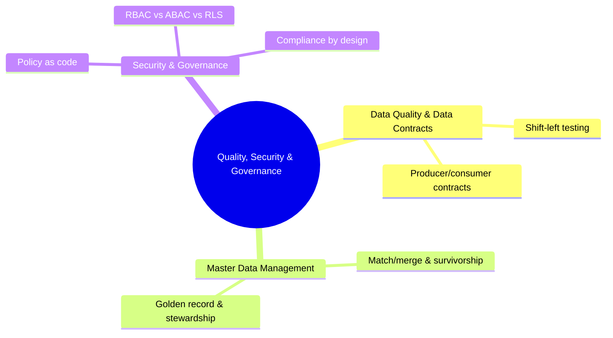

# Quality, Security & Governance
*Part 5: Running It Like a Platform*

The two groups before this one made sure the platform *runs* — pipelines scheduled and versioned, lineage traceable end to end — but running reliably says nothing about whether the data flowing through that platform is correct, unambiguous, or safe for the person querying it to see. This group is the trust layer on top of the operational one. **Data quality and data contracts** make correctness an engineered, tested property instead of a hope; **master data management** makes sure the entities every team argues about — customer, product, account — resolve to one trustworthy golden record instead of five conflicting ones; and **security and governance** make sure access to all of it is controlled, auditable, and defensible to a regulator, not just convenient for whoever asks first. Together, these three topics are what turns "the pipeline ran" into "you can build a decision, a model, or a compliance filing on what it produced."

**See also:** [Dimensional Modeling for the Cloud Era](../05-dimensional-modeling-cloud-era/) — a master data management golden record is the upstream source a conformed `dim_customer` is built from, and the same Slowly Changing Dimension decisions apply once that golden record starts changing over time.

## Topics

| # | Topic |
|---|-------|
| 1 | [Data Quality & Data Contracts: How Much Quality Is Enough?](01-data-quality-and-contracts/) |
| 2 | [Master Data Management: Golden Records, Matching & Stewardship](02-master-data-management/) |
| 3 | [Security & Governance: Access Control, Federated Governance & Compliance by Design](03-security-and-governance/) |

<!-- prevnext:start -->

---

| [&larr; Previous: Metadata, Lineage & the Data Catalog](../08-dataops-orchestration-and-metadata/02-metadata-lineage-and-catalog/) | [Next: Data Quality & Data Contracts: How Much Quality Is Enough? &rarr;](01-data-quality-and-contracts/) |
|:---|---:|

<!-- prevnext:end -->
