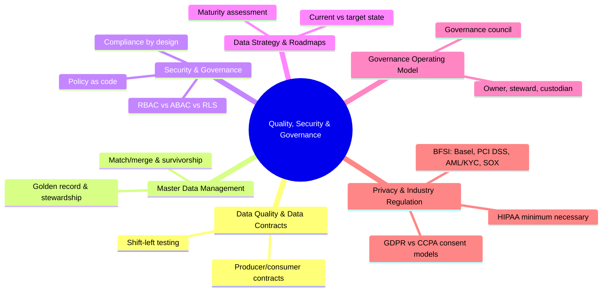

# Quality, Security & Governance
*Part 5: Running It Like a Platform*

The two groups before this one made sure the platform *runs* — pipelines scheduled and versioned, lineage traceable end to end — but running reliably says nothing about whether the data flowing through that platform is correct, unambiguous, or safe for the person querying it to see. This group is the trust layer on top of the operational one. **Data quality and data contracts** make correctness an engineered, tested property instead of a hope; **master data management** makes sure the entities every team argues about — customer, product, account — resolve to one trustworthy golden record instead of five conflicting ones; and **security and governance** make sure access to all of it is controlled, auditable, and defensible to a regulator, not just convenient for whoever asks first. The last two topics step back from mechanism to institution: **data strategy and roadmaps** is how an architect turns an executive mandate into a sequenced, defensible plan, and the **governance operating model** is who is actually accountable for all of the above once the policy engine is built — a person, not a product, has to own the answer when something goes wrong. The group closes with **privacy and industry regulation**, which is where all of the above stops being a best practice and becomes a legal obligation with a specific, named architecture requirement attached. Together, these six topics are what turns "the pipeline ran" into "you can build a decision, a model, or a compliance filing on what it produced — and defend, to a board or a regulator, who decided that and why, and exactly which law required it."

```mermaid
mindmap
  root((Quality, Security & Governance))
    Data Quality & Data Contracts
      Shift-left testing
      Producer/consumer contracts
    Master Data Management
      Match/merge & survivorship
      Golden record & stewardship
    Security & Governance
      RBAC vs ABAC vs RLS
      Policy as code
      Compliance by design
    Data Strategy & Roadmaps
      Maturity assessment
      Current vs target state
    Governance Operating Model
      Owner, steward, custodian
      Governance council
    Privacy & Industry Regulation
      GDPR vs CCPA consent models
      HIPAA minimum necessary
      BFSI: Basel, PCI DSS, AML/KYC, SOX
```

**See also:** [Dimensional Modeling for the Cloud Era](../05-dimensional-modeling-cloud-era/) — a master data management golden record is the upstream source a conformed `dim_customer` is built from, and the same Slowly Changing Dimension decisions apply once that golden record starts changing over time. [The Architect's Decision Framework](../03-architects-decision-framework/) — a data strategy roadmap is that framework's build-vs-buy-vs-compose judgment applied at the scale of a multi-year plan instead of a single decision.

## Topics

| # | Topic |
|---|-------|
| 1 | [Data Quality & Data Contracts: How Much Quality Is Enough?](01-data-quality-and-contracts/) |
| 2 | [Master Data Management: Golden Records, Matching & Stewardship](02-master-data-management/) |
| 3 | [Security & Governance: Access Control, Federated Governance & Compliance by Design](03-security-and-governance/) |
| 4 | [Data Strategy & Roadmaps: Maturity Assessment, Gap Analysis & Business Alignment](04-data-strategy-and-roadmaps/) |
| 5 | [The Governance Operating Model: Owners, Stewards, Custodians & the Council](05-governance-operating-model/) |
| 6 | [Privacy & Industry Regulation: GDPR, CCPA, HIPAA & BFSI Compliance (Basel, PCI DSS, AML/KYC, SOX)](06-privacy-and-industry-regulation/) |

<!-- prevnext:start -->

---

| [&larr; Previous: Metadata, Lineage & the Data Catalog](../08-dataops-orchestration-and-metadata/02-metadata-lineage-and-catalog/) | [Next: Data Quality & Data Contracts: How Much Quality Is Enough? &rarr;](01-data-quality-and-contracts/) |
|:---|---:|

<!-- prevnext:end -->
