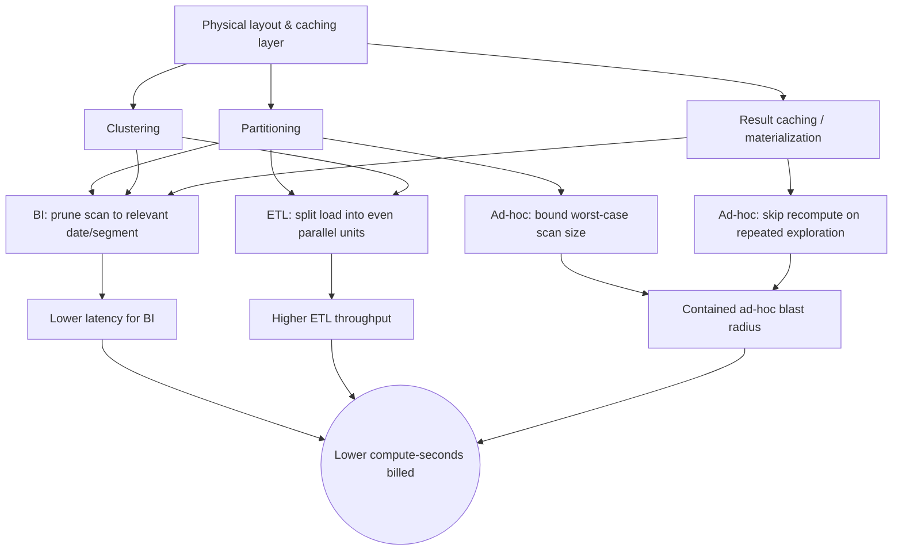

# Performance Architecture: Tuning by Workload
{: .no_toc }

*Part 5: Running It Like a Platform &middot; Cost & Performance Architecture*

An architect who tunes a platform for "speed" in the abstract will optimize the wrong thing for most of the people using it — indexing for the dashboard that runs in two seconds anyway while the nightly load that actually blocks the business quietly doubles in duration. [Cost as an Architectural Decision](01-cost-as-architectural-decision/) established that every storage and compute choice carries a price; performance tuning is the other half of that same coin, because most of the levers that make a workload faster are the identical levers that make it cheaper to run. Getting this wrong doesn't just cost money — it means shipping a platform that feels fast in the demo and falls over the first week production traffic hits it unevenly across workload types.

## There Is No "Fast" — Only Fast for a Workload

The first mistake is treating performance as one number a platform either has or doesn't. A data platform typically serves at least three distinct workload shapes, and they want opposite things from the underlying system: **BI** workloads run the same handful of queries repeatedly against a relatively stable dataset and care about sub-second, predictable response time; **ETL** workloads move and transform large volumes on a schedule and care about total throughput, not the latency of any single row; **ad-hoc and data-science** workloads run unpredictable, exploratory queries — sometimes lightweight, sometimes a full-table scan with a badly written join — and care about not getting starved by, or starving, everything else running at the same time. A configuration tuned for one of these can actively hurt the other two: aggressively pre-aggregating for BI dashboards adds transformation overhead that slows ETL; giving ad-hoc users the same compute pool as production BI risks one runaway analyst query blowing out everyone's dashboard latency. Tuning "the platform" is a category error; the real job is tuning for each workload, deliberately, and keeping them from stepping on each other.

## BI Workloads: Clustering, Materialization & Result Caching

BI workloads are the most predictable of the three, which makes them the easiest to pre-optimize. **Clustering** — physically co-locating rows that share common filter or join column values (a customer ID, a date) — lets the query engine skip reading data blocks that can't match a query's filter, shrinking the amount of data scanned before a single row of comparison happens. **Materialization** takes it further: instead of recomputing an expensive join or aggregation on every dashboard refresh, the result is computed once and stored as a table or materialized view, and every subsequent query reads the pre-built answer instead of redoing the work. **Result caching** goes one step further still — if the exact same query (or a query the engine recognizes as equivalent) has already run recently against unchanged data, the engine returns the cached result directly, skipping computation entirely. Layered together, these three techniques are why a well-tuned BI layer can serve thousands of dashboard refreshes a day at a fraction of the compute cost of running every query fresh.

## ETL Workloads: Throughput, Parallelism & File Sizing

ETL cares about a different metric entirely: not how fast one query returns, but how much data moves through the pipeline in a given window before the next load needs to start. Throughput here is mostly won or lost on parallelism and file sizing. A transformation job split across many parallel workers, each handling an independent partition of the data, finishes in a fraction of the time a single-threaded pass would take — provided the data is actually partitioned in a way that splits evenly. File sizing matters just as much: a landing zone full of thousands of tiny files forces the engine to pay fixed per-file overhead (opening a file, reading its footer/metadata) far more often than the data volume justifies, the same small-files problem that shows up in storage-layer design. Compacting small files into fewer, right-sized ones before a heavy ETL pass routinely cuts runtime more than any amount of query rewriting does.

## Ad-hoc & Data-Science Workloads: Isolation & Elasticity

Ad-hoc and data-science workloads are the wildcard: an analyst or data scientist can, without warning, submit a query that scans a full year of raw events or trains a model against a multi-terabyte extract. The architectural answer is not to forbid this — it's to contain it. **Workload isolation** means giving unpredictable, exploratory workloads their own compute pool (a separate warehouse, cluster, or serverless endpoint) so a runaway query burns its own budget and its own capacity instead of degrading the BI dashboards and ETL jobs sharing the same resources. **Elasticity** — the ability to scale compute up automatically when a heavy ad-hoc job arrives and back down to near-zero when it's idle — is what makes isolation affordable rather than wasteful; a dedicated, always-on cluster sized for worst-case ad-hoc demand would sit idle (and billing) most of the time. Isolation plus elasticity is what lets an architect say yes to open-ended exploratory access without putting production SLAs at risk.

## Partitioning, Clustering & Caching as a Shared Cost + Performance Lever

The reason this topic sits directly after cost economics is that the tuning techniques above aren't separate from the cost levers in the previous topic — they're the same levers, viewed from the performance side. Partitioning and clustering reduce the bytes scanned per query, which simultaneously makes the query faster *and* reduces the compute-seconds billed for it. Result caching and materialization mean a query might not run at all, which is both the fastest possible response time and the cheapest possible one. This is why performance tuning belongs in an architect's cost conversation, not a separate "make it fast" backlog: get the physical layout and caching strategy right once, and it pays out in both currencies at the same time, across every workload that touches the table.

{: .important }
> Don't design partitioning, clustering, and caching as three separate performance projects for three separate teams. They're one architectural investment that pays a cost dividend and a performance dividend simultaneously — tune the physical layout once, correctly, and every workload type that reads the table benefits, including ones you haven't built yet.

None of these levers require guessing. Query engines expose scan statistics, cache hit rates, and per-workload compute consumption — the same telemetry that tells you a dashboard is slow tells you exactly how many bytes it scanned and whether a materialized view would have skipped that scan entirely. Tuning by workload, informed by that telemetry, is what separates an architect's performance work from a developer's habit of adding an index and hoping.

<!-- prevnext:start -->

---

| [&larr; Previous: Cost as an Architectural Decision: Storage, Compute & Egress Economics](01-cost-as-architectural-decision/) | [Next: Serving, Reliability & the Mesh Operating Model &rarr;](../11-serving-reliability-and-mesh-operating-model/) |
|:---|---:|

<!-- prevnext:end -->
