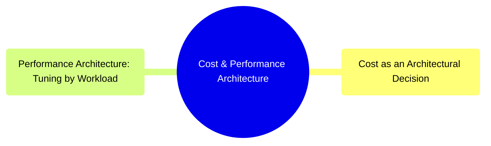

# Cost & Performance Architecture
*Part 5: Running It Like a Platform*

Part 5, "Running It Like a Platform," has so far covered how to operate the platform (DataOps, orchestration, metadata) and how to keep it trustworthy and safe (quality, MDM, security, governance) — this group closes that arc by asking whether the result is actually sustainable to run. A platform can be reliable, well-governed, and still architecturally broken if nobody priced the storage tiers, the compute pattern, or the query shape it invites. The two topics here are that closing pair: cost as a first-class design constraint across storage, compute, and egress, and performance tuned deliberately by workload rather than chased generically — the last lever an architect pulls before the course turns, in Part 6, to serving that platform's output and keeping it up.

## Topics

| # | Topic |
|---|-------|
| 1 | [Cost as an Architectural Decision: Storage, Compute & Egress Economics](01-cost-as-architectural-decision/) |
| 2 | [Performance Architecture: Tuning by Workload](02-performance-tuning-by-workload/) |

<!-- prevnext:start -->

---

| [&larr; Previous: Security & Governance: Access Control, Federated Governance & Compliance by Design](../09-quality-security-and-governance/03-security-and-governance/) | [Next: Cost as an Architectural Decision: Storage, Compute & Egress Economics &rarr;](01-cost-as-architectural-decision/) |
|:---|---:|

<!-- prevnext:end -->
