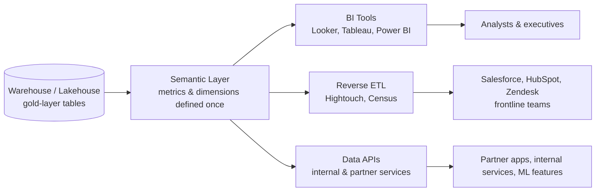

# The Serving Layer: BI, Semantic Layer, Reverse ETL & Data APIs
{: .no_toc }

*Part 6: Delivering Value & Staying Up &middot; Serving, Reliability & the Mesh Operating Model*

An architect who has spent a quarter getting the storage tiers, table formats, and warehouse compute right can still watch the project get called a failure — because the VP of Sales and the CFO walked into a meeting with two different numbers for "active customers," both pulled from the same warehouse, computed by two different BI tools with two different SQL definitions. [Performance Architecture: Tuning by Workload](../10-cost-and-performance-architecture/02-performance-tuning-by-workload/) made sure the platform runs fast and affordably for every workload that hits it; this topic is about the last mile that actually turns that tuned platform into decisions, actions, and products people trust — the point where all that engineering either pays off or gets quietly ignored.

## The many faces of serving: who consumes your data, and how

A cloud warehouse or lakehouse rarely has one consumer. In a single organization the same gold-layer tables might be queried by a BI dashboard an executive checks every morning, a data scientist's notebook doing ad-hoc exploration, a nightly job that pushes updated lead scores into Salesforce, and a mobile app's backend calling an internal API for a personalization feature — each with different latency expectations, different query shapes, and a different tolerance for a stale or wrong number. Treating "serving" as a single BI connection is how architects end up with four teams writing four slightly different versions of "monthly recurring revenue" directly against raw tables, each defensible in isolation and none of them agreeing with each other. The serving layer is the architectural answer: a deliberate boundary between how data is modeled and stored, and how it's exposed to each class of consumer.

## The semantic layer wars: Looker vs dbt Semantic Layer vs Cube

The **semantic layer** is the piece that keeps those four teams from re-deriving "MRR" four different ways. It's a layer of metric and dimension definitions — revenue, active customer, churn, grain, join logic — declared once, in code, and reused by every downstream tool instead of copy-pasted into every dashboard's SQL. If you've ever maintained a shared view or a "certified" reporting table in a legacy warehouse so that every report agreed with finance, you've already built a primitive semantic layer by hand; the modern versions just make that definition portable across tools instead of locked inside one schema.

{: .key-term }
> A **semantic layer** sits between raw/modeled tables and every consuming tool, translating physical columns and joins into business-named metrics and dimensions — so "active customer" is defined exactly once, and every BI tool, API, and reverse-ETL sync inherits the same answer.

Three tools currently compete to own this layer, and the choice matters because metric logic tends to outlive whichever BI tool is fashionable this year:

| | Looker (LookML) | dbt Semantic Layer | Cube |
|---|---|---|---|
| Definition language | LookML, Looker's proprietary modeling language | YAML metrics defined inside the dbt project, alongside models | YAML/JS data model, deployed as its own service |
| Coupling | Tightly bound to Looker as the BI front end | Decoupled — metrics exposed via API/JDBC to many BI tools | Decoupled — API-first, headless by design |
| Where it lives | Looker's hosted platform | Inside your existing dbt project and transformation workflow | A separate semantic-layer service you deploy and operate |
| Best fit | Orgs standardizing on Looker for BI, want mature governance and a large modeling ecosystem | Orgs with heavy dbt investment who want metrics defined next to the transformations that produce them | Orgs wanting one semantic layer to feed multiple BI tools, embedded analytics, and APIs without adopting a specific BI vendor |

None of these is a strictly dominant choice — it's a build-vs-buy-vs-compose decision like any other in this guide. Looker buys you a mature, governed ecosystem at the cost of coupling your metric layer to one BI vendor. dbt's semantic layer buys you proximity to your transformation code, at the cost of being a newer, still-maturing surface. Cube buys you vendor neutrality and an API-first posture, at the cost of running and operating another service. An illustrative metric definition — the shape is similar across all three, even though exact syntax differs:

```yaml
# Illustrative only — not the exact syntax of any one tool
metric: active_customers
description: "Customers with >= 1 order in the trailing 30 days"
grain: customer_id
source: fct_orders
filter: order_date >= current_date - interval '30 days'
```

## Reverse ETL: operational analytics

Traditional ETL/ELT moves data *into* the warehouse. **Reverse ETL** moves it back *out* — syncing a curated warehouse table (say, a lead-scoring model's output, or a computed lifetime-value figure) into the operational SaaS tools where frontline staff actually work: Salesforce, HubSpot, Zendesk, an ad platform's audience list. Tools like Hightouch and Census exist specifically for this sync. The architectural shift this represents is easy to underestimate: the warehouse stops being a read-only reporting system and becomes a write path into production business systems. That means the same rigor you'd apply to a data contract or an SLA for a dashboard now applies to a sales rep's CRM record — except the failure mode is worse, because a wrong number now drives a phone call or a discount offer, not just a chart nobody double-checks.

## Data APIs & data-as-a-product serving

The third serving mode skips both BI and reverse-ETL entirely: exposing curated, governed data directly through a **data API** — an internal service, a partner-facing endpoint, or a feature powering an ML model — so that other systems consume data programmatically rather than through a dashboard or a batch sync. This is the serving pattern that starts to blur into the idea of "data as a product," covered in full later in this group: an API implies a contract (schema, freshness, availability) that a consuming team can build against without ever touching your tables directly.



Whichever combination of BI, reverse ETL, and data APIs a platform supports, they all share one dependency: a semantic layer that keeps the numbers consistent underneath them. Get that layer right, and the next question — can consumers actually count on this being there, on time, correctly — is what the rest of this group covers.

<!-- prevnext:start -->

---

| [&larr; Previous: Serving, Reliability & the Mesh Operating Model](./) | [Next: Reliability: SLAs/SLOs, Observability, Multi-Region DR & Tenancy &rarr;](02-reliability-scale-and-multiregion-dr/) |
|:---|---:|

<!-- prevnext:end -->
