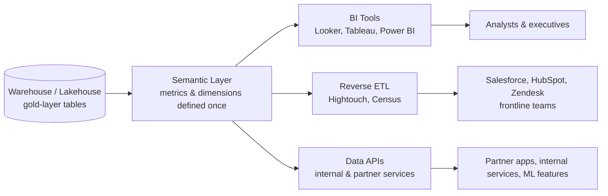

# The Serving Layer: BI, Semantic Layer, Reverse ETL & Data APIs
{: .no_toc }

*Part 6: Delivering Value & Staying Up &middot; Serving, Reliability & the Mesh Operating Model*

An architect who has spent a quarter getting the storage tiers, table formats, and warehouse compute right can still watch the project get called a failure — because the VP of Sales and the CFO walked into a meeting with two different numbers for "active customers," both pulled from the same warehouse, computed by two different BI tools with two different SQL definitions. [Performance Architecture: Tuning by Workload](../10-cost-and-performance-architecture/02-performance-tuning-by-workload/) made sure the platform runs fast and affordably for every workload that hits it; this topic is about the last mile that actually turns that tuned platform into decisions, actions, and products people trust — the point where all that engineering either pays off or gets quietly ignored.

## The many faces of serving: who consumes your data, and how

A cloud warehouse or lakehouse rarely has one consumer. In a single organization the same gold-layer tables might be queried by a BI dashboard an executive checks every morning, a data scientist's notebook doing ad-hoc exploration, a nightly job that pushes updated lead scores into Salesforce, and a mobile app's backend calling an internal API for a personalization feature — each with different latency expectations, different query shapes, and a different tolerance for a stale or wrong number. Treating "serving" as a single BI connection is how architects end up with four teams writing four slightly different versions of "monthly recurring revenue" directly against raw tables, each defensible in isolation and none of them agreeing with each other. The serving layer is the architectural answer: a deliberate boundary between how data is modeled and stored, and how it's exposed to each class of consumer.

## The semantic layer wars: Looker vs dbt Semantic Layer vs Cube

The **semantic layer** is the piece that keeps those four teams from re-deriving "MRR" four different ways. It's a layer of metric and dimension definitions — revenue, active customer, churn, grain, join logic — declared once, in code, and reused by every downstream tool instead of copy-pasted into every dashboard's SQL. If you've ever maintained a shared view or a "certified" reporting table in a legacy warehouse so that every report agreed with finance, you've already built a primitive semantic layer by hand; the modern versions just make that definition portable across tools instead of locked inside one schema.

{: .key-term }
> A **semantic layer** sits between raw/modeled tables and every consuming tool, translating physical columns and joins into business-named metrics and dimensions — so "active customer" is defined exactly once, and every BI tool, API, and reverse-ETL sync inherits the same answer.

Three tools currently compete to own this layer, and the choice matters because metric logic tends to outlive whichever BI tool is fashionable this year:

| | Looker (LookML) | dbt Semantic Layer | Cube |
|---|---|---|---|
| Definition language | LookML, Looker's proprietary modeling language | YAML metrics defined inside the dbt project, alongside models | YAML/JS data model, deployed as its own service |
| Coupling | Tightly bound to Looker as the BI front end | Decoupled — metrics exposed via API/JDBC to many BI tools | Decoupled — API-first, headless by design |
| Where it lives | Looker's hosted platform | Inside your existing dbt project and transformation workflow | A separate semantic-layer service you deploy and operate |
| Best fit | Orgs standardizing on Looker for BI, want mature governance and a large modeling ecosystem | Orgs with heavy dbt investment who want metrics defined next to the transformations that produce them | Orgs wanting one semantic layer to feed multiple BI tools, embedded analytics, and APIs without adopting a specific BI vendor |

None of these is a strictly dominant choice — it's a build-vs-buy-vs-compose decision like any other in this guide. Looker buys you a mature, governed ecosystem at the cost of coupling your metric layer to one BI vendor. dbt's semantic layer buys you proximity to your transformation code, at the cost of being a newer, still-maturing surface. Cube buys you vendor neutrality and an API-first posture, at the cost of running and operating another service. An illustrative metric definition — the shape is similar across all three, even though exact syntax differs:

```yaml
# Illustrative only — not the exact syntax of any one tool
metric: active_customers
description: "Customers with >= 1 order in the trailing 30 days"
grain: customer_id
source: fct_orders
filter: order_date >= current_date - interval '30 days'
```

## Beyond the semantic layer: ontologies and knowledge graphs

A semantic layer solves the BI tool's version of the meaning problem — "active customer" computed once, consistently, for every dashboard. It does not solve the harder version an architect eventually runs into once the organization has more than one domain, more than one system of record, and a question that spans both: is the "Acme Corp" in the CRM the same legal entity as the "Acme Holdings LLC" in the billing system, and if a regulator or an AI assistant needs to reason about that relationship rather than just display it on a chart, where does that reasoning live? A semantic layer's metric definitions are flat — a name, a SQL expression, a grain — and that's exactly why they don't answer this kind of question; nothing in a LookML or dbt metric definition says *why* two rows represent the same real-world thing, or what else follows if they do. This is the gap an **ontology** closes.

{: .key-term }
> An **ontology** is a formal, explicit specification of the entities in a domain, the relationships between them, and the rules those relationships must obey — written so a machine can check and reason over it, not just so a human can read it. Where a semantic layer declares "here is how to compute this number," an ontology declares "here is what this thing *is*, what it can be related to, and what must logically follow from that relationship."

It helps to place an ontology against three things an architect already has, because each looks similar on the surface and solves a narrower problem:

| | Data model / ER diagram | Taxonomy | Semantic layer | Ontology / knowledge graph |
|---|---|---|---|---|
| What it captures | Tables, columns, foreign keys | Hierarchical categories (is-a only) | Named metrics and dimensions for analytics | Entity types, arbitrary relationships, and logical rules/constraints |
| Semantics are | Implicit — inferred from naming conventions and tribal knowledge | Explicit, but single-relationship (parent/child only) | Explicit, but scoped to BI/analytics consumption | Explicit and machine-reasoned — a query engine can *infer* new facts, not just retrieve stored ones |
| Example | `orders.customer_id` references `customers.id` | Electronics > Laptops > Ultrabooks | `active_customers = count(customers with order in trailing 30d)` | "A Subsidiary `is-part-of` a Parent Company" + a rule that `is-part-of` is transitive, so a query can derive the full corporate hierarchy without anyone writing that join |
| Typical tooling | ERD tool, the warehouse's own catalog | Spreadsheet, SKOS vocabulary | Looker, dbt Semantic Layer, Cube | Protégé (authoring), Neo4j / Amazon Neptune / Stardog / GraphDB (storage), SPARQL or Cypher (query) |

A **knowledge graph** is what you get when you take an ontology — the schema of entity types, relationships, and rules — and populate it with actual instance data: every real customer, order, and subsidiary as a node, every relationship between them as an edge. The ontology is the vocabulary; the knowledge graph is that vocabulary plus every fact the organization actually has. The standards underneath this come out of what used to be called the Semantic Web: **RDF** (Resource Description Framework) represents every fact as a subject-predicate-object triple — `(Acme Subsidiary, is-part-of, Acme Holdings)` — and **OWL** (Web Ontology Language) layers formal, machine-checkable axioms on top of RDF so a reasoner can derive new triples from existing ones instead of requiring every fact to be stored explicitly.

Three concrete situations put this to work rather than leaving it academic:

- **Entity resolution for master data management.** [Master Data Management & the Golden Record](../09-quality-security-and-governance/02-master-data-management/) covers matching the same customer across systems with fuzzy-matching heuristics scattered across pipelines. An ontology makes "same-as" a first-class, auditable relationship — `(crm:AcmeCorp, owl:sameAs, billing:AcmeHoldingsLLC)` — with the matching rule defined once and reasoned over consistently, instead of re-implemented, slightly differently, in every pipeline that needs to join across those systems.
- **Federated governance in a data mesh.** The shared identifiers and canonical taxonomies that [federated computational governance](03-data-products-and-mesh-operating-model/) depends on *are* a small ontology, whether or not anyone calls it that — a minimal, centrally agreed vocabulary of entity types and relationships that every domain's data product has to honor so two domains' data products can be joined without a bespoke reconciliation project each time.
- **Grounding AI retrieval with explicit relationships (GraphRAG).** [Architecting for AI](../12-architecting-for-ai-and-closing-the-loop/01-architecting-for-ai/) covers RAG retrieving document chunks by vector similarity — which answers "what sounds like this question" but not "which suppliers of this vendor are affected by this regulation," a multi-hop relationship question no similarity score can trace. A knowledge graph built on a domain ontology lets the retrieval step traverse explicit relationships instead of only ranking by semantic distance, which is both more accurate for that class of question and produces an answer with a traceable path instead of an opaque nearest-neighbor match.

{: .important }
> Enterprise ontology efforts have a well-earned reputation for stalling: a multi-year attempt to model the *entire* business's entities and relationships up front, before any concrete consumer needs most of them, collapses under its own modeling overhead and never ships. Treat an ontology the way you'd treat any other two-way-door investment in this guide — scope it to the entities one real consumer (an MDM match rule, a mesh's shared identifiers, a RAG pipeline's retrieval graph) actually needs, and extend it only when the next consumer shows up, not in anticipation of one that might.

LLM-assisted extraction is changing the on-ramp here faster than the standards themselves: rather than hand-authoring OWL classes and axioms from scratch, a common pattern now is prompting an LLM to propose candidate entities and relationships from unstructured sources (contracts, wikis, tickets) and having a human curate the result into the formal ontology — turning what used to be a purely manual modeling exercise into a review task, which is a large part of why knowledge-graph-backed RAG has become practical for teams that would never have staffed a dedicated ontology effort a few years ago.

## Reverse ETL: operational analytics

Traditional ETL/ELT moves data *into* the warehouse. **Reverse ETL** moves it back *out* — syncing a curated warehouse table (say, a lead-scoring model's output, or a computed lifetime-value figure) into the operational SaaS tools where frontline staff actually work: Salesforce, HubSpot, Zendesk, an ad platform's audience list. Tools like Hightouch and Census exist specifically for this sync. The architectural shift this represents is easy to underestimate: the warehouse stops being a read-only reporting system and becomes a write path into production business systems. That means the same rigor you'd apply to a data contract or an SLA for a dashboard now applies to a sales rep's CRM record — except the failure mode is worse, because a wrong number now drives a phone call or a discount offer, not just a chart nobody double-checks.

## Data APIs & data-as-a-product serving

The third serving mode skips both BI and reverse-ETL entirely: exposing curated, governed data directly through a **data API** — an internal service, a partner-facing endpoint, or a feature powering an ML model — so that other systems consume data programmatically rather than through a dashboard or a batch sync. This is the serving pattern that starts to blur into the idea of "data as a product," covered in full later in this group: an API implies a contract (schema, freshness, availability) that a consuming team can build against without ever touching your tables directly.


```mermaid
flowchart LR
    A[(Warehouse / Lakehouse\ngold-layer tables)] --> B[Semantic Layer\nmetrics & dimensions defined once]
    B --> C[BI Tools\nLooker, Tableau, Power BI]
    B --> D[Reverse ETL\nHightouch, Census]
    B --> E[Data APIs\ninternal & partner services]
    C --> F[Analysts & executives]
    D --> G[Salesforce, HubSpot, Zendesk\nfrontline teams]
    E --> H[Partner apps, internal services, ML features]
```

Whichever combination of BI, reverse ETL, and data APIs a platform supports, they all share one dependency: a semantic layer that keeps the numbers consistent underneath them. Get that layer right, and the next question — can consumers actually count on this being there, on time, correctly — is what the rest of this group covers.

<!-- prevnext:start -->

---

| [&larr; Previous: Serving, Reliability & the Mesh Operating Model](./) | [Next: Reliability: SLAs/SLOs, Observability, Multi-Region DR & Tenancy &rarr;](02-reliability-scale-and-multiregion-dr/) |
|:---|---:|

<!-- prevnext:end -->
