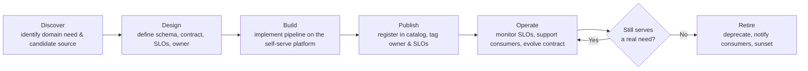

# Data Products & the Data Mesh Operating Model
{: .no_toc }

*Part 6: Delivering Value & Staying Up &middot; Serving, Reliability & the Mesh Operating Model*

An architect who has just finished pinning SLAs and SLOs onto every serving output in [Reliability: SLAs/SLOs, Observability, Multi-Region DR & Tenancy](02-reliability-scale-and-multiregion-dr/) runs straight into the question that topic left open: who actually owns each of those promises once the platform serves dozens of domains, and no central team has the context to know whether a given table is fresh, correct, or fit for purpose today? Get the ownership model wrong and you land in one of two failure modes — a central data team that's a permanent bottleneck on every domain's roadmap, or dozens of domains publishing tables nobody can find, trust, or hold accountable. **Data mesh** is the answer to that ownership question: not better tooling bolted onto a centralized data team, but a change in who owns the data and what standard they're held to. The [Data Mesh: Decentralized Domain Ownership](../02-architecture-patterns-deep-dive/05-data-mesh/) topic introduced this as an architecture pattern — decentralized ownership instead of one monolithic warehouse team; this topic is the operating-model deep-dive: what a data product actually is, how a domain team builds and runs one, and what breaks when the pattern is adopted without the operating model to match.

## The four principles of data mesh

Data mesh rests on four principles that only work together — pick two and skip the others, and you've built something else entirely.

**Domain ownership** moves data responsibility to the teams that already understand it best — the order-management domain owns order data, the claims domain owns claims data — rather than funneling every source through a central ETL team that has to relearn each domain's business logic from scratch. Treating **data as a product** means a domain doesn't just dump a table over the wall; it publishes something with an owner, a documented contract, a quality bar, and a consumer's expectations in mind, the same discipline a product manager applies to a customer-facing feature. A **self-serve data platform** gives domain teams the infrastructure — ingestion, storage, compute, catalog registration, quality checks, access control — as paved-road tooling, so "own your data" doesn't quietly become "go hire your own platform team." And **federated computational governance** keeps enough central control that products can actually interoperate: shared identifiers, consistent PII handling, common interoperability standards, enforced automatically rather than by a governance committee reviewing every change by hand.

## What is a data product?

A **data product** is the unit mesh is built around, and it needs to be more than "a table someone finds useful." Four things turn a table into a data product. Its **boundaries** map to a real business domain — the data a domain owns end-to-end, not an arbitrary technical grouping like "everything in this schema." Its **contract** is explicit: schema, semantics, update cadence, and breaking-change policy, written down the way a **data contract** should be, not inferred by a downstream analyst reverse-engineering column names. Its **SLOs** are published and monitored — freshness, completeness, accuracy — using exactly the SLA/SLO/SLI machinery from the previous topic, except now the SLO belongs to the domain team, not a central platform team fielding pages for data it didn't create. And it's **discoverable**: registered in the data catalog with an owner, a description, sample queries, and lineage, so a consumer can find it and judge whether to trust it without a Slack message to whoever wrote the pipeline two years ago. A domain that ships a table with none of these four is still doing centralized ETL with extra org-chart steps — the label "data mesh" doesn't do the work by itself.

## The data product lifecycle

A data product isn't a one-time deliverable; it moves through a lifecycle a domain team owns end to end, from the moment a need is identified to the day the product no longer earns its keep.

**Discover** starts with a real consumer need, not a source system that happens to exist. **Design** is where the domain team commits to a schema, a contract, and SLOs before writing a pipeline — the mesh equivalent of designing a fact table's grain before loading it. **Build** implements that design on the self-serve platform rather than bespoke infrastructure. **Publish** is the step centralized ETL usually skips entirely: registering the product in the catalog with an owner and SLOs attached, so it's discoverable rather than merely queryable. **Operate** is the long middle — monitoring the SLOs, handling schema evolution without breaking consumers, fielding support requests — which is where most of a data product's real lifetime is spent. And **retire** is a first-class step, not an accident: a product that no longer serves a real need gets deprecated on a schedule, with consumers notified, rather than silently going stale until someone downstream discovers it broke three weeks ago.

## The self-serve data platform

None of the above works if every domain team has to reinvent ingestion connectors, provisioning, access control, and observability from scratch — that's the fastest route back to a bottlenecked central team, just with more teams doing the bottlenecking badly. The **self-serve platform** is the paved road: standardized ingestion patterns, provisioned storage and compute, a shared catalog with automatic registration, built-in data-quality and testing frameworks, RBAC/ABAC wired in by default, and observability that surfaces SLO breaches without a domain team building its own monitoring stack. Think of it as the mesh-era replacement for the DBA team that used to hand-provision a schema and grant access over a two-week ticket queue — except now provisioning is self-service and the domain team, not a central gatekeeper, decides what gets built on top of it. A platform team that gets this right measures its own success by how little domain teams have to think about infrastructure, not by how much control it retains.

## Federated governance in practice

Federated governance is what keeps a mesh from fragmenting into isolated silos even though ownership is decentralized. The pattern is a small set of computational, automatically enforced global policies — a canonical customer identifier, a standard PII-tagging taxonomy, a common access-control model — layered under domain-level autonomy for everything else. "Computational" is the operative word: these rules are encoded as platform checks and CI gates a product can't publish without passing, not a governance committee that reviews every schema change by hand and becomes the new bottleneck.

## When mesh fails: the mesh that became a mess

{: .important }
> Data mesh fails for a predictable, recurring reason: an organization adopts the domain-ownership rhetoric — "you own your data now" — without funding the self-serve platform or building out federated governance, and gets a worse version of the problem it started with. Domains bootstrap their own inconsistent pipelines because there's no paved road. Nobody enforces a shared identifier or a common PII taxonomy, so joining two "data products" together requires the same reconciliation work as integrating two unrelated acquisitions. The catalog fills with entries nobody registered properly, so discoverability collapses back into tribal knowledge. The result isn't a mesh — it's dozens of ungoverned mini-warehouses with a new vocabulary, and it's usually harder to unwind than the centralized model it replaced, because now the sprawl is organizationally sanctioned.

The fix isn't abandoning the four principles — it's recognizing that domain ownership and self-serve platform investment are a package deal, and that federated governance has to be built and enforced computationally from the start, not retrofitted once ten domains have already diverged. An architect proposing data mesh who can't point to the platform team, the funding, and the governance mechanism alongside the ownership model is proposing the mess, not the mesh.

<!-- prevnext:start -->

---

| [&larr; Previous: Reliability: SLAs/SLOs, Observability, Multi-Region DR & Tenancy](02-reliability-scale-and-multiregion-dr/) | [Next: Architecting for AI & Closing the Loop &rarr;](../12-architecting-for-ai-and-closing-the-loop/) |
|:---|---:|

<!-- prevnext:end -->
