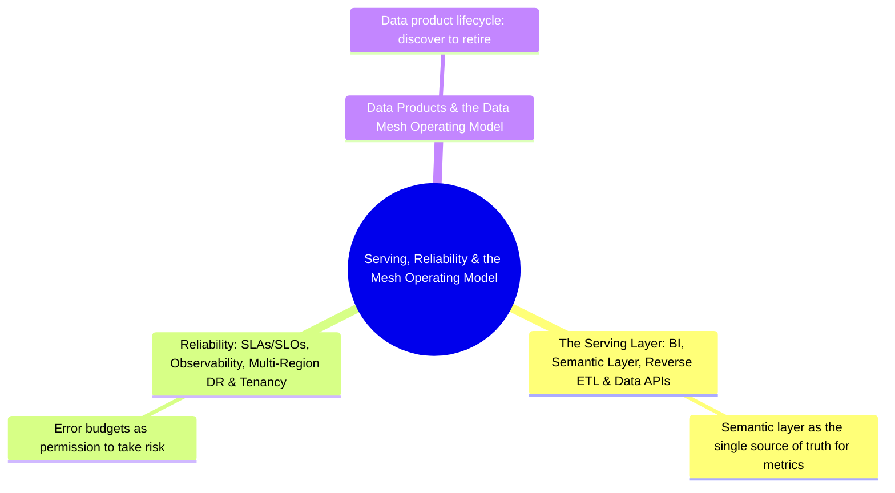

# Serving, Reliability & the Mesh Operating Model
*Part 6: Delivering Value & Staying Up*

Part 5, *Running It Like a Platform*, was about making the platform affordable and fast to run — storage tiers, workload tuning, the cost side of every architecture decision. None of that matters to the business if the data never reaches anyone, or reaches them unreliably: Part 6, *Delivering Value & Staying Up*, is where the platform stops being an internal engineering concern and starts being judged by the people who actually consume its output. These three topics trace that last mile end to end: getting data out through the serving layer consumers actually touch, keeping every one of those promises measurable and defensible when something breaks, and scaling the organizational model — data mesh — so that "who owns this" has an answer even as the number of consumers and domains grows past what one central team can hold in its head.

Together these topics answer the question every serving-layer promise eventually raises: who is accountable for it, how is that accountability measured, and how does the organization scale that accountability past a single central team.

See also: [Data Mesh: Decentralized Domain Ownership](../02-architecture-patterns-deep-dive/05-data-mesh/) in Architecture Patterns Deep Dive, which introduces data mesh as an architecture pattern before this group's third topic covers the operating model that runs it day to day.

## Topics

| # | Topic |
|---|-------|
| 1 | [The Serving Layer: BI, Semantic Layer, Reverse ETL & Data APIs](01-serving-layer-bi-semantic-reverse-etl-apis/) |
| 2 | [Reliability: SLAs/SLOs, Observability, Multi-Region DR & Tenancy](02-reliability-scale-and-multiregion-dr/) |
| 3 | [Data Products & the Data Mesh Operating Model](03-data-products-and-mesh-operating-model/) |

<!-- prevnext:start -->

---

| [&larr; Previous: Performance Architecture: Tuning by Workload](../10-cost-and-performance-architecture/02-performance-tuning-by-workload/) | [Next: The Serving Layer: BI, Semantic Layer, Reverse ETL & Data APIs &rarr;](01-serving-layer-bi-semantic-reverse-etl-apis/) |
|:---|---:|

<!-- prevnext:end -->
