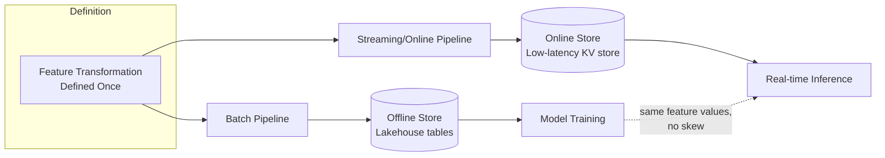
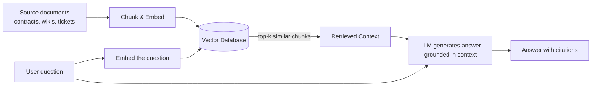

# Architecting for AI: Feature Stores, Vector Databases, RAG & Governance Guardrails
{: .no_toc }

*Part 7: The Frontier & The Defense &middot; Architecting for AI & Closing the Loop*

An architect who ships a warehouse that serves BI dashboards flawlessly can still watch an ML initiative fail for reasons that have nothing to do with the model — a training set that doesn't match what production actually sees, a nightly batch feature that a real-time fraud check needs in milliseconds, or a chatbot that confidently cites a policy the company retired two years ago. None of those are data-science problems; they are platform problems, and they land on the architect's desk. This topic builds directly on [Data Products & the Data Mesh Operating Model](../11-serving-reliability-and-mesh-operating-model/03-data-products-and-mesh-operating-model/): everything that group covered — a platform that serves reliably, publishes trustworthy data products, and stays up under load — is exactly what an AI workload consumes, only faster, hungrier, and less forgiving of drift than any BI dashboard ever was.

## Why AI breaks your data platform: the two-speed problem

A warehouse built for BI answers questions in seconds and tolerates data that's a day old. An AI system built on top of the same platform introduces a second speed entirely: a recommendation model or fraud check needs an answer in single-digit milliseconds, computed from data that must be *identical in shape* to what the model saw during training. This is the **two-speed problem** — your platform now has to serve slow, batch-oriented analytical consumers and fast, latency-sensitive inference consumers off the same underlying data, without letting one starve the other or silently diverge from it. Most "AI initiatives stall in production" post-mortems trace back to an architect treating this as a modeling problem instead of the serving-layer and consistency problem it actually is.

Put numbers on it: a nightly batch job that lands "transactions in the last 10 minutes" four hours after midnight is architecturally useless to a fraud check that has to approve or decline a card swipe in under 100ms — the feature has to exist in a store the inference call can hit synchronously, not a table the next DAG run will eventually populate. A marketing dashboard querying that same customer's lifetime purchase history, by contrast, is genuinely fine with data that's a day old; nobody notices a recommendation widget lagging the warehouse by an SLA the business never asked to shrink. The two-speed problem isn't that AI needs "faster infrastructure" everywhere — it's that one platform now has to draw that latency line correctly, workload by workload, and enforce it.

## The feature store: training-serving consistency

The specific failure mode the two-speed problem produces is **training-serving skew**: a model trained on features computed one way in a batch job, then served in production by a different code path that computes the "same" feature slightly differently (a different time window, a different null-handling rule, a stale join). The model's accuracy in production silently degrades from what it showed in testing, and nobody can say why.

A **feature store** exists to close that gap. It is a dual-sided system: an *offline store* (typically built on your existing lakehouse tables) that serves large historical batches for training, and an *online store* (a low-latency key-value store) that serves the current value of the same features to a live model at inference time — both computed from one shared feature-transformation definition, so "customer's 30-day average order value" means the exact same thing, computed the exact same way, in both places.

{: .important }
> If your offline and online feature computations live in two separately maintained codebases, you have not built a feature store — you have built two chances to define "30-day average" differently. The single shared definition, not the two storage tiers, is the actual point of the pattern.

Here's what that skew looks like when it isn't hypothetical: the batch job defines "transactions in the last 7 days" using calendar-day boundaries — midnight to midnight, Sunday through Saturday — because that's how the nightly DAG has always partitioned its runs. The online store, built later by a different engineer under time pressure, defines the same feature as a rolling 168-hour window, because that's the natural unit for a service answering requests continuously. On most days the two definitions agree closely enough that nobody looks twice. On a day with an unusual purchase spike near a boundary, they can disagree by a day's worth of transactions, and the model's fraud precision drops a few points — with no error thrown anywhere, no failed job, no red dashboard tile. The pipeline runs successfully every single time; it's just quietly wrong, which is the failure mode a feature store's single shared definition is specifically built to make impossible.

## Embeddings, vector databases & RAG

Large language models don't query your warehouse directly — they need your data translated into a form they can reason over, and that translation is an **embedding**: a numeric vector that represents the semantic meaning of a piece of text, image, or record, positioned so that similar meanings land near each other in vector space. Storing and searching millions of these vectors efficiently — "find the 10 documents whose meaning is closest to this question" — is a different access pattern than anything a relational warehouse or object store was built for, which is why a **vector database** (Pinecone, Weaviate, pgvector, or a vector index bolted onto an existing warehouse) exists as its own architectural component.

**RAG** (retrieval-augmented generation) is the pattern that stitches this together for question-answering: instead of asking an LLM to answer purely from what it memorized during training (and risking a confident, fabricated answer — a "hallucination"), the system first retrieves the most relevant chunks of your own documents from the vector database, then hands those chunks to the LLM as grounding context alongside the question.

This is architecturally no different from the ingest-store-serve pipeline you've built all course: source documents are ingested, chunked, and transformed (embedded) exactly the way a fact table is transformed before it's queryable — the transform step just happens to be a model call instead of SQL, and the "table" it lands in is a vector index instead of a star schema.

Retrieval only solves half of RAG's serving problem — the other half is deciding how the LLM itself gets invoked, and that's a **build vs. buy vs. compose** call in the same sense you've made throughout this guide for every other component. A hosted LLM API is the "buy" option: no infrastructure to operate, a per-token cost that scales with usage, and a data-residency question you can't avoid — every retrieved chunk you send as grounding context leaves your network and reaches a third party at inference time, which is a real problem if those chunks contain PII or contractual terms under an existing data-sharing restriction. A self-hosted, open-weight model is the "build" option: it keeps every request inside your own infrastructure and turns cost from per-token into fixed GPU spend, but it also means your team now owns model-serving infrastructure and its on-call burden, on top of everything else the platform already asks of them. Most teams land on "compose" — a hosted API for the workload where speed-to-value matters most, with the option to self-host later if volume or residency requirements change — which is itself a two-way door worth stating explicitly rather than defaulting into by accident.

## AI governance, lineage & cost

Everything you've already learned about **lineage**, access control, and cost discipline gets sharper edges under AI, not new rules. If a model was trained on a table containing PII, you need lineage that traces forward from that table to every model and every embedding derived from it — "right to be forgotten" now means retraining or re-embedding, not just deleting a row. **RBAC/ABAC** has to extend to the vector database and the feature store, not just the warehouse, or a poorly scoped retrieval index becomes the easiest way to exfiltrate data a user was never granted access to in the first place. And AI workloads carry a genuinely new cost axis — LLM API calls and GPU inference time — that behaves nothing like a warehouse query's cost curve, so the cost-as-architectural-decision discipline from earlier in the course needs a new line item, monitored per-request, not just per-terabyte-scanned. Here's why that distinction earns its own monitoring: a support chatbot fielding 50,000 conversations a month at a few cents per LLM call is a real, forecastable budget line — but a retrieval bug that calls the LLM three times per user question instead of once triples that line silently, and it looks identical to normal growth on a monthly invoice until someone traces individual requests back to a specific code path. Per-terabyte-scanned alerting, tuned for a warehouse, will never catch that; per-request cost monitoring, scoped to each model and environment, is the only thing that will.

## Designing an AI-ready platform: what "ready" actually means

None of this requires ripping out your lakehouse. An AI-ready platform is your existing reference architecture (source, ingest, store, transform, serve, consume) with three additions layered on top: a feature store bridging batch and online serving, a vector database and RAG pipeline for unstructured and generative use cases, and governance extended to cover models and embeddings as first-class lineage objects — not a parallel platform built and secured from scratch. The architect's job is deciding which of those three additions the organization's actual AI mandate justifies, and in what order, which is precisely the kind of build-vs-buy-vs-compose call the rest of this guide has been preparing you to make — and exactly what the capstone later in this group asks you to do end to end.

<!-- prevnext:start -->

---

| [&larr; Previous: Architecting for AI & Closing the Loop](./) | [Next: Architecture Decision Records, Anti-Patterns & War Stories &rarr;](02-adrs-anti-patterns-and-war-stories/) |
|:---|---:|

<!-- prevnext:end -->
