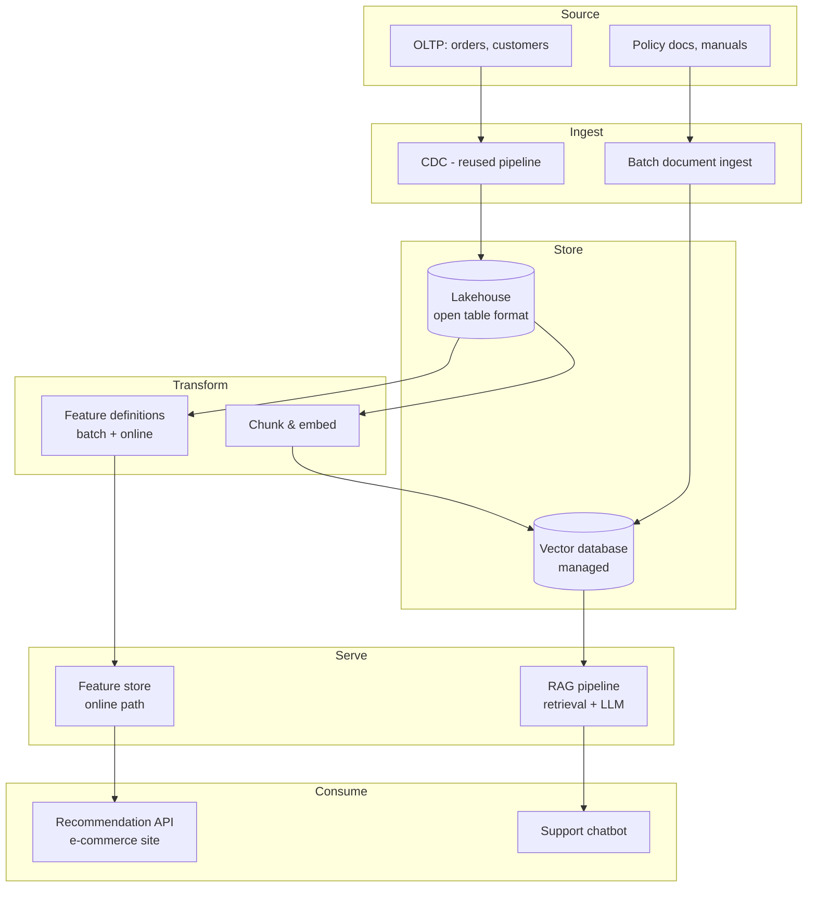

# Capstone: Designing and Defending an AI-Ready Platform to the Board
{: .no_toc }

*Part 7: The Frontier & The Defense &middot; Architecting for AI & Closing the Loop*

Everything in this guide has been rehearsal for a specific, recurring moment in an architect's career: a room full of people who control budget and risk tolerance, asking you to justify a system that doesn't fully exist yet. You won't get there by reciting definitions of the medallion pattern or the CAP theorem — you get there by having actually designed something end to end and being able to defend every layer of it. [Architecture Decision Records, Anti-Patterns & War Stories](02-adrs-anti-patterns-and-war-stories/) gave you the tools to document and defend a decision; this capstone is where you use those tools on a full platform, not a single choice, by walking through one worked example from a blank page to a board-ready defense.

## The brief: a hypothetical company's requirements, constraints & AI mandate

To make this concrete rather than abstract, walk through it with one company: **Solstice Outfitters**, a mid-size outdoor-gear retailer, three years into a cloud migration, with a lakehouse already running on object storage with an open table format. Their brief, as it would actually arrive on an architect's desk, looks like this:

- **Requirements**: a product-recommendation feature for the e-commerce site (sub-200ms response), and a customer-support chatbot that can answer questions grounded in the company's actual return policy, warranty terms, and product manuals — not the model's general training knowledge.
- **Constraints**: a data engineering team of six, no dedicated ML infrastructure team, a board that just approved a cloud migration and is wary of a second multi-year platform project, and existing PII (customer addresses, purchase history) already under a data contract and access-control regime.
- **The AI mandate**: leadership wants "AI in production within two quarters," which — read past the buzzword, the way [Deciding Under Uncertainty](../03-architects-decision-framework/01-deciding-under-uncertainty/) taught you to read any stakeholder ask — actually decomposes into two distinct, separable problems: a low-latency inference workload (recommendations) and a retrieval-grounded generation workload (support chatbot).

This is the same move as every requirements-gathering exercise earlier in the course: the stated ask ("we want AI") is not the actual set of constraints you design against. The real brief is two workloads, a six-person team, a wary board, and an existing governance regime that the new work has to extend rather than bypass.

Put a number on "two quarters" and the design space shrinks fast: eight or nine sprints, for a team of six who also have to keep the existing warehouse and CDC pipelines running, is not enough time to stand up a self-hosted vector index or retrain data engineers into ML infrastructure operators from scratch. It is comfortably enough time to wire a managed vector database and a hosted LLM API into the platform they already run. That single arithmetic check — sprints available against capability the team would have to build versus buy — eliminates roughly half the plausible architectures before a single ADR gets written, which is exactly the point of reading constraints literally instead of aspirationally.

## Designing the architecture end-to-end: one decision per layer

Solstice's existing platform is already, in effect, an instance of the [reference architecture](../03-architects-decision-framework/03-reference-architecture/) — source, ingest, store, transform, serve, consume. The capstone discipline is not designing something new; it's re-walking that same canonical diagram and making one explicit, justified decision at each layer for the two new AI workloads, using the [mental model's](../03-architects-decision-framework/04-mental-model-for-architecture-choices/) six dimensions — cost, control, complexity, lock-in, team skill, reversibility — to weigh each one.

| Layer | Decision | Why (mental-model lens) |
|---|---|---|
| Source | Product catalog, order history, and policy/warranty documents (PDFs, wikis) as new sources alongside existing OLTP feeds | Documents are a genuinely new source type — this is where the AI mandate touches ingestion first |
| Ingest | Batch ingest for documents (low change rate); existing CDC feed reused, unchanged, for order/customer data | Team skill: the team already runs this CDC pipeline reliably — don't rebuild what isn't broken |
| Store | Existing lakehouse tables for structured data; add a managed vector database for embeddings rather than self-hosting one | Complexity/team skill: a six-person team can't also become vector-database operators in two quarters — buy, don't build |
| Transform | A **feature store**'s online path computes recommendation features at request time from lakehouse-derived batch aggregates; a chunk-and-embed job transforms documents for RAG | Reversibility: the shared feature definition (batch + online) is the one-way door worth doing carefully; chunking strategy is a two-way door, safe to iterate |
| Serve | Low-latency online feature store + model endpoint for recommendations; RAG pipeline (retrieval + LLM call) behind the support chatbot's API | Cost: per-request LLM cost is a new line item, isolated here so it's monitored separately from warehouse compute |
| Consume | E-commerce site calls the recommendation API; support-chatbot UI calls the RAG endpoint; both logged back through existing lineage tooling | Control/governance: nothing new to consumers — same access-control and lineage expectations as every other data product |

Notice what this diagram is *not*: it is not a second platform. Every AI-specific box attaches to an existing layer of the same reference architecture rather than standing beside it — which is exactly the argument you'll need to make to a board that's wary of funding a second multi-year project.

The Transform row is worth pausing on, because "a feature store's online path" sounds like a single box but is actually a routing decision made feature by feature. The recommendation model needs two very different kinds of input: a signal like "this customer's 30-day category affinity," which changes slowly and can be precomputed by the nightly batch job and cached in the online store well before any request arrives, and a signal like "what's currently in this customer's cart," which only exists at request time and has to be computed synchronously in the milliseconds the product page has to render. A feature store isn't "make everything online" — it's the discipline of sorting every feature into one of those two buckets correctly, once, in a shared definition, so the online path only ever computes what genuinely can't be precomputed. Get that sort wrong in either direction and you've rebuilt the training-serving skew problem from the previous topic, just with an extra storage tier to hide it in.

## The ADR package: documenting every major decision

Each row in that table is a candidate for its own **ADR**, following the same format from the previous topic. A realistic package for Solstice would include, at minimum:

- ADR-001: Reuse existing CDC pipeline for order/customer data (no change) — two-way door, low ceremony.
- ADR-002: Adopt a managed vector database rather than self-hosting — one-way door once embeddings and access policies are built against it; justified by team-skill and complexity constraints.
- ADR-003: Single shared feature definition for recommendation features, computed once, served two ways — one-way door; this is the anti-pattern from the previous topic (a feature store that's secretly two warehouses) made explicit and avoided in writing.
- ADR-004: Extend existing PII access controls and lineage to cover the vector database and embeddings — non-negotiable given the existing data contract regime; not really a decision so much as a constraint made explicit.
- ADR-005: Support-chatbot RAG pipeline falls back to a static FAQ page if retrieval confidence is low or the LLM API is unavailable — two-way door, cheap to implement, and the single line item that turns "what happens when this breaks" from an open question into an answered one.

ADR-002 is worth writing out in full once, because its shape is the shape every entry in the package should take. **Context**: Solstice's support chatbot needs sub-second retrieval over a corpus that will grow as new manuals and policy revisions are added, and the data engineering team has never operated a vector index in production. **Decision**: adopt a managed vector database rather than self-hosting one against the team's existing object storage. **Consequences**: the team avoids owning index tuning, scaling, and upgrade cycles it has no experience with, at the cost of a new vendor bill and a new access-control surface that ADR-004 has to extend into; migrating off the vendor later means re-embedding the corpus against a new index, which is real work but bounded, not a rewrite of the platform. Writing the consequence down — including the one-way-door cost being accepted, not just the upside — is what separates an ADR from a slide bragging about the decision.

The package as a whole is the artifact that turns "we designed something" into "we can show our work" — every anti-pattern from the previous topic maps to an ADR that explicitly declined it, which is the strongest possible answer to a skeptical question in the room.

## The board defense: the full architecture review

A board review of a design like this typically works through nine questions, in order, and each one maps to something covered somewhere in this course: what problem are we solving (requirements, read correctly); what does it cost (storage, compute, and now per-request inference economics); what could go wrong (reliability, SLOs, the anti-pattern catalog); who can see what (RBAC/ABAC extended to new stores); what happens in a disaster (RPO/RTO, now including a vector database's recovery story); what's reversible versus permanent (the one-way/two-way door framing, stated plainly for every major choice); how does this scale (the two-speed problem, feature-store throughput); what did we choose not to build and why (build vs. buy vs. compose, argued from team skill and time-to-value, not vendor preference); and what's the fallback if this doesn't work (a chatbot that degrades to a plain FAQ page is a defensible fallback; a recommendation engine that falls back to "top sellers" is too). An architect who can answer all nine with a specific ADR, a specific diagram layer, or a specific number is not improvising in that room — they're presenting a decision that was already made, carefully, before anyone asked.

## Your architecture journey: the thesis revisited

The thesis this entire guide has been building toward is unglamorous but durable: architecture is not a set of technologies to memorize, it's a discipline of naming trade-offs explicitly and choosing among them on purpose, in writing, so the choice survives the person who made it. A feature store, a vector database, a mesh, a medallion pipeline — none of them are the point. The point is the same six-dimension reasoning from the mental model, applied consistently, from a two-node OLTP system all the way to a board-level AI platform review. Carry that discipline forward past this course, into whatever your organization builds next — the specific technologies will keep changing every few years; the way you decide among them doesn't have to.

<!-- prevnext:start -->

---

| [&larr; Previous: Architecture Decision Records, Anti-Patterns & War Stories](02-adrs-anti-patterns-and-war-stories/) | [Next: Hands-on Tutorials &rarr;](../13-hands-on-tutorials/) |
|:---|---:|

<!-- prevnext:end -->
