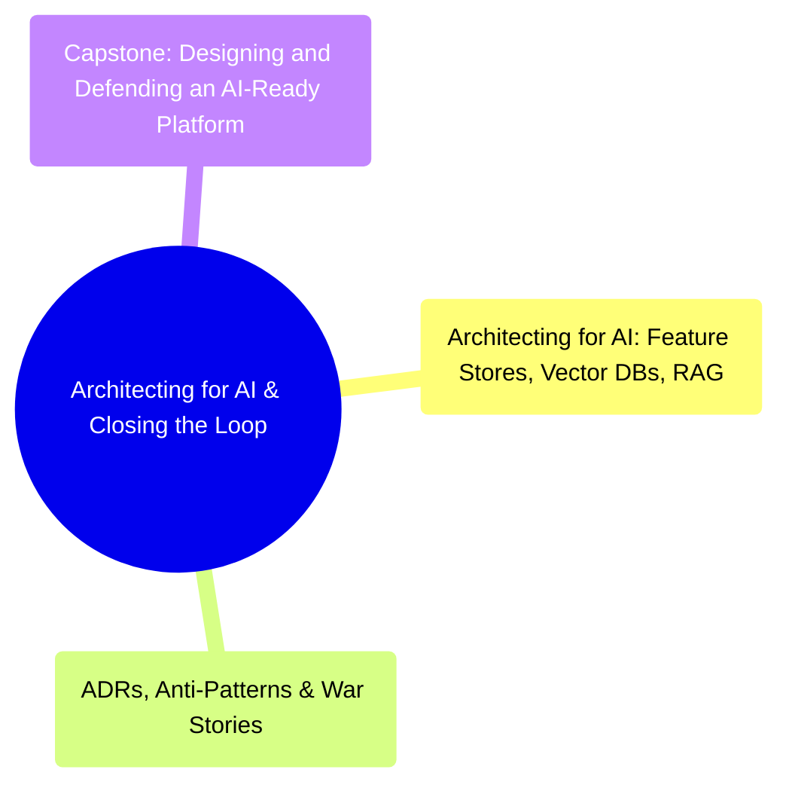

# Architecting for AI & Closing the Loop
*Part 7: The Frontier & The Defense*

Part 7, "The Frontier & The Defense," is the last Part before the course turns to hands-on tutorials, and it closes the course's arc rather than opening a new one. Every layer built across Parts 1 through 6 — storage, modeling, ingestion, transformation, operations, and serving — gets tested here against the newest and least forgiving consumer class (AI workloads), then held up for scrutiny the way a real decision gets held up in an organization: documented, defended, and second-guessed. The three topics move from extending the platform to serve AI, to turning the whole course's worth of decisions and mistakes into a durable record (ADRs, anti-patterns, war stories), to a capstone that applies all of it end-to-end and defends the result to a board.

## Topics

| # | Topic |
|---|-------|
| 1 | [Architecting for AI: Feature Stores, Vector Databases, RAG & Governance Guardrails](01-architecting-for-ai/) |
| 2 | [Architecture Decision Records, Anti-Patterns & War Stories](02-adrs-anti-patterns-and-war-stories/) |
| 3 | [Capstone: Designing and Defending an AI-Ready Platform to the Board](03-capstone-designing-and-defending-ai-ready-platform/) |

<!-- prevnext:start -->

---

| [&larr; Previous: Data Products & the Data Mesh Operating Model](../11-serving-reliability-and-mesh-operating-model/03-data-products-and-mesh-operating-model/) | [Next: Architecting for AI: Feature Stores, Vector Databases, RAG & Governance Guardrails &rarr;](01-architecting-for-ai/) |
|:---|---:|

<!-- prevnext:end -->
