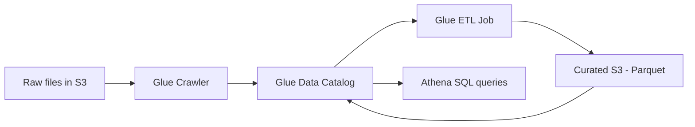

# Serverless Data Lake Analytics with AWS Glue, S3 & Athena
{: .no_toc }

*Part 8: Hands-on Tutorials &middot; Hands-on Tutorials*

**Read the full tutorial:** [Serverless Data Lake Analytics with AWS Glue, S3 & Athena](https://aws.amazon.com/blogs/big-data/build-and-automate-a-serverless-data-lake-using-an-aws-glue-trigger-for-the-data-catalog-and-etl-jobs/) &#8599;

*Link verified 2026-08-23.*

This tutorial builds the smallest complete version of a lake: land raw files in **S3**, point a Glue crawler at the bucket to infer schema into the Glue Data Catalog, trigger an ETL job to clean and repartition the data, and query the result straight from **Athena** with no cluster to manage.

It's the practical, click-by-click counterpart to [Storage Foundations: Object Storage, File Formats & Access Patterns](../04-storage-and-table-formats/01-storage-foundations/) — the same object-storage-plus-file-format decisions covered there (partitioning, columnar formats, the small-files problem) show up here as real S3 prefixes and real crawler configuration, not just diagrams.

<!-- prevnext:start -->

---

| [&larr; Previous: Hands-on Tutorials](./) | [Next: Stream CDC into an S3 Data Lake in Parquet with AWS DMS &rarr;](02-cdc-pipelines-dms-redshift/) |
|:---|---:|

<!-- prevnext:end -->
